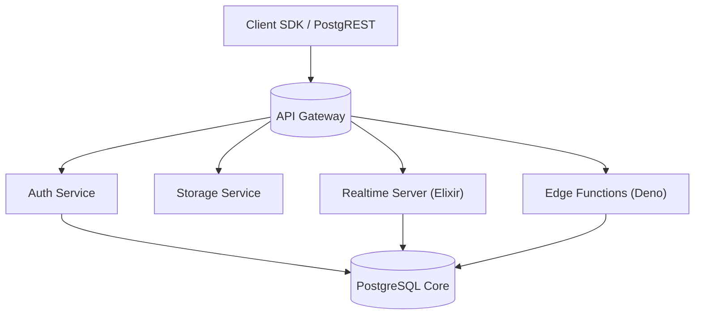

# Part 13. Advanced Topics

> Goal: Provide advanced knowledge to optimize, extend, and integrate Supabase + Next.js into complex systems, large scale, or special requirements.

## 13.1 🎯 Main Content of Advanced Section

| #     | Topic                                     | Goal                                       |
| ----- | ----------------------------------------- | ------------------------------------------ |
| 13.2  | Supabase Architecture Deep Dive           | Deep understanding of internal mechanisms  |
| 13.3  | Performance Profiling & Query Planning    | Analyze and optimize query performance     |
| 13.4  | Supabase + OpenTelemetry                  | End-to-end system tracing                  |
| 13.5  | Advanced Edge Functions                   | Patterns and function runtime optimization |
| 13.6  | Database Replication & Read Scaling       | Increase DB load capacity                  |
| 13.7  | Integration with AI / Analytics           | Connect LLM, vector DB, warehouse          |
| 13.8  | Data Governance & Compliance              | Audit, GDPR, PII and data security         |
| 13.9  | Multi-Tenant Architecture                 | How to design multi-customer apps          |
| 13.10 | Supabase Plugin Ecosystem                 | Advanced extensions and tools              |
| 13.11 | DevOps Automation (IaC, Supabase CLI Pro) | IaC & self-host Supabase                   |
| 13.12 | Case Study & Design Patterns              | Real-world implementation patterns         |
| 13.13 | Training Expansion & Knowledge Base       | How to maintain and expand training docs   |

## 13.2 🧱 Supabase Architecture Deep Dive

### Main Components



- **PostgREST:** automatically generates CRUD API from PostgreSQL schema.
- **Realtime:** streams data changes via logical replication slot.
- **Auth:** uses GoTrue (JWT + Postgres integration).
- **Edge Functions:** runs on Deno runtime (stateless, isolated).
- **Storage:** stores files in S3-compatible storage + metadata DB.

> 💡 Each Supabase project is an isolated cluster of Postgres + service layer.

## 13.3 ⚙️ Performance Profiling & Query Planning

### Main Tools

- `EXPLAIN ANALYZE`
- `pg_stat_statements`
- `pg_buffercache`
- `pg_stat_activity`

### Analysis Example

```sql
explain analyze
select *
from invoices
where customer_id = '123'
order by created_at desc;
```

Result:

```bash
Index Scan using invoices_customer_id_idx on invoices
(cost=0.42..8.54 rows=10 width=...) (actual time=0.1..0.3)
```

✅ Explanation: Query uses correct index → good performance.

### When Query is Slow

- Missing index → `Seq Scan`
- Function in WHERE (`lower(column)`) → can't use index
- Using `IN (...)` with too many values
- `ORDER BY` + large `OFFSET` → should use keyset pagination

## 13.4 🔍 Supabase + OpenTelemetry (OTEL)

OTEL integration helps trace across **Next.js - Edge Function - Database**.

### Configuration Example (Next.js)

```ts
import { trace } from "@opentelemetry/api";

const tracer = trace.getTracer("nextjs-supabase");

export async function getUserData() {
  const span = tracer.startSpan("fetch_user");
  try {
    const res = await supabase.from("users").select("*");
    span.setAttribute("record_count", res.data.length);
    return res;
  } finally {
    span.end();
  }
}
```

### Exporter Integration

- OTLP exporter → send traces to Tempo / Grafana Cloud
- Use tag `service.name = "nextjs-frontend"`

> 💡 Allows observing transactions end-to-end: user click → API → DB query.

## 13.5 🧩 Advanced Edge Functions

### Function Composition

Call function from another function (service role):

```ts
await fetch(`${Deno.env.get("FN_URL")}/notify-user`, {
  method: "POST",
  headers: { Authorization: `Bearer ${SERVICE_ROLE_KEY}` },
  body: JSON.stringify({ user_id }),
});
```

### Middleware Pattern

```ts
const withAuth = (handler) => async (req) => {
  const token = req.headers.get("authorization")?.split(" ")[1];
  if (!token) return new Response("Unauthorized", { status: 401 });
  return handler(req, token);
};
```

### Retry Pattern

Use pgmq queue:

```sql
select pgmq.send('retry-queue', json_build_object('event', 'email_fail'));
```

> Supabase Edge + pgmq can replace RabbitMQ at small scale.

## 13.6 🧮 Database Replication & Read Scaling

### Read Replicas

Supabase Pro/Enterprise supports **replica DB** → scale reads.

- Use param: `read_replica=true` in connection string.
- Next.js SSR can use replica for static queries.

### Connection Pooling

- Use **PgBouncer** to limit session count.
- Supabase automatically enables PgBouncer on production.

### Partitioning

```sql
create table logs_y2025m11 partition of logs
for values from ('2025-11-01') to ('2025-12-01');
```

> Helps query logs faster, reduces total table size.

## 13.7 🤖 Integration with AI / Analytics

### Store Vector Embeddings

```sql
create extension if not exists vector;
create table doc_embeddings (
  id bigint generated always as identity primary key,
  content text,
  embedding vector(1536)
);
```

### Similarity Search

```sql
select id, content
from doc_embeddings
order by embedding <-> '[0.1, 0.2, ...]' limit 5;
```

### Connect BigQuery / Snowflake

Use `pg_fdw` or `pgbouncer` connector → push analytics data to data warehouse.

## 13.8 🧾 Data Governance & Compliance (PII / GDPR)

| Issue                          | Solution                                      |
| ------------------------------ | --------------------------------------------- |
| Personal Data (PII)            | Encrypt AES or hash with pgcrypto             |
| "Permanent Delete" Requirement | `soft delete` + job hard delete after 30 days |
| Audit Access                   | Trigger writes to `audit_log` table           |
| Role Separation                | Don't let service role query full user table  |
| Secure Backup                  | Enable encryption-at-rest (Supabase default)  |

> 🔐 Supabase Pro/Enterprise complies with SOC2 and GDPR by default.

## 13.9 🧱 Multi-Tenant Architecture

### 1️⃣ Single DB - Row Isolation

```sql
create policy "Tenant isolation"
on orders
for all
using ( tenant_id = current_setting('app.tenant_id')::uuid );
```

→ Set tenant_id in Edge Function context.

### 2️⃣ Separate Schema Per Tenant

```bash
tenant_1.orders
tenant_2.orders
```

→ Use dynamic schema switch.

> Suitable when each tenant has much independent data.

### 3️⃣ Separate Database Per Tenant

→ Use Supabase CLI to deploy multiple projects.

> Suitable when large customers need complete isolation.

## 13.10 🧩 Supabase Plugin Ecosystem

| Plugin / Extension | Use Case                        |
| ------------------ | ------------------------------- |
| `pg_net`           | Send HTTP requests from SQL     |
| `pg_cron`          | Schedule cron jobs              |
| `pgmq`             | Lightweight message queue       |
| `pgvector`         | AI embedding search             |
| `pg_graphql`       | Auto-generate GraphQL endpoint  |
| `pg_partman`       | Table partition management      |
| `pg_audit`         | Audit trail                     |
| `pgjwt`            | Custom JWT encode/decode        |
| `http`             | Trigger webhooks from DB events |

## 13.11 ⚙️ DevOps Automation (IaC & Self-host)

### Infrastructure as Code (IaC)

Use Terraform + Supabase provider:

```hcl
resource "supabase_project" "main" {
  name  = "my-supabase"
  plan  = "pro"
  region = "ap-southeast-1"
}
```

### Self-host Supabase (Enterprise)

```bash
git clone https://github.com/supabase/supabase
cd supabase/docker
docker compose up
```

> When need to deploy in private network / on-premise.

## 13.12 🧠 Case Study & Design Patterns

| Use Case              | Applied Pattern                      | Notes                      |
| --------------------- | ------------------------------------ | -------------------------- |
| SaaS subscription app | Supabase Auth + RLS + Stripe webhook | Simple, fast MVP           |
| Internal dashboard    | Edge Function + RLS bypass (admin)   | Separate user level        |
| IoT device logging    | pgmq queue + partition table         | Optimize inserts           |
| Multi-tenant CRM      | RLS by tenant_id + view per role     | Secure & easy to scale     |
| AI note app           | pgvector + Supabase Storage          | Search + Store audio files |
| Analytics pipeline    | pg_net + BigQuery sync               | Lightweight serverless ETL |

## 13.13 📚 Training Expansion & Knowledge Base

### Internal Notion / Wiki Structure

```bash
Supabase Training Hub
├── Getting Started
│   ├── Setup Environment
│   └── Authentication & RLS
├── API & Function Library
│   ├── Integration Guides
│   └── Common Patterns
├── DevOps & CI/CD
│   ├── GitHub Actions templates
│   └── Rollback checklist
├── Observability & Logging
├── Security & Governance
└── Advanced Topics
    ├── AI Integration
    ├── Multi-Tenant
    └── Scaling & Performance
```

> 📘 Each module should have:
>
> - Training slides (key points)
> - Demo code repo
> - Exercise checklist
> - Review quiz

## 13.14 🧭 Completion Checklist (Advanced Level)

| Item                                                 | Status |
| ---------------------------------------------------- | ------ |
| Understand Supabase internal architecture            | ☐      |
| Can use EXPLAIN ANALYZE to optimize queries          | ☐      |
| Integrate OTEL end-to-end tracing                    | ☐      |
| Write complex Edge Functions with retry / middleware | ☐      |
| Deploy read replica DB                               | ☐      |
| Use pgvector for AI search                           | ☐      |
| Have audit log & PII compliance mechanism            | ☐      |
| Design multi-tenant isolation                        | ☐      |
| Automate deployment with CLI / Terraform             | ☐      |
| Contribute internal case studies                     | ☐      |

## 13.15 💡 Next Development Directions

- Build **Supabase Internal Template Repo** (standard boilerplate).
- Create **Monitoring Dashboard** (Grafana or Vercel Insights).
- Write **Internal Plugins (pg_function)** for specific use cases.
- Build **AI Copilot Internal** to auto-suggest queries / policies.
- Organize **Supabase Camp**: mini training quarterly.

## 13.16 🧾 Output After This Section

> After completing Part 13 (Advanced), senior developers can:
>
> - [x] Optimize Supabase + Next.js systems at enterprise production level.
> - [x] Connect with other systems (AI, Data Warehouse, Monitoring).
> - [x] Deeply understand Supabase internal mechanisms.
> - [x] Write advanced Edge Functions, policies, and cron jobs.
> - [x] Design multi-tenant, compliance-ready architecture.

## ✅ Conclusion of Entire Documentation

You have completed **Comprehensive Supabase + Next.js Training Documentation** with 13 parts:

| #     | Main Topic                     | Goal                               |
| ----- | ------------------------------ | ---------------------------------- |
| 0-4   | Setup, Auth, RLS, DB           | Core Supabase foundation           |
| 5-8   | Integration, Batch, API, CI/CD | Real practice & deployment         |
| 9-10  | Observability, Security        | Safe, reliable operation           |
| 11-12 | Cost, Tech Stack Comparison    | Optimization & strategic direction |
| 13    | Advanced & Appendix            | Extension, deep dive, AI, scaling  |
