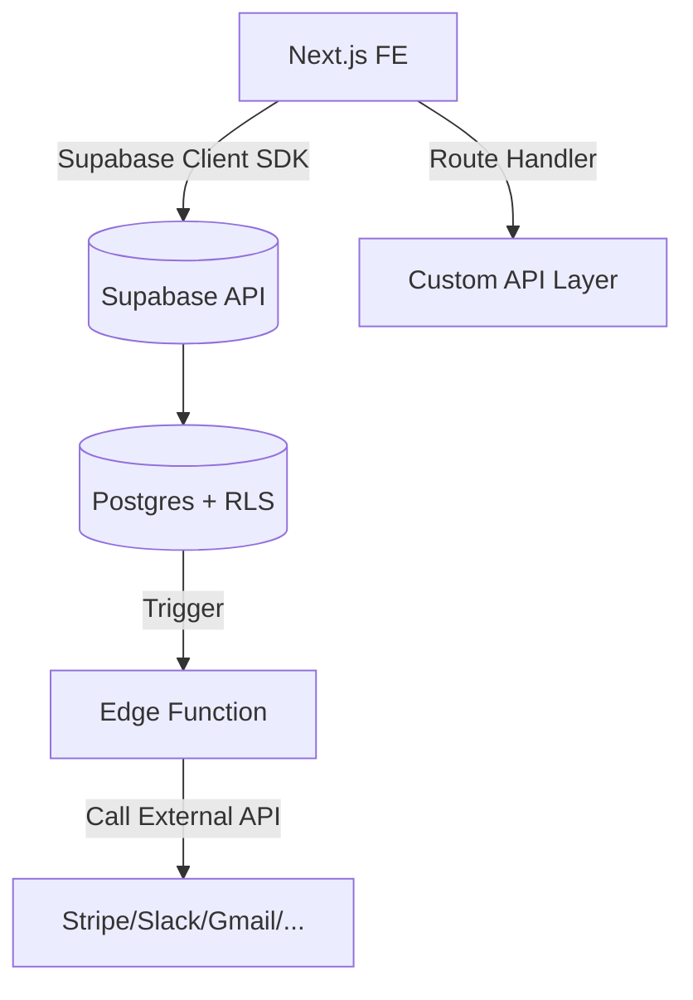
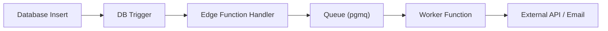

# Part 7. API & Integration Patterns

> Goal: Understand API integration patterns with Supabase, design appropriate API layers, and connect to external services securely, observably, and testably.

## 7.1 🎯 Learning Objectives

After completing this section, developers can:

- Distinguish between **Direct Supabase Query** and **API Layer Integration**.
- Design **Route Handlers** or **Edge Functions** for API logic.
- Integrate **Webhooks (Stripe, Slack, Email)** into the system.
- Implement **event-driven** pattern: trigger in DB → call Edge Function.
- Write logs, retries, and secure API calls correctly.

## 7.2 🧠 API Integration Architecture Overview



> 🔍 Supabase allows you to **both read/write DB directly** and **trigger functions or webhooks** to extend to other systems.

## 7.3 ⚙️ 1️⃣ When to Call Supabase Directly from FE

**Suitable when:**

- Data is not sensitive, already protected by RLS.
- FE only needs simple CRUD.
- No need for transform, cache, or side-effects.

```tsx
"use client";
import { createClient } from "@/lib/supabaseClient";

export default function Profile() {
  const supabase = createClient();
  const [user, setUser] = useState(null);

  useEffect(() => {
    supabase
      .from("profiles")
      .select("*")
      .then(({ data }) => setUser(data?.[0]));
  }, []);
}
```

✅ Advantages: fast, concise, realtime.
⚠️ Disadvantages: no control over complex logic, hard to trace, tightly dependent on RLS.

## 7.4 ⚙️ 2️⃣ When to Use Intermediate API Layer (Route Handler)

**Suitable when:**

- Need **complex business logic** (query multiple tables, logic, condition checks).
- Want to **hide logic** or **avoid exposing Supabase key directly**.
- Need **additional logging / retry / external integration steps**.

Example:

```ts
// app/api/invoices/route.ts
import { createServer } from "@/lib/supabaseServer";
import { NextResponse } from "next/server";

export async function POST(req: Request) {
  const supabase = createServer();
  const body = await req.json();

  const { data, error } = await supabase
    .from("invoices")
    .insert({ ...body, created_at: new Date() });

  if (error) return NextResponse.json({ error }, { status: 400 });

  // Call external webhook (e.g., send email)
  await fetch(process.env.NOTIFY_URL!, {
    method: "POST",
    headers: { "Content-Type": "application/json" },
    body: JSON.stringify({ event: "invoice_created", data }),
  });

  return NextResponse.json({ message: "Invoice created", data });
}
```

✅ Advantages:

- Easy to add retry, logging, custom auth.
- Easy to test (Postman / integration tests).
  ⚠️ Disadvantages:
- Lose realtime.
- Must maintain intermediate layer (DevOps + CI).

## 7.5 ⚙️ 3️⃣ When to Use Edge Function

**Suitable when:**

- Need to run server-side logic **outside user request context**.
- Handle trigger events from DB or cron (e.g., "invoice created" → send email).
- Call external APIs with **service role key** (secure, higher permissions).

Example: `functions/notify-slack/index.ts`

```ts
import { serve } from "https://deno.land/std@0.168.0/http/server.ts";
import { createClient } from "https://esm.sh/@supabase/supabase-js@2";

serve(async (req) => {
  const event = await req.json();
  console.log("🔔 Received event:", event);

  await fetch("https://hooks.slack.com/services/XXXXX", {
    method: "POST",
    body: JSON.stringify({ text: `New invoice: ${event.data.id}` }),
  });

  return new Response("ok", { status: 200 });
});
```

Deploy:

```bash
supabase functions deploy notify-slack
```

## 7.6 🧩 4️⃣ Webhook from Supabase (Trigger → Edge Function)

### Create Trigger in DB

```sql
create or replace function notify_new_invoice()
returns trigger as $$
declare
  payload jsonb;
begin
  payload := jsonb_build_object('id', new.id, 'amount', new.amount);
  perform net.http_post(
    url := 'https://<project>.functions.supabase.co/notify-slack',
    headers := jsonb_build_object('Content-Type', 'application/json'),
    body := payload
  );
  return new;
end;
$$ language plpgsql security definer;

create trigger on_invoice_created
after insert on invoices
for each row execute function notify_new_invoice();
```

> ✅ When invoice is inserted → trigger calls Slack function.

## 7.7 ⚡ 5️⃣ Integrate External Webhooks (Stripe, GitHub, etc.)

### Stripe Webhook Example

`app/api/stripe/route.ts`

```ts
import { headers } from "next/headers";
import Stripe from "stripe";
import { createServer } from "@/lib/supabaseServer";

const stripe = new Stripe(process.env.STRIPE_SECRET_KEY!);

export async function POST(req: Request) {
  const sig = headers().get("stripe-signature")!;
  const text = await req.text();

  try {
    const event = stripe.webhooks.constructEvent(
      text,
      sig,
      process.env.STRIPE_WEBHOOK_SECRET!
    );

    if (event.type === "checkout.session.completed") {
      const session = event.data.object as any;
      const supabase = createServer();
      await supabase
        .from("payments")
        .insert({ stripe_id: session.id, email: session.customer_email });
    }

    return new Response("ok", { status: 200 });
  } catch (err: any) {
    console.error(err);
    return new Response("Webhook Error", { status: 400 });
  }
}
```

> ⚠️ **Don't parse JSON before verifying signature** — Stripe requires raw body.

## 7.8 🧭 Event-driven Integration Pattern

When the system becomes more complex, you should use the **Event → Function → Queue** pattern:



### Advantages

- Don't block user requests.
- Have retry / logs.
- Easy to extend when adding events.

## 7.9 🧠 Error Handling & Logging

### Log Request / Response

```ts
try {
  const res = await fetch(apiUrl, options);
  if (!res.ok) throw new Error(`HTTP ${res.status}`);
  const data = await res.json();
  console.log("✅ API success", data);
} catch (err) {
  console.error("❌ API error", err);
  await supabase.from("api_log").insert({
    endpoint: apiUrl,
    status: "failed",
    error: String(err),
  });
}
```

### `api_log` Table

```sql
create table api_log (
  id bigserial primary key,
  endpoint text,
  status text,
  error text,
  created_at timestamptz default now()
);
```

## 7.10 🧰 Security & Rate Limiting

1. **Don't expose service key** — only use in Edge Functions or Route Handlers.
2. **Verify signature** with webhooks (Stripe, Slack, GitHub…).
3. **Limit requests** with middleware:

   ```ts
   // app/middleware.ts
   import { NextResponse } from "next/server";
   export function middleware(req) {
     const ip = req.headers.get("x-forwarded-for");
     // Simple rate limit logic
     return NextResponse.next();
   }
   ```

4. **Hide sensitive endpoints** (place under `/api/internal/`) and protect with token header.
5. **Log all API errors** to trace via Supabase Logs.

## 7.11 🧭 Completion Checklist

- [ ] Know when to call Supabase directly vs intermediate API.
- [ ] Can create Route Handler for CRUD + external API calls.
- [ ] Can create Edge Function to receive webhooks from DB.
- [ ] Can integrate Stripe / Slack / Gmail webhooks.
- [ ] Understand event-driven pattern: Trigger → Function → Queue.
- [ ] Have `api_log` table to store traces & errors.

## 7.12 💡 Internal Best Practices

1. **Route Handler = short logic, Edge Function = complex logic.**
2. **Always verify signature for webhooks.**
3. **Don't send requests outside DB transactions.**
4. **Idempotent API** — calling multiple times doesn't cause duplicates.
5. **Add detailed logs** in Edge Functions (console.log + table log).
6. **Use pgmq for retries** when API calls fail.
7. **Clearly separate public/private endpoints.**
8. **Keep all integration keys in Supabase secrets, not local .env.**
9. **Limit API call timeout ≤ 10s.**
10. **Document all internal endpoints clearly in `/docs/api.md`.**

## 7.13 📚 References

- [Supabase Functions & Webhooks](https://supabase.com/docs/guides/functions)
- [Supabase pg_net (HTTP client)](https://supabase.com/docs/guides/database/extensions/pg-net)
- [Next.js Route Handlers](https://nextjs.org/docs/app/building-your-application/routing/route-handlers)
- [Stripe Webhook Verification](https://stripe.com/docs/webhooks/signatures)
- [Supabase Queue (pgmq)](https://supabase.com/docs/guides/database/extensions/pgmq)

## 7.14 🧾 Output After This Section

> After completing Part 7, new developers will be able to:
>
> - [x] Choose the right API integration pattern.
> - [x] Write Route Handlers for CRUD and webhooks.
> - [x] Write Edge Functions to handle event-driven flows.
> - [x] Successfully integrate Stripe/Slack/GitHub webhooks.
> - [x] Log and secure APIs according to standards.
