# 🔐 Part 2. Authentication

> Goal: Master the complete registration – login – session management – route protection flow in Next.js + Supabase.

## 2.1 🎯 Learning Objectives

After completing this section, developers can:

- Understand how **Supabase Auth works** (JWT, claims, anon/service role key).
- Configure **Next.js + Supabase** for login/logout.
- Create basic **login / signup / reset password UI**.
- Protect routes with middleware (server-side).
- Attach user profile and metadata to database.

## 2.2 🔍 Supabase Auth Overview

### Auth Architecture

Supabase Auth is based on:

- **Postgres** as core (user data stored in `auth.users` table)
- **JWT** to authenticate client requests
- **Policies (RLS)** control access at DB layer

```mermaid
sequenceDiagram
Frontend->>Supabase Auth: Email/password, OAuth, Magic Link
Supabase Auth->>Postgres: Create user record
Postgres-->>Supabase Auth: Return user_id
Supabase Auth-->>Frontend: JWT (contains user_id, role, claims)
Frontend->>Database: Send query + JWT in header
Database->>Policy: Check `auth.uid()` → Allow / Deny
```



### Key Concepts

| Concept                      | Explanation                                                                |
| ---------------------------- | -------------------------------------------------------------------------- |
| **Anon Key**                 | Public key used in frontend to call Supabase API (limited permissions).    |
| **Service Role Key**         | Used for backend (Edge Functions / server) — has permission to bypass RLS. |
| **JWT Token**                | Contains user info (id, role, email, metadata). Sent in every request.     |
| **RLS (Row-Level Security)** | Policy in DB checks `auth.uid()` to determine access permissions.          |

## 2.3 🧱 Setup Auth in Next.js

### Install Additional Packages

```bash
pnpm add @supabase/ssr
```

`@supabase/ssr` helps **maintain Supabase session on server** (important for App Router).

### Standard Internal Helper Structure

#### `/lib/supabaseClient.ts`

Update `createClient` to use `createBrowserClient` from `@supabase/ssr`.

```ts
import { createBrowserClient } from "@supabase/ssr";

export const createClient = () =>
  createBrowserClient(
    process.env.NEXT_PUBLIC_SUPABASE_URL!,
    process.env.NEXT_PUBLIC_SUPABASE_ANON_KEY!
  );
```

#### `/lib/supabaseServer.ts`

```ts
import { createServerClient } from "@supabase/ssr";
import { cookies } from "next/headers";

export async function createServer() {
  const cookieStore = await cookies();

  return createServerClient(
    process.env.NEXT_PUBLIC_SUPABASE_URL!,
    process.env.NEXT_PUBLIC_SUPABASE_ANON_KEY!,
    {
      cookies: {
        getAll() {
          return cookieStore.getAll();
        },
        setAll(cookiesToSet) {
          try {
            cookiesToSet.forEach(({ name, value, options }) =>
              cookieStore.set(name, value, options)
            );
          } catch {
            // The `setAll` method was called from a Server Component.
            // This can be ignored if you have middleware refreshing
            // user sessions.
          }
        },
      },
    }
  );
}
```

### Middleware to Protect Routes

`/middleware.ts`

```ts
import { NextResponse, type NextRequest } from "next/server";
import { createServer } from "@/lib/supabaseServer";

export async function middleware(req: NextRequest) {
  const res = NextResponse.next();
  const supabase = await createServer();
  const { data } = await supabase.auth.getSession();

  // If no session → redirect to login page
  if (!data.session && req.nextUrl.pathname.startsWith("/dashboard")) {
    return NextResponse.redirect(new URL("/signin", req.url));
  }
  return res;
}

export const config = {
  matcher: ["/dashboard/:path*"],
};
```

## 2.4 🧭 Login / Signup / Logout Flow

### Sign Up

`/app/signup/page.tsx`

```ts
"use client";
import { useState } from "react";
import { createClient } from "@/lib/supabaseClient";

export default function Signup() {
  const supabase = createClient();
  const [email, setEmail] = useState("");
  const [password, setPassword] = useState("");

  const handleSignup = async () => {
    const { error } = await supabase.auth.signUp({ email, password });
    if (error) alert(error.message);
    else alert("Check your email to confirm signup!");
  };

  return (
    <div>
      <h2>Sign up</h2>
      <input onChange={(e) => setEmail(e.target.value)} placeholder="Email" />
      <input
        type="password"
        onChange={(e) => setPassword(e.target.value)}
        placeholder="Password"
      />
      <button onClick={handleSignup}>Register</button>
    </div>
  );
}
```

### Sign In

`/app/signin/page.tsx`

```ts
"use client";
import { useState } from "react";
import { createClient } from "@/lib/supabaseClient";
import { useRouter } from "next/navigation";

export default function Login() {
  const [email, setEmail] = useState("");
  const [password, setPassword] = useState("");
  const router = useRouter();
  const supabase = createClient();

  const handleLogin = async (email: string, password: string) => {
    const { error } = await supabase.auth.signInWithPassword({
      email,
      password,
    });
    if (error) alert(error.message);
    else router.push("/dashboard");
  };

  return (
    <div>
      <h2>Sign in</h2>
      <input onChange={(e) => setEmail(e.target.value)} placeholder="Email" />
      <input
        type="password"
        onChange={(e) => setPassword(e.target.value)}
        placeholder="Password"
      />
      <button onClick={() => handleLogin(email, password)}>Login</button>
    </div>
  );
}
```

### Sign Out

`/app/components/LogoutButton.tsx`

```ts
"use client";
import { createClient } from "@/lib/supabaseClient";
import { useRouter } from "next/navigation";

export default function LogoutButton() {
  const router = useRouter();
  const supabase = createClient();

  const handleLogout = async () => {
    await supabase.auth.signOut();
    router.push("/signin");
  };

  return <button onClick={handleLogout}>Logout</button>;
}
```

## 2.5 🧩 Sync User Profile

After signup, Supabase only has a record in `auth.users`.
You should also sync a `public.profiles` table to store metadata or additional information.

### SQL Migration

`/supabase/migrations/20251105120000_create_profiles_table.sql`

```sql
create table profiles (
  id uuid references auth.users on delete cascade primary key,
  full_name text,
  avatar_url text,
  created_at timestamptz default now()
);
alter table profiles enable row level security;

create policy "Public profiles are viewable by owner"
on profiles for select
using ( auth.uid() = id );

create policy "Users can insert their own profile"
on profiles for insert
with check ( auth.uid() = id );
```

---

### Trigger to Auto-Create Profile

`/supabase/migrations/20251105120100_trigger_sync_profile.sql`

```sql
create function public.handle_new_user()
returns trigger as $$
begin
  insert into public.profiles (id) values (new.id);
  return new;
end;
$$ language plpgsql security definer;

create trigger on_auth_user_created
after insert on auth.users
for each row execute procedure public.handle_new_user();
```

> ✅ When user signs up → trigger automatically creates corresponding profile.

## 2.6 🧩 Metadata & Claims

You can add **custom metadata** to JWT to support complex RLS (like role or org_id).

### Update Metadata

```ts
await supabase.auth.updateUser({
  data: { role: "admin", organization_id: "org_abc123" },
});
```

### Access Metadata in Policy

```sql
create policy "Org members only"
on tasks
for select
using (
  auth.jwt()->>'organization_id' = organization_id
);
```

## 2.7 🛡️ Protect Routes (Protected Routes)

- Use **middleware.ts** (server-side) to redirect if not logged in.
- Use **server component** to fetch user session.

Example:

```tsx
import { createServer } from "@/lib/supabaseServer";

export default async function DashboardPage() {
  const supabase = createServer();
  const { data } = await supabase.auth.getUser();

  if (!data.user) return <div>Unauthorized</div>;
  return <div>Welcome, {data.user.email}</div>;
}
```

## 2.8 🧭 Password Reset & Magic Link

### Send Reset Link

```ts
await supabase.auth.resetPasswordForEmail(email, {
  redirectTo: "http://localhost:3000/reset-password",
});
```

### Magic Link Login (email-only)

```ts
await supabase.auth.signInWithOtp({
  email: "user@example.com",
});
```

> When user clicks link in email → Supabase will automatically create session and redirect to FE.

## 2.9 ✅ Completion Checklist

- [ ] Understand Supabase Auth mechanism and JWT
- [ ] Signup / login / logout works
- [ ] Middleware redirects unauthenticated users
- [ ] Have `profiles` table synced with user metadata
- [ ] Understand how to add custom claims to JWT
- [ ] Can protect `/dashboard` page

## 2.10 💡 Internal Best Practices

1. **Never store passwords manually** — always use `auth.signUp` API.
2. **Don't share service key** with FE (only use anon key).
3. **Always sync user profile** using trigger, don't create manually.
4. **Always enable RLS** for every table related to users.
5. **Middleware only redirects** – don't handle heavy logic.
6. **Clearly separate client/server Supabase client** (`createClient` vs `createServer`).
7. **Always test logout & expired session** when implementing auth.

## 2.11 📚 References

- [Supabase Auth Docs](https://supabase.com/docs/guides/auth)
- [Next.js App Router + Supabase Auth](https://supabase.com/docs/guides/auth/server-side/nextjs)
- [Postgres RLS Docs](https://supabase.com/docs/guides/database/postgres/row-level-security)
- [Supabase Next Demo](https://github.com/lamngockhuong/supabase-next-demo)

## 2.12 🧾 Output After This Section

After completing Part 2, new developers must:

- [x] Understand Auth architecture (JWT, anon key, service role).
- [x] Create complete login/logout flow.
- [x] Have middleware protecting `/dashboard` route.
- [x] Have `profiles` table synced with `auth.users`.
- [x] Can add metadata (role, org_id) for use in RLS.
