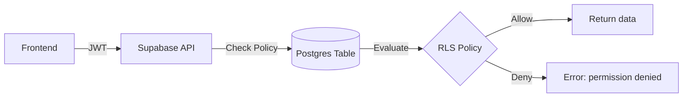

# 🔑 Part 3. Authorization (RLS & Policy)

> Goal: Understand how Supabase uses RLS to protect data, write secure policies for each table, and attach metadata (role, org_id) from JWT to policies.

## 3.1 🎯 Learning Objectives

After completing this section, developers can:

- Understand how **RLS (Row-Level Security)** works in Postgres/Supabase.
- Know how to enable/disable RLS, write policies for CRUD.
- Use **`auth.uid()`** and **JWT claims** in policies.
- Design secure **multi-tenant** (multiple organizations, multiple users).
- Manage roles (admin, member, guest) at DB layer.

## 3.2 🔍 Authorization Overview in Supabase

### Auth vs Authorization

| Concept            | Role                                                           | Handled Where              |
| ------------------ | -------------------------------------------------------------- | -------------------------- |
| **Authentication** | Verify user identity (login, token, session)                   | Supabase Auth              |
| **Authorization**  | Determine what they **are allowed to do** (view, edit, delete) | **RLS Policy in Database** |

### Authorization Architecture



> ✅ The decision of "who can access" is **right in the DB**, not in FE code or API.

## 3.3 🧱 Enable RLS and Basic Policies

### Step 1. Enable RLS for Table

```sql
alter table profiles enable row level security;
```

### Step 2. Create Policy for `SELECT`

```sql
create policy "Users can view their own profile"
on profiles
for select
using ( auth.uid() = id );
```

> ✅ Meaning: user can only view records where the record's `id` matches `auth.uid()` from JWT.

### Step 3. Policy for `INSERT`

```sql
create policy "Users can insert their own profile"
on profiles
for insert
with check ( auth.uid() = id );
```

### Step 4. Policy for `UPDATE`

```sql
create policy "Users can update their own profile"
on profiles
for update
using ( auth.uid() = id )
with check ( auth.uid() = id );
```

> 🔎 **`using`** checks when _reading records_, while **`with check`** checks when _writing/inserting/updating_.

## 3.4 🧩 Helper Functions in Supabase RLS

| Function       | Description                                                         |
| -------------- | ------------------------------------------------------------------- |
| `auth.uid()`   | Returns `user_id` from JWT.                                         |
| `auth.jwt()`   | Returns entire JWT payload as JSON.                                 |
| `auth.role()`  | Returns role of accessing user (usually `authenticated` or `anon`). |
| `auth.email()` | Returns user email if available.                                    |

Example:

```sql
create policy "Admins can see all"
on users
for select
using ( auth.jwt()->>'role' = 'admin' );
```

## 3.5 🏢 Design Authorization for Multi-tenant

### Sample Data Model

```sql
create table organizations (
  id uuid primary key default gen_random_uuid(),
  name text not null
);

create table members (
  id uuid primary key default gen_random_uuid(),
  organization_id uuid references organizations(id),
  user_id uuid references auth.users(id),
  role text check (role in ('admin', 'member')),
  created_at timestamptz default now()
);
```

### Policy for `organizations` Table

```sql
alter table organizations enable row level security;

create policy "Org members can view their organization"
on organizations
for select
using (
  id in (
    select organization_id from members where user_id = auth.uid()
  )
);
```

### Policy for `members` Table

```sql
alter table members enable row level security;

create policy "Members can view members in their org"
on members
for select
using (
  organization_id in (
    select organization_id from members where user_id = auth.uid()
  )
);
```

> 👉 This ensures users only see their organization's data, never other organizations' data — **even if a hacker changes the ID**.

## 3.6 🧩 Using JWT Metadata for Role & Org

### When User Logs In, JWT Contains Metadata

```json
{
  "sub": "user_123",
  "email": "john@example.com",
  "role": "admin",
  "organization_id": "org_456"
}
```

### Policy Using Metadata

```sql
create policy "Admins can view all org data"
on organizations
for select
using (
  auth.jwt()->>'role' = 'admin'
);
```

> ✅ Role/org_id data is added using `updateUser({ data: { role, organization_id } })` in Supabase Auth.

## 3.7 🧩 Comprehensive Role-based Policy (RBAC)

| Role     | Action                      | Example Policy                  |
| -------- | --------------------------- | ------------------------------- |
| `admin`  | View & edit all data in org | `auth.jwt()->>'role' = 'admin'` |
| `member` | Only view/edit own records  | `auth.uid() = created_by`       |
| `guest`  | Only read public data       | `auth.role() = 'anon'`          |

Example: RBAC Policy for `tasks` Table

```sql
alter table tasks enable row level security;

create policy "Admins can manage all tasks"
on tasks for all
using ( auth.jwt()->>'role' = 'admin' );

create policy "Members can manage own tasks"
on tasks for all
using ( auth.uid() = created_by );

create policy "Guests can view public tasks"
on tasks for select
using ( visibility = 'public' );
```

## 3.8 🧮 Testing Policies

### Quick Test Method with SQL

```sql
-- Simulate user login
set role authenticated;
set jwt.claims.role = 'member';
set jwt.claims.sub = 'user_123';

-- Test SELECT
select * from tasks;
```

### Check via Supabase Dashboard → SQL Editor

- Run queries as above with `Run as Authenticated User`.
- Try different JWT metadata to verify results.

## 3.9 🧩 Using Policies Combined with Triggers (Audit Log)

Example logging every time user accesses `tasks` table

```sql
create table audit_log (
  id bigserial primary key,
  user_id uuid,
  action text,
  table_name text,
  at timestamptz default now()
);

create function log_task_access()
returns trigger as $$
begin
  insert into audit_log (user_id, action, table_name)
  values (auth.uid(), TG_OP, TG_TABLE_NAME);
  return new;
end;
$$ language plpgsql;

create trigger trg_log_task_access
after select or insert or update or delete on tasks
for each statement execute procedure log_task_access();
```

## 3.10 🧭 Completion Checklist

- [ ] Know how to enable/disable RLS and write basic policies.
- [ ] Understand `auth.uid()` and `auth.jwt()`.
- [ ] Can write multi-tenant policies.
- [ ] Apply RBAC (admin/member/guest) at DB layer.
- [ ] Test policies using SQL or Supabase Dashboard.
- [ ] Understand how to attach metadata to JWT for flexible policies.

## 3.11 💡 Internal Best Practices

1. **Always enable RLS** for all tables (except system tables).
2. **Don't use service key** to bypass RLS except special cases (Edge Function admin).
3. **Each table → have at least 1 clear SELECT, INSERT, UPDATE, DELETE policy**.
4. **Don't rely on frontend code** to check access permissions.
5. **Metadata in JWT only for context** – doesn't replace complex logic checks.
6. **Keep policy files versioned** with migrations (`migrations/policies.sql`).
7. **Test policies** every time you add a new table or role.
8. **Avoid writing duplicate policy logic — split by action**.
9. **Always review "superuser" (admin) policies** to avoid leaking all data.
10. **Use comments in SQL** to describe each policy's meaning (useful when onboarding new devs).

## 3.12 📚 References

- [Supabase RLS Guide](https://supabase.com/docs/guides/auth/row-level-security)
- [PostgreSQL Row-Level Security Docs](https://www.postgresql.org/docs/current/ddl-rowsecurity.html)
- [Supabase Auth JWT Custom Claims](https://supabase.com/docs/guides/auth/auth-jwt)
- [Example: Multi-tenant SaaS with RLS](https://supabase.com/docs/guides/auth/row-level-security#multi-tenant-rls)

## 3.13 🧾 Output After This Section

> After completing Part 3, new developers should:
>
> - [x] Understand how RLS and policies work.
> - [x] Know how to write policies for each CRUD operation.
> - [x] Can create multi-tenant policies (by organization).
> - [x] Apply RBAC (role-based) using JWT claims.
> - [x] Test and verify each user's access permissions.
