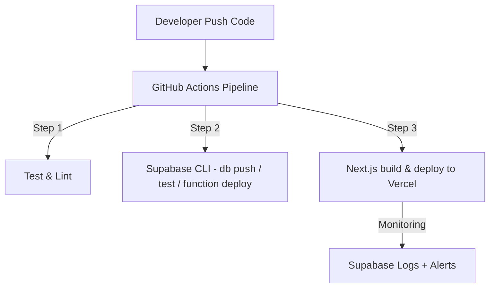
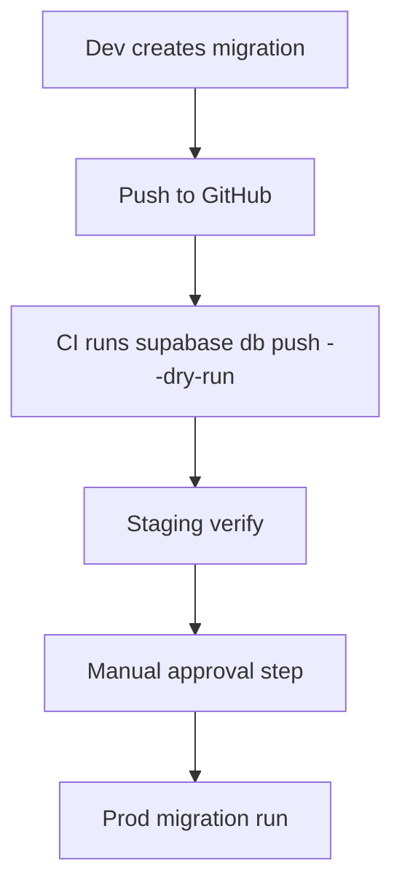

# ⚙️ Part 8. CI/CD & DevOps

> Goal: Set up automated CI/CD processes for Supabase and Next.js, manage multiple environments (dev/staging/prod), and ensure safe deployment and easy rollback.

---

## 8.1 🎯 Learning Objectives

After completing this section, developers can:

- Set up CI/CD pipeline (GitHub Actions) for Supabase + Next.js.
- Automate **migrations, Edge Functions deployment, FE build**.
- Manage multiple environments and secrets securely.
- Understand monitoring, logging, and rollback.
- Know how to optimize cost & DevOps effort for Supabase-first projects.

---

## 8.2 🧩 CI/CD Architecture Overview



---

## 8.3 ⚙️ CI/CD Preparation

### 1️⃣ Install Supabase CLI in Pipeline

```yaml
- name: Setup Supabase CLI
  uses: supabase/setup-cli@v1
  with:
    version: latest
```

### 2️⃣ Configure Secrets in GitHub

| Name                                                         | Description                  |
| ------------------------------------------------------------ | ---------------------------- |
| `SUPABASE_ACCESS_TOKEN`                                      | Supabase CLI token           |
| `SUPABASE_PROJECT_REF`                                       | Project ref ID (`abcd1234`)  |
| `SUPABASE_DB_PASSWORD`                                       | DB password (for migrations) |
| `VERCEL_TOKEN`                                               | Next.js deploy token         |
| `VERCEL_ORG_ID` / `VERCEL_PROJECT_ID`                        | From Vercel dashboard        |
| `NEXT_PUBLIC_SUPABASE_URL` / `NEXT_PUBLIC_SUPABASE_ANON_KEY` | For FE build                 |

---

## 8.4 🧰 Sample CI/CD Pipeline

`.github/workflows/ci.yml`

```yaml
name: Supabase + Next.js CI/CD

on:
  push:
    branches: [main]
  workflow_dispatch:

jobs:
  build-test-deploy:
    runs-on: ubuntu-latest
    steps:
      - name: Checkout repo
        uses: actions/checkout@v4

      - name: Setup Node.js
        uses: actions/setup-node@v4
        with:
          node-version: 20

      - name: Setup Supabase CLI
        uses: supabase/setup-cli@v1
        with:
          version: latest

      - name: Install dependencies
        run: npm ci

      - name: Lint & Unit Test
        run: npm run lint && npm run test --if-present

      - name: Supabase Migration & Functions
        env:
          SUPABASE_ACCESS_TOKEN: ${{ secrets.SUPABASE_ACCESS_TOKEN }}
          SUPABASE_PROJECT_REF: ${{ secrets.SUPABASE_PROJECT_REF }}
        run: |
          supabase link --project-ref $SUPABASE_PROJECT_REF
          supabase db push
          supabase functions deploy --all

      - name: Build Next.js
        run: npm run build

      - name: Deploy to Vercel
        run: |
          npm i -g vercel
          vercel deploy --prebuilt --prod \
            --token=${{ secrets.VERCEL_TOKEN }}
```

> 💡 `supabase functions deploy --all` will automatically deploy all new/updated functions.

---

## 8.5 🧩 Multi-environment Setup (dev/staging/prod)

### 📂 Environment Structure

```
.env.development
.env.staging
.env.production
```

### Example `.env.production`

```bash
NEXT_PUBLIC_SUPABASE_URL=https://prod-project.supabase.co
NEXT_PUBLIC_SUPABASE_ANON_KEY=...
SUPABASE_PROJECT_REF=prod-xyz123
```

### GitHub Actions Dynamic Env

```yaml
env:
  SUPABASE_PROJECT_REF: ${{ github.ref == 'refs/heads/main' && secrets.PROD_REF || secrets.STG_REF }}
```

> ✅ Automatically select different Supabase projects based on branch (`staging` or `main`).

---

## 8.6 🧱 Migration Workflow (Production-safe)



### Example in Pipeline

```yaml
- name: Supabase Migration Dry Run
  run: supabase db push --dry-run

- name: Wait for staging approval
  if: github.ref == 'refs/heads/main'
  uses: trstringer/manual-approval@v1
  with:
    approvers: "teamlead1, teamlead2"

- name: Apply Production Migration
  if: github.ref == 'refs/heads/main'
  run: supabase db push
```

> 🔐 **Always require review before applying migrations to production.**

---

## 8.7 🧩 Deploy Edge Functions Separately

When you only update functions without changing schema.

```bash
supabase functions deploy send-reminder
```

### CI Integration

```yaml
- name: Deploy Edge Functions only
  run: supabase functions deploy send-reminder --project-ref $SUPABASE_PROJECT_REF
```

> ✅ Helps deploy faster without affecting DB migrations.

---

## 8.8 🧠 Rollback Strategy

### 1️⃣ Rollback Migration

```bash
supabase db remote commit --message "rollback to previous version"
supabase db push
```

Or restore from Supabase Dashboard backup (auto snapshot daily).

### 2️⃣ Rollback Function

```bash
supabase functions deploy send-reminder@<previous-version>
```

> ✅ Keeping function files versioned in Git helps quick rollback.

---

## 8.9 🧭 Monitoring & Observability

| Component           | How to Monitor                        | Tool              |
| ------------------- | ------------------------------------- | ----------------- |
| **Edge Function**   | `supabase functions logs --name <fn>` | Supabase CLI      |
| **Cron/pgmq Job**   | Query `cron.job_run_details`          | Supabase SQL      |
| **Frontend deploy** | Vercel / Cloudflare dashboard         | Web UI            |
| **Error tracking**  | Sentry or Logflare                    | Optional          |
| **System alert**    | Email / Slack webhook                 | via Edge Function |

---

## 8.10 🧮 Backup & Disaster Recovery

- Supabase auto-backup daily (Pro plan).
- Optional manual export:

  ```bash
  supabase db dump --remote > backup-2025-11-06.sql
  ```

- Restore when needed:

  ```bash
  supabase db restore --file backup-2025-11-06.sql
  ```

- Always backup before large migrations or bulk data deletion.

---

## 8.11 🧰 Local DevOps Utilities

Create `scripts/dev.sh` script for devs to run full local environment:

```bash
#!/bin/bash
echo "🧱 Starting local Supabase + Web..."
supabase start &
pnpm run dev
```

Create `scripts/teardown.sh`:

```bash
#!/bin/bash
echo "🧹 Cleaning up..."
supabase stop
docker system prune -f
```

> Helps devs set up local easily, not dependent on manual steps.

---

## 8.12 🧭 Completion Checklist

- [ ] GitHub Actions pipeline works (build + migrate + deploy).
- [ ] Supabase & Vercel secrets configured securely.
- [ ] Have dry-run migration + approval mechanism before prod.
- [ ] Function deployment automated.
- [ ] Have way to rollback migrations & functions.
- [ ] Have logs + alerts for jobs and functions.

---

## 8.13 💡 Internal Best Practices

1. **Clearly separate branch → environment (dev/stg/prod).**
2. **Don't run migrations automatically on main** without approval.
3. **Keep CLI version consistent between dev and CI** (`supabase --version`).
4. **Always check `supabase db diff` before pushing.**
5. **Link commit message → migration name** for easy tracing.
6. **Keep secrets in GitHub → don't commit .env files.**
7. **Don't deploy functions not tested locally (`supabase functions serve`).**
8. **Use release tags `vX.Y.Z` for official deployments.**
9. **Document all jobs in CI/CD changelog.**
10. **Always have rollback scripts (migration + function).**

---

## 8.14 📚 References

- [Supabase CLI – Managing Environments](https://supabase.com/docs/guides/cli/managing-environments)
- [Supabase db push / diff / dump](https://supabase.com/docs/reference/cli/supabase-db-push)
- [Supabase Functions Deploy](https://supabase.com/docs/reference/cli/supabase-functions-deploy)
- [GitHub Actions Manual Approval](https://github.com/marketplace/actions/manual-approval)
- [Vercel CLI Deploy Docs](https://vercel.com/docs/cli/deploy)

---

## 8.15 🧾 Output After This Section

> After completing Part 8, new developers can:
>
> - [x] Understand complete CI/CD process for Supabase + Next.js.
> - [x] Automate migrations, tests, builds, deployments.
> - [x] Manage multi-environment and secrets.
> - [x] Monitor logs, rollback on incidents.
> - [x] Operate Supabase-first projects with minimal DevOps effort.
