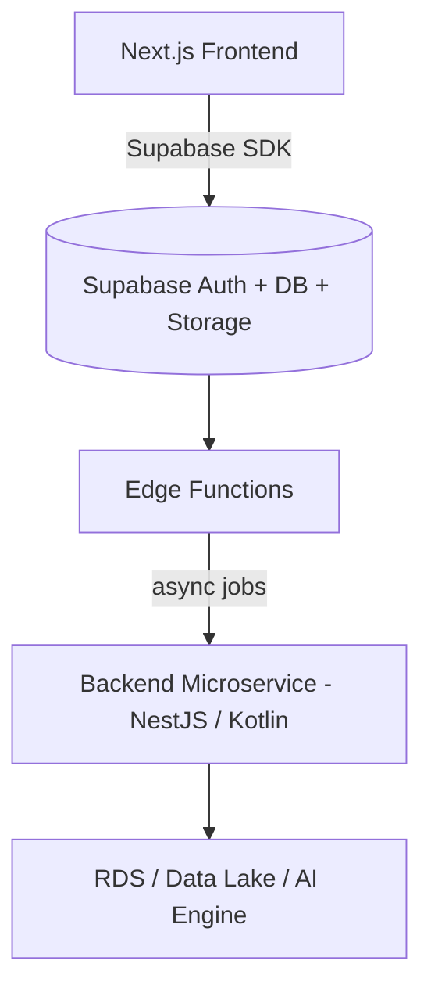

# Part 12. Comparison with Traditional Tech Stack

> Goal: Understand differences between "Supabase-first architecture" and "Traditional Backend API" - in structure, implementation effort, cost, development speed, and long-term operational capability.

## 12.1 🎯 Learning Objectives

After this section, you can:

- Clearly explain when to use **Supabase-first**, when to use **traditional backend**.
- Understand **trade-offs** in performance, cost, and maintainability.
- Easily make technology decisions for real projects.

## 12.2 🧩 Overview Comparison

| Item                        | **Supabase + Next.js**                                         | **Traditional Backend (NestJS / Spring Boot)**      |
| --------------------------- | -------------------------------------------------------------- | --------------------------------------------------- |
| **Overall Architecture**    | Monolithic serverless (Auth, DB, API, Storage in one platform) | Microservice or 3-tier (API + DB + Infra separated) |
| **Initial Setup**           | 5–10 minutes (CLI + project init)                              | 1–2 days (server setup, DB config, auth, deploy)    |
| **Auth / Session**          | Built-in Supabase Auth (JWT, OTP, OAuth)                       | Must install passport.js / Spring Security          |
| **Database**                | Managed PostgreSQL + RLS + triggers                            | Self-hosted PostgreSQL / MySQL or RDS               |
| **Storage / File Upload**   | Supabase Storage (API ready)                                   | AWS S3 / GCP Storage + integration code             |
| **API Layer**               | Supabase client SDK / Edge Functions                           | REST / GraphQL self-defined                         |
| **Batch Job / Cron**        | pg_cron, pgmq, Edge Function schedule                          | Cloud Task / separate cron jobs                     |
| **CI/CD**                   | Supabase CLI + GitHub Actions                                  | Jenkins / GitLab CI requires manual config          |
| **Realtime**                | Supabase Realtime (WS built-in)                                | Redis PubSub / Socket.io / Kafka                    |
| **Initial Cost**            | ~$25–50/month                                                  | ~$70–150/month                                      |
| **Scale Cost**              | By usage (linear)                                              | By instance (step-based)                            |
| **DevOps Effort**           | Low (almost no sysadmin needed)                                | High (must maintain infra, scaling, logs)           |
| **Performance Baseline**    | Good for CRUD and simple APIs                                  | Higher in high-load / compute-heavy                 |
| **Scalability**             | Easy for MVP / small SaaS, limited when deep control needed    | Complete freedom, but requires effort               |
| **Lock-in Risk**            | Medium (Supabase vendor lock-in)                               | Low (can migrate host freely)                       |
| **Security**                | Has RLS, key-based access, clear policies                      | Self-implement middleware, guards, ACL              |
| **Logging & Observability** | Supabase Logs + Dashboard                                      | ELK / Loki / Prometheus must self-deploy            |
| **Developer Experience**    | High, new devs onboard quickly                                 | Good with strong backend team                       |
| **Time to MVP**             | Very fast (1–3 days)                                           | Medium (1–2 weeks)                                  |

## 12.3 ⚙️ Detailed Comparison by Layer

### Authentication & Authorization

| Criteria                                    | Supabase                     | Traditional Backend        |
| ------------------------------------------- | ---------------------------- | -------------------------- |
| Auth provider (email, Google, GitHub, etc.) | Built-in                     | Self-code or use library   |
| JWT / Session                               | Auto-generated, auto refresh | Self-manage refresh tokens |
| Role / RLS                                  | Native in DB                 | Implement in middleware    |
| MFA / OTP                                   | Has plugins ready            | Must add yourself          |
| FE Integration                              | Supabase client SDK, easy    | Manual API login/logout    |

✅ **Supabase Advantages:** Deploy auth extremely fast, JWT security standard.
⚠️ **Disadvantages:** Hard to extend custom claims or complex multi-tenant logic.

### Database & ORM

| Criteria            | Supabase                   | Traditional Backend                |
| ------------------- | -------------------------- | ---------------------------------- |
| Query Layer         | Direct SQL (PostgREST API) | ORM (TypeORM, Hibernate)           |
| Migration           | `supabase db push`         | Flyway / Liquibase / TypeORM CLI   |
| Triggers, Functions | Built-in and auto-deploy   | Self-write SQL / scripts           |
| Row Level Security  | Native                     | Self-code (middleware, ACL)        |
| Monitoring          | Supabase Dashboard         | pgAdmin / Grafana / custom metrics |

✅ **Supabase** suitable for MVP, fast SaaS CRUD.
⚠️ **Traditional Backend** stronger when complex transaction logic or hybrid DB needed.

### API & Integration

| Criteria                 | Supabase                      | Traditional Backend              |
| ------------------------ | ----------------------------- | -------------------------------- |
| API CRUD                 | Auto via PostgREST            | Write REST/GraphQL endpoints     |
| Business Logic           | Edge Functions or Next.js API | Controller + Service Layer       |
| External API Integration | Edge Functions / pg_net       | HTTP client (Axios, Feign, etc.) |
| Rate Limiting            | Middleware self-code          | Built-in in Nest / API Gateway   |
| Custom Serialization     | Limited                       | Full control                     |

✅ **Supabase:** Simplifies backend API.
⚠️ **Traditional:** More flexible when complex logic, deep validation needed.

### CI/CD & DevOps

| Criteria     | Supabase                          | Traditional Backend                |
| ------------ | --------------------------------- | ---------------------------------- |
| Deploy       | CLI (`supabase functions deploy`) | Docker / K8s / EC2                 |
| DB Migration | Auto push                         | Flyway / Liquibase                 |
| Build & Test | GitHub Actions quick & clean      | Jenkins / GitLab CI lots of config |
| Scaling      | Auto-managed                      | Manual or auto-scaling group       |
| Monitoring   | Logs dashboard                    | Grafana, Loki, Prometheus          |
| Backup       | Built-in snapshots                | RDS backup self-setup              |

✅ **Supabase:** Reduces DevOps effort 70–80%.
⚠️ **Traditional:** More flexible with custom infra, multi-region, network layer.

### Cost & Maintainability

| Criteria             | Supabase-first     | Traditional Backend       |
| -------------------- | ------------------ | ------------------------- |
| Cost per user        | Low (usage-based)  | High (instance-based)     |
| Storage              | Shared, auto-scale | Pay per GB S3 / EBS       |
| Compute              | Pay per function   | Pay per hour instance     |
| Maintenance          | Almost 0           | Need DevOps team          |
| Developer Onboarding | Fast (1–2 days)    | Slow (1–2 weeks)          |
| Debug                | Centralized logs   | Distributed across layers |

✅ Supabase helps startups save significant initial costs.
⚠️ When scaling large (millions of users, heavy compute), need hybrid architecture.

## 12.4 🚀 Performance Trade-off

| Workload Type                        | Supabase + Edge Functions              | Traditional Backend          |
| ------------------------------------ | -------------------------------------- | ---------------------------- |
| Small CRUD, realtime, SaaS dashboard | 🟢 Excellent                           | 🟢 Good                      |
| Large batch jobs, long compute       | 🟡 Runtime limited                     | 🟢 Flexible                  |
| Multi-step API pipeline              | 🟡 Limited by service key / call chain | 🟢 Flexible                  |
| High concurrency (>10k RPS)          | 🟡 Cold start impact                   | 🟢 Optimized connection pool |
| Heavy async I/O                      | 🟢 Deno handles well                   | 🟢 Node/Java both fine       |
| CPU-bound processing                 | 🔴 Not suitable                        | 🟢 Good (thread pool)        |

👉 Summary:
Supabase **excels for MVP / small to medium SaaS**,
Traditional Backend **superior when extremely high performance and detailed infrastructure control needed**.

## 12.5 🧠 Dev Experience & Productivity

| Factor               | Supabase-first                | Traditional                      |
| -------------------- | ----------------------------- | -------------------------------- |
| New Dev Onboarding   | 1–2 days                      | 1–2 weeks                        |
| Code to Write        | 30–50% less                   | Lots of boilerplate              |
| Debug auth / DB      | Fast, integrated dashboard    | Must combine multiple logs       |
| Small Team (2–5 dev) | Very suitable                 | Costly setup                     |
| Large Team (10+ dev) | Need clearer code conventions | Easy to split modules            |
| Hotfix / Deploy      | 1 CLI command                 | Pipeline build, restart server   |
| Documentation        | Concise, easy self-learn      | Must document internal standards |

## 12.6 🧮 Effort vs Value Overview

| Phase                      | Supabase Effort             | Traditional Effort | Notes                    |
| -------------------------- | --------------------------- | ------------------ | ------------------------ |
| MVP (0–3 months)           | ⭐ Low                      | 🔺 High            | Supabase wins absolutely |
| Production (3–12 months)   | ⚖️ Medium                   | ⚖️ Medium          | Depends on scale         |
| Large Scale (1M+ users)    | 🔺 Increases (vendor limit) | ⭐ Stable          | Backend has advantage    |
| Long-term Maintenance      | ⭐ Easy                     | ⚠️ Costly          | Supabase auto-updates    |
| DevOps Cost                | ⭐ Low                      | 🔺 High            | No server admin needed   |
| Flexibility (custom logic) | ⚠️ Limited                  | ⭐ High            | Backend more free        |

## 12.7 🧭 When to Choose Supabase

✅ **Use Supabase-first when:**

- Building MVP / small to medium SaaS (<1M users).
- Prioritize speed to market.
- No dedicated DevOps team.
- Need realtime / auth / storage built-in.
- Next.js or frontend-heavy codebase.
- Want to optimize infrastructure costs early stage.

## 12.8 ⚙️ When to Choose Traditional Backend

✅ **Use separate backend when:**

- Complex business logic (multi-step business flow).
- Need to integrate many systems (ERP, payment, data pipeline).
- Have strong backend team or dedicated DevOps.
- Need extremely high performance, network control, connection pooling.
- System needs multi-region / private VPC / fine-grained IAM.

## 12.9 🧾 Quantitative Comparison Summary

| Criteria              | Supabase-first    | Traditional Backend    |
| --------------------- | ----------------- | ---------------------- |
| Setup Project         | 10 minutes        | 1–2 days               |
| Complete MVP          | 2–4 days          | 1–2 weeks              |
| Initial Cost          | $25               | $100+                  |
| DevOps Effort         | 1x                | 5x                     |
| Auth / Storage Ready  | ✅                | ❌                     |
| Realtime / PubSub     | ✅                | ⚠️                     |
| Compute Performance   | ⚠️                | ✅                     |
| Custom Workflow       | ⚠️                | ✅                     |
| Security & Audit      | ✅                | ✅                     |
| Maintainability       | ✅                | ⚠️                     |
| Scaling Limit         | ⚠️ (vendor-based) | ✅                     |
| Feature Release Speed | 🚀 Fast           | ⚙️ Slower              |
| ROI (effort/value)    | ⭐ Highest        | ⚖️ Depends on use case |

## 12.10 💡 Hybrid Architecture Implementation Advice

Many companies now choose **Hybrid model**:

💡 **This pattern ideal when:**

- Supabase handles Auth, CRUD, Realtime.
- Separate backend only for heavy logic or async jobs.
- Easy to scale while keeping costs low early stage.

## 12.11 🧭 Checklist for Choosing Stack for Project

| Question                                           | If "Yes" → Suggestion          |
| -------------------------------------------------- | ------------------------------ |
| Need MVP in < 2 weeks?                             | ✅ Supabase                    |
| Project expects < 1 million users?                 | ✅ Supabase                    |
| Team doesn't have DevOps engineer?                 | ✅ Supabase                    |
| Need realtime UI, chat, dashboard?                 | ✅ Supabase                    |
| Have complex business logic / large batches?       | ✅ Traditional Backend         |
| Need to connect internal systems (ERP, SSO)?       | ✅ Traditional Backend         |
| System needs parallel processing or heavy compute? | ✅ Traditional Backend         |
| Expect global multi-region expansion?              | ⚙️ Hybrid (Supabase + Backend) |

## 12.12 📚 References

- [Supabase vs Firebase vs AWS Amplify](https://supabase.com/docs/guides/resources/compare)
- [Supabase vs Custom Backend Architecture](https://supabase.com/blog/supabase-vs-custom-backend)
- [NestJS Official Docs](https://docs.nestjs.com/)
- [Spring Boot Architecture](https://spring.io/projects/spring-boot)
- [AWS Pricing Calculator](https://calculator.aws/)
- [PostgREST Performance Notes](https://postgrest.org/en/stable/performance.html)

## 12.13 🧾 Output After This Section

> After completing Part 12, new developers can:
>
> - [x] Compare Supabase + Next.js with traditional backend in detail.
> - [x] Understand trade-offs between development speed and scalability.
> - [x] Make appropriate technology decisions for each project.
> - [x] Identify when to combine hybrid architecture.
> - [x] Clearly explain why Supabase is optimal choice for MVP.
