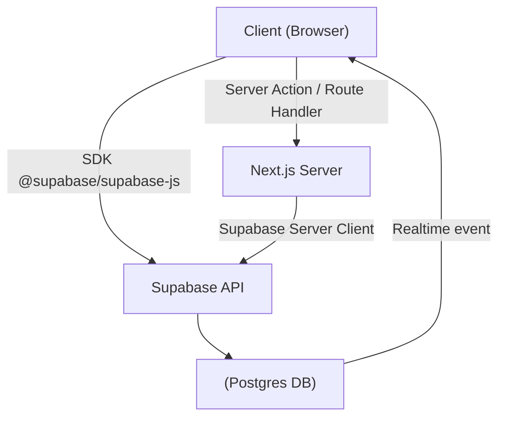

# Part 5. Supabase + Next.js Integration

> Goal: Understand how to integrate Supabase SDK into Next.js App Router (SSR/CSR), perform CRUD securely with RLS, and implement realtime UI + file upload.

## 5.1 🎯 Learning Objectives

After completing this section, developers can:

- Configure Supabase for both **client-side** and **server-side** in Next.js.
- Perform CRUD (Create / Read / Update / Delete) via Server Actions or Route Handlers.
- Understand how to protect queries via RLS and JWT session.
- Update UI in realtime when data changes.
- Upload files securely with Supabase Storage.

## 5.2 🧩 Supabase – Next.js Connection Architecture



### Explanation

- **Client SDK** used for quick UI operations (light fetches, realtime subscriptions).
- **Server Client** used for logic requiring security (create, update, delete).
- **RLS** ensures data is only accessed by valid users.

## 5.3 ⚙️ Setup Supabase Client

### `/lib/supabaseClient.ts`

```ts
import { createBrowserClient } from "@supabase/ssr";

export const createClient = () =>
  createBrowserClient(
    process.env.NEXT_PUBLIC_SUPABASE_URL!,
    process.env.NEXT_PUBLIC_SUPABASE_ANON_KEY!
  );
```

### `/lib/supabaseServer.ts`

```ts
import { cookies } from "next/headers";
import { createServerClient } from "@supabase/ssr";

export const createServer = () => {
  const cookieStore = cookies();
  return createServerClient(
    process.env.NEXT_PUBLIC_SUPABASE_URL!,
    process.env.NEXT_PUBLIC_SUPABASE_ANON_KEY!,
    { cookies: { get: (name) => cookieStore.get(name)?.value } }
  );
};
```

## 5.4 🧠 When to Use Client vs Server

| Situation                                 | Use                              | Explanation                   |
| ----------------------------------------- | -------------------------------- | ----------------------------- |
| Quick data display (UI table, feed)       | Client SDK                       | Has realtime, easy to use     |
| Update, delete, create records            | Server Action / Server Component | Maintain security & stability |
| Complex logic (batch, external API calls) | Route Handler / Edge Function    | Separate for reuse            |
| Fetch when rendering SSR                  | Server SDK                       | Maintain session and SEO      |

## 5.5 💾 Basic CRUD (Server Action)

### `app/subscriptions/page.tsx`

```tsx
import { createServer } from "@/lib/supabaseServer";

export default async function SubscriptionPage() {
  const supabase = createServer();
  const { data: subs } = await supabase
    .from("subscriptions")
    .select("*")
    .order("created_at", { ascending: false });

  return (
    <div className="p-6">
      <h2 className="text-xl font-semibold mb-3">My Subscriptions</h2>
      <ul>
        {subs?.map((s) => (
          <li key={s.id}>
            {s.service_name} – ${s.price} ({s.status})
          </li>
        ))}
      </ul>
    </div>
  );
}
```

### Create New (Server Action)

`app/subscriptions/add.tsx`

```tsx
"use client";

import { useState } from "react";
import { createClient } from "@/lib/supabaseClient";

export default function AddSubscription() {
  const [form, setForm] = useState({ service_name: "", price: 0 });
  const supabase = createClient();

  const handleAdd = async () => {
    const { error } = await supabase.from("subscriptions").insert(form);
    if (error) alert(error.message);
    else alert("Added successfully!");
  };

  return (
    <div>
      <input
        placeholder="Service name"
        onChange={(e) => setForm({ ...form, service_name: e.target.value })}
      />
      <input
        type="number"
        placeholder="Price"
        onChange={(e) =>
          setForm({ ...form, price: parseFloat(e.target.value) })
        }
      />
      <button onClick={handleAdd}>Add</button>
    </div>
  );
}
```

> ✅ Because Supabase has RLS enabled, users can only add records with `user_id = auth.uid()`.

## 5.6 🧭 Route Handlers (Optional API Layer)

`app/api/subscriptions/route.ts`

```ts
import { NextResponse } from "next/server";
import { createServer } from "@/lib/supabaseServer";

export async function POST(req: Request) {
  const supabase = createServer();
  const body = await req.json();
  const { data, error } = await supabase.from("subscriptions").insert(body);
  if (error) return NextResponse.json({ error }, { status: 400 });
  return NextResponse.json(data);
}
```

> Advantages: can add middleware / logging / transform data.
> Use when FE doesn't call Supabase directly or needs external API integration.

## 5.7 ⚡ Realtime Update

Supabase supports **listening to database events** via `channel`.

```tsx
"use client";
import { useEffect, useState } from "react";
import { createClient } from "@/lib/supabaseClient";

export default function RealtimeList() {
  const supabase = createClient();
  const [subs, setSubs] = useState([]);

  useEffect(() => {
    const load = async () => {
      const { data } = await supabase.from("subscriptions").select("*");
      setSubs(data || []);
    };
    load();

    const channel = supabase
      .channel("public:subscriptions")
      .on(
        "postgres_changes",
        { event: "*", schema: "public", table: "subscriptions" },
        (payload) => {
          console.log("Change received!", payload);
          load();
        }
      )
      .subscribe();

    return () => supabase.removeChannel(channel);
  }, []);

  return (
    <ul>
      {subs.map((s) => (
        <li key={s.id}>{s.service_name}</li>
      ))}
    </ul>
  );
}
```

> ⚡ Every time a user adds/edits/deletes a subscription → UI automatically updates in realtime.

## 5.8 🖼️ Upload Files with Supabase Storage

### 1. Create Bucket

In Supabase Dashboard → Storage → Create Bucket → `invoices`

### 2. Enable RLS for Bucket

```sql
create policy "Users can upload own invoices"
on storage.objects for insert
with check ( auth.uid() = owner );
```

### 3. Upload File from Client

```tsx
"use client";
import { createClient } from "@/lib/supabaseClient";

export default function UploadInvoice() {
  const supabase = createClient();

  const handleUpload = async (e: React.ChangeEvent<HTMLInputElement>) => {
    const file = e.target.files?.[0];
    if (!file) return;
    const { data, error } = await supabase.storage
      .from("invoices")
      .upload(`user-${Date.now()}-${file.name}`, file);
    if (error) alert(error.message);
    else alert("Uploaded!");
  };

  return <input type="file" onChange={handleUpload} />;
}
```

### 4. Get Signed URL to Download

```ts
const { data } = await supabase.storage
  .from("invoices")
  .createSignedUrl("user-123-invoice.pdf", 3600);
console.log(data.signedUrl);
```

> ✅ Signed URL allows users to access files temporarily (1 hour).

## 5.9 🧭 Server Components with Session

When rendering SSR, need to get user session:

```tsx
import { createServer } from "@/lib/supabaseServer";

export default async function Dashboard() {
  const supabase = createServer();
  const { data } = await supabase.auth.getUser();
  const user = data.user;

  return (
    <div>
      <h2>Welcome, {user?.email}</h2>
    </div>
  );
}
```

> ✅ Keep session secure, no client-side state needed.

## 5.10 🧩 Error Handling

| Situation        | How to Handle                      | Suggestion                            |
| ---------------- | ---------------------------------- | ------------------------------------- |
| Policy denied    | Check RLS logs or Supabase console | Review `auth.uid()`                   |
| 401 Unauthorized | Session expired                    | Call `supabase.auth.refreshSession()` |
| API Timeout      | Reduce payload or paginate         | `limit()`, `range()`                  |
| Upload error 413 | File > 50MB                        | Compress or split                     |

## 5.11 🧭 Completion Checklist

- [ ] Have set up client & server Supabase in Next.js
- [ ] CRUD works with RLS
- [ ] Understand when to use client SDK vs server SDK
- [ ] Realtime updates UI successfully
- [ ] Upload / download files securely
- [ ] Understand how to attach session and auth to SSR

## 5.12 💡 Internal Best Practices

1. **Always run CRUD through RLS** — don't bypass with service key except Edge Functions.
2. **Use Server Actions or Route Handlers for mutations** → avoid exposing keys.
3. **Realtime should limit schema/table** to save connections.
4. **Upload files → use signed URLs, not public buckets.**
5. **Separate Supabase logic into `/lib/hooks/` or `/lib/repository/`** for easier testing.
6. **Light caching in server components** when fetching static data (`revalidate: 60`).
7. **Don't store JWT in localStorage** — Supabase manages cookies automatically.
8. **Log every important CRUD operation** (use triggers or Edge Functions).

## 5.13 📚 References

- [Supabase JS SDK Docs](https://supabase.com/docs/reference/javascript/start)
- [Next.js App Router Server Actions](https://nextjs.org/docs/app/building-your-application/data-fetching/server-actions)
- [Supabase Realtime Docs](https://supabase.com/docs/guides/realtime)
- [Supabase Storage Security](https://supabase.com/docs/guides/storage)

## 5.14 🧾 Output After This Section

> After completing Part 5, new developers will be able to:
>
> - [x] Create complete CRUD pages with Supabase + Next.js.
> - [x] Update UI in realtime when data changes.
> - [x] Upload files securely using signed URLs.
> - [x] Understand session + RLS flow between client & server.
> - [x] Create secure route handlers or server actions.
