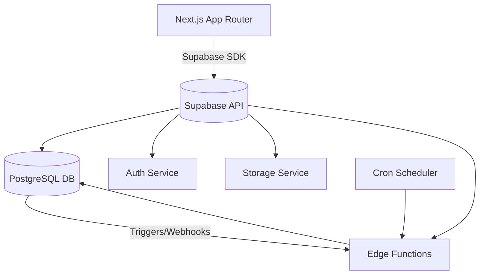

# 🏁 Part 0. Introduction & Overview

> Purpose: Help new developers understand "what Supabase is", "why choose this stack", and "what the learning path looks like" before diving into specific technical details.

## 0.1 🎯 Documentation Goals

### ✅ Purpose

- Provide **step-by-step** knowledge and guidance so new developers can:

  - Understand the **Supabase + Next.js** architecture (Fullstack as one project).
  - Know how to **deploy applications from scratch to production** (Auth, CRUD, RLS, Storage, Cron, Queue, etc.).
  - Master **internal best practices** when writing code, testing, and managing environments.
  - Know how to compare Supabase effectiveness with traditional backends (NestJS, Express, Spring Boot, etc.).

### 👥 Target Audience

- **Frontend Devs** wanting to expand to fullstack.
- **Fullstack Devs** wanting to save backend effort (quick MVP).
- **Intern / Junior Devs** needing to master the internal standard stack.
- **Tech leads / Trainers** needing to use this documentation to train newcomers.

### 🧩 Learning Outcomes

After completing the documentation:

- Can create a **new Supabase project** + **Next.js frontend** from zero.
- Can write CRUD, Auth, RLS, batch jobs, storage, deploy CI/CD independently.
- Understand that **"Supabase = Postgres + Backend service layer"**, not just a database.
- Can **review code / guide others** following best practices.

## 0.2 🧠 Introduction to Supabase

### 💡 Brief Definition

> Supabase is an open-source **Backend-as-a-Service (BaaS)** built on **PostgreSQL**, providing:
>
> - Database (Postgres)
> - Authentication
> - Storage (files, images, etc.)
> - Realtime
> - Edge Functions
> - Cron / Queue
>   → Helps you **build a backend in hours instead of weeks.**

### ⚙️ Main Components

| Component          | Description                                       | Equivalent Role in Traditional Backend |
| ------------------ | ------------------------------------------------- | -------------------------------------- |
| **Database**       | PostgreSQL queryable directly or via REST/GraphQL | RDS / Cloud SQL                        |
| **Auth**           | User management, OAuth, JWT, Magic Link           | Auth service / JWT middleware          |
| **Storage**        | File, image storage, signed URLs                  | S3 / Cloud Storage                     |
| **Edge Functions** | Serverless functions written in JS/TS             | Cloud Functions / Lambda               |
| **Cron**           | Job scheduling (pg_cron, pg_net)                  | BullMQ / Cloud Scheduler               |
| **Realtime**       | Pub/Sub data changes (WebSocket)                  | Socket.IO / Pusher                     |
| **Queue (pgmq)**   | Message Queue in DB                               | SQS / RabbitMQ                         |

### 📊 Overview Comparison

| Criteria               | Supabase                               | Traditional Backend                |
| ---------------------- | -------------------------------------- | ---------------------------------- |
| MVP build speed        | 🚀 Very fast (Auth, Storage, DB ready) | Need to setup each part            |
| DevOps effort          | Low (almost no server management)      | High (RDS, S3, cron, queue, CI/CD) |
| Infrastructure control | Medium                                 | Full control                       |
| Domain complexity      | Suitable for small–medium apps         | Better for large, complex apps     |
| Initial cost           | Very low (free tier)                   | Medium – high                      |
| Scalability            | Limited by Supabase plan               | Flexible based on infra            |

## 0.3 🏗️ Supabase + Next.js Architecture Overview

### 🔍 Architecture Overview



### 💬 Flow Explanation

1. **Frontend (Next.js)**: render SSR/CSR, call Supabase SDK for CRUD, login, etc.
2. **Supabase API layer**: automatically exposes REST/GraphQL endpoints from schema.
3. **Postgres (Database)**: stores data + enforces policies (RLS).
4. **Auth module**: handles registration, login, JWT claims.
5. **Edge Functions**: handle complex business logic / connect to external services.
6. **Cron & Queue**: handle background tasks / scheduled jobs.
7. **Realtime & Webhook**: push data updates to frontend via events.

## 0.4 ⚡ Why Choose Supabase + Next.js

### 🧩 Technical Reasons

- Internal projects or MVPs needing quick delivery → reduce backend setup time.
- Next.js App Router + Supabase SDK support SSR/SSG/ISR well → smooth user experience.
- Postgres + RLS ensures security at DB layer, reduces risk from code errors.
- CLI, migrations, Edge Functions, Cron → powerful enough for production-scale deployment.

### 💵 Operational Reasons

- Supabase has **Free Tier** and **Pay-as-you-go**, no DevOps team needed.
- Has dashboard monitoring, logs, rollback, auto backup.
- Easy to train new teams: only need to know SQL and JavaScript/TypeScript.

### 👨‍💻 Training Reasons

- A new developer can master the entire stack in **1 week**.
- Helps frontend devs understand backend logic without learning a separate backend framework.

## 0.5 🚀 Learning & Implementation Path

| Phase       | Main Topic                        | Learning Outcomes                                   | Suggested Duration |
| ----------- | --------------------------------- | --------------------------------------------------- | ------------------ |
| **Phase 0** | Overview, environment setup       | Know what Supabase is, create project & Next.js app | 0.5 days           |
| **Phase 1** | Database, Auth, RLS               | Know how to design schema, secure RLS               | 2 days             |
| **Phase 2** | Supabase + Next.js Integration    | CRUD, Auth UI, Protect routes                       | 2 days             |
| **Phase 3** | Batch jobs, Queue, Edge Functions | Create jobs, handle async                           | 2–3 days           |
| **Phase 4** | CI/CD & DevOps                    | Know deployment, migrations, tests                  | 2 days             |
| **Phase 5** | Review & Best practices           | Summary, compare with traditional backend           | 1 day              |

> Total: **~10 days of training** for a developer to independently build a production-ready MVP.

## 0.6 📦 Case Study Throughout: _Subscription Manager App_

To make learning easier and examples consistent, the documentation will use **one app throughout**.

### 🔧 Feature Requirements

- User registration / login (email + OAuth).
- Each user can create multiple "subscriptions" (Netflix, Spotify, etc.).
- Send email reminders when near expiration.
- Allow invoice image uploads.
- Dashboard displays realtime when adding/editing subscriptions.

### 🗂️ Suggested Directory Structure

```bash
/app
  /auth
  /dashboard
  /subscription
/lib
  supabaseClient.ts
  auth.ts
/supabase
  /migrations
  /policies
  /functions
/scripts
  sendReminder.ts
```

### 💬 Output

- Complete app deployed on Vercel + Supabase.
- All examples in the documentation will use this app for illustration.

## 0.7 ✅ Checklist After Reading This Section

- [ ] Understand Supabase concepts and main modules.
- [ ] Understand advantages over traditional backend.
- [ ] Grasp Supabase + Next.js architecture diagram.
- [ ] Know documentation goals and expected outcomes.
- [ ] Have tools installed (Node, Supabase CLI, VSCode).
- [ ] Have created a sample Supabase + Next.js project.

## 0.8 💡 Internal Best Practices

1. **Always think of Supabase as extended Postgres**, not a "no-code backend".
2. **Always write migrations and policies in SQL** — don't manually operate on production dashboard.
3. **Each learning module → separate commit** (so new devs can checkout step by step).
4. **Start from real use cases (app throughout)** → easier to understand than dry learning.
5. **After each section → review with checklist & mini quiz.**

## 0.9 📚 References

- [Supabase Docs](https://supabase.com/docs)
- [Next.js App Router Guide](https://nextjs.org/docs/app)
- [Supabase GitHub Examples](https://github.com/supabase/examples)
- Internal:
  - `/docs/supabase_overview.md`
  - `/docs/training_schedule.md`
  - `/repos/supabase-next-starter`
