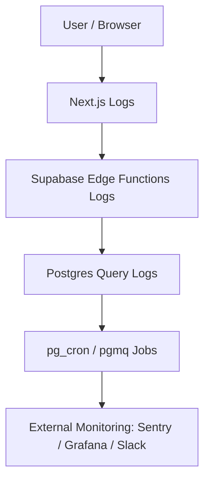

# Part 9. Observability & Debugging

> Goal: Build comprehensive "observability" — logs, traces, metrics — to detect errors early, understand root causes, and optimize Supabase + Next.js performance.

## 9.1 🎯 Learning Objectives

After completing this section, developers can:

- Read, filter, and analyze Supabase logs (DB, Edge Functions, Cron).
- Catch and track error traces in Next.js and Edge Functions.
- Write business logs (custom logging).
- Monitor slow queries, HTTP errors, or job failures.
- Set up alerts (Slack, Email, Sentry, etc.).

## 9.2 🧩 Observability Layers in System



| Layer                  | Observability Goal                            | Main Tools             |
| ---------------------- | --------------------------------------------- | ---------------------- |
| **Frontend (Next.js)** | UI errors, API latency                        | Sentry, console logs   |
| **Edge Functions**     | Runtime errors, event tracing                 | Supabase CLI logs      |
| **Database**           | Slow queries, constraint errors, RLS failures | Supabase SQL logs      |
| **Background jobs**    | Cron failures, queue retries                  | pg_cron / pgmq logs    |
| **Integration**        | Webhook failures, 3rd-party timeouts          | API log table / alerts |

## 9.3 ⚙️ Basic Logging in Supabase

### 1️⃣ Edge Function Logs

```bash
supabase functions logs --name send-reminder --follow
```

> Displays actual function logs when called (errors, console.log, status).

### 2️⃣ Database Logs (Query / Error)

Access **Supabase Dashboard → Logs → Database**
Or query manually:

```sql
select event_message, metadata
from logs
where event_type = 'postgres'
order by timestamp desc limit 10;
```

### 3️⃣ Cron Job Logs

```sql
select * from cron.job_run_details order by start_time desc limit 5;
```

### 4️⃣ Realtime Errors

If Realtime channel disconnects:

```js
supabase
  .channel("x")
  .subscribe()
  .on("error", (err) => console.error("Realtime error:", err));
```

## 9.4 🧰 Structured Logging

Instead of text logs, log JSON for easier querying and analysis.

```ts
console.log(
  JSON.stringify({
    event: "invoice_created",
    user: userId,
    amount,
    timestamp: new Date().toISOString(),
  })
);
```

> Easy to send through pipelines (Sentry, Loki, Logflare) or parse with SQL JSON queries.

## 9.5 🧠 Debugging in Edge Functions

### Local Serve with Live Logs

```bash
supabase functions serve send-reminder
```

Then test:

```bash
curl -i http://localhost:54321/functions/v1/send-reminder
```

### Add Detailed try/catch

```ts
try {
  const res = await fetch(api);
  if (!res.ok) throw new Error(`External API failed ${res.status}`);
} catch (err) {
  console.error("❌ [send-reminder] error", err);
}
```

> ✅ When deployed, this log will appear in `supabase functions logs`.

## 9.6 🧩 Logging in Database (Custom Table)

Create `system_logs` table to store important actions / errors:

```sql
create table system_logs (
  id bigserial primary key,
  level text check (level in ('info', 'warn', 'error')),
  message text,
  context jsonb,
  created_at timestamptz default now()
);
```

Write logs from Edge Function:

```ts
await supabase.from("system_logs").insert({
  level: "error",
  message: "Failed to call external API",
  context: { api: "slack", status: 500 },
});
```

> Can review logs via dashboard or export to Grafana / DataDog.

## 9.7 ⚡ Debug Performance Queries

### Find Slow Queries

```sql
select query, total_exec_time, calls
from pg_stat_statements
order by total_exec_time desc limit 10;
```

### Enable Extension

```sql
create extension if not exists pg_stat_statements;
```

### Analyze EXPLAIN ANALYZE

```sql
explain analyze select * from subscriptions where user_id = 'abc';
```

> Helps identify missing indexes, full table scans, or RLS overhead.

## 9.8 🧭 Observability for Next.js

### Basic Logging

```ts
import pino from "pino";
export const logger = pino({ level: "info" });

logger.info({ route: "/api/task", user, latency });
logger.error({ route: "/api/task", err });
```

### Sentry Integration

```bash
npm i @sentry/nextjs
```

`/sentry.client.config.ts`

```ts
import * as Sentry from "@sentry/nextjs";
Sentry.init({
  dsn: process.env.SENTRY_DSN!,
  tracesSampleRate: 1.0,
});
```

> ✅ Automatically catches FE/BE errors, displays stacktrace + user info + release version.

## 9.9 🧩 Alerting (Email / Slack)

Create Edge Function `alert-slack`:

```ts
import { serve } from "https://deno.land/std/http/server.ts";

serve(async (req) => {
  const { level, message, context } = await req.json();
  await fetch("https://hooks.slack.com/services/XXXX", {
    method: "POST",
    body: JSON.stringify({
      text: `🚨 [${level}] ${message}\nContext: ${JSON.stringify(context)}`,
    }),
  });
  return new Response("ok");
});
```

Call when critical errors occur:

```ts
await fetch(`${SUPABASE_FN_URL}/alert-slack`, {
  method: "POST",
  body: JSON.stringify({
    level: "error",
    message: "Payment failed",
    context: { user: userId, amount },
  }),
});
```

> 🔔 Helps team receive notifications in Slack when runtime errors occur.

## 9.10 🧮 Periodic System Monitoring

| Component      | Check                           | Frequency  | How to Implement             |
| -------------- | ------------------------------- | ---------- | ---------------------------- |
| Database       | Slow queries, constraint errors | Daily      | `pg_stat_statements`         |
| Cron jobs      | Fail / delayed runs             | Every 6h   | Query `cron.job_run_details` |
| Edge Functions | Error rate > 1%                 | Realtime   | Supabase Logs                |
| Storage        | File upload failures            | Daily      | `system_logs`                |
| FE latency     | TTFB, LCP, errors               | Continuous | Vercel / Sentry              |
| Integration    | API timeouts                    | Daily      | `api_log` table              |

## 9.11 🧭 Completion Checklist

- [ ] Know how to read Supabase logs (DB, Cron, Functions).
- [ ] Created `system_logs` table for internal tracing.
- [ ] Find slow queries via `pg_stat_statements`.
- [ ] Catch Edge Function runtime errors with `try/catch + console`.
- [ ] Set up Sentry for FE + BE.
- [ ] Created automatic Slack alerts.
- [ ] Have dashboard or queries to check logs periodically.

## 9.12 💡 Internal Best Practices

1. **Always log JSON instead of plain text.**
2. **Attach traceId or requestId** to all related logs.
3. **Don't log sensitive data** (passwords, tokens).
4. **Use standard log levels (`info`, `warn`, `error`).**
5. **Log right before return in Edge Functions** to trace full context.
6. **Always run EXPLAIN ANALYZE before adding indexes.**
7. **Use Sentry for entire frontend + backend.**
8. **Create view `v_slow_queries` for automatic monitoring.**
9. **Attach ISO timestamp to all logs.**
10. **Keep log retention ≥ 30 days.**

## 9.13 📚 References

- [Supabase Logs](https://supabase.com/docs/guides/platform/logs)
- [Supabase pg_stat_statements](https://supabase.com/docs/guides/database/extensions/pg-stat-statements)
- [Supabase Functions Logs](https://supabase.com/docs/guides/functions/logs)
- [Sentry Next.js Integration](https://docs.sentry.io/platforms/javascript/guides/nextjs/)
- [OpenTelemetry + Next.js Guide](https://opentelemetry.io/docs/instrumentation/js/nextjs/)

## 9.14 🧾 Output After This Section

> After completing Part 9, new developers will be able to:
>
> - [x] Read and filter complete Supabase logs (functions, cron, queries).
> - [x] Write structured JSON logs for easy analysis.
> - [x] Catch Edge Function & Frontend runtime errors with Sentry.
> - [x] Find and optimize slow queries.
> - [x] Create automatic alerts for critical errors.
> - [x] Keep Supabase + Next.js system observable & debuggable.
