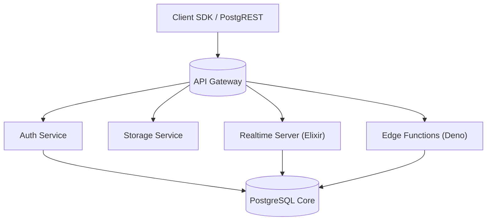

# Phần 13. Phụ lục (Advanced)

> Mục tiêu: cung cấp các kiến thức nâng cao giúp tối ưu, mở rộng và tích hợp Supabase + Next.js vào các hệ thống phức tạp, quy mô lớn hoặc yêu cầu đặc biệt.

## 13.1 🎯 Nội dung chính của phần phụ lục

| STT   | Chủ đề                                    | Mục tiêu                                  |
| ----- | ----------------------------------------- | ----------------------------------------- |
| 13.2  | Supabase Architecture Deep Dive           | Hiểu sâu cơ chế hoạt động bên trong       |
| 13.3  | Performance Profiling & Query Planning    | Phân tích và tối ưu hiệu năng truy vấn    |
| 13.4  | Supabase + OpenTelemetry                  | Theo dõi trace toàn hệ thống              |
| 13.5  | Advanced Edge Functions                   | Patterns và tối ưu function runtime       |
| 13.6  | Database Replication & Read Scaling       | Tăng khả năng chịu tải DB                 |
| 13.7  | Integration with AI / Analytics           | Kết nối LLM, vector DB, warehouse         |
| 13.8  | Data Governance & Compliance              | Audit, GDPR, PII và bảo mật dữ liệu       |
| 13.9  | Multi-Tenant Architecture                 | Cách thiết kế app nhiều khách hàng        |
| 13.10 | Supabase Plugin Ecosystem                 | Các extension và tool nâng cao            |
| 13.11 | DevOps Automation (IaC, Supabase CLI Pro) | IaC & self-host Supabase                  |
| 13.12 | Case Study & Design Patterns              | Các mô hình triển khai thực tế            |
| 13.13 | Training Expansion & Knowledge Base       | Cách duy trì và mở rộng tài liệu training |

## 13.2 🧱 Supabase Architecture Deep Dive

### Thành phần chính



- **PostgREST:** tự động sinh API CRUD từ schema PostgreSQL.
- **Realtime:** stream thay đổi dữ liệu qua logical replication slot.
- **Auth:** dùng GoTrue (JWT + Postgres integration).
- **Edge Functions:** chạy trên Deno runtime (stateless, isolated).
- **Storage:** lưu file trong S3-compatible storage + metadata DB.

> 💡 Mỗi project Supabase là một cluster cô lập gồm Postgres + service layer.

## 13.3 ⚙️ Performance Profiling & Query Planning

### Công cụ chính

- `EXPLAIN ANALYZE`
- `pg_stat_statements`
- `pg_buffercache`
- `pg_stat_activity`

### Ví dụ phân tích

```sql
explain analyze
select *
from invoices
where customer_id = '123'
order by created_at desc;
```

Kết quả:

```bash
Index Scan using invoices_customer_id_idx on invoices
(cost=0.42..8.54 rows=10 width=...) (actual time=0.1..0.3)
```

✅ Giải thích: Query sử dụng đúng index → hiệu năng tốt.

### Khi query chậm

- Thiếu index → `Seq Scan`
- Hàm trong WHERE (`lower(column)`) → không dùng index
- Dùng `IN (...)` quá nhiều giá trị
- `ORDER BY` + `OFFSET` lớn → nên dùng keyset pagination

## 13.4 🔍 Supabase + OpenTelemetry (OTEL)

Tích hợp OTEL giúp trace xuyên suốt giữa **Next.js - Edge Function - Database**.

### Ví dụ cấu hình (Next.js)

```ts
import { trace } from "@opentelemetry/api";

const tracer = trace.getTracer("nextjs-supabase");

export async function getUserData() {
  const span = tracer.startSpan("fetch_user");
  try {
    const res = await supabase.from("users").select("*");
    span.setAttribute("record_count", res.data.length);
    return res;
  } finally {
    span.end();
  }
}
```

### Tích hợp exporter

- OTLP exporter → gửi trace đến Tempo / Grafana Cloud
- Dùng tag `service.name = "nextjs-frontend"`

> 💡 Cho phép quan sát transaction xuyên suốt: user click → API → DB query.

## 13.5 🧩 Advanced Edge Functions

### Function composition

Gọi function từ function khác (service role):

```ts
await fetch(`${Deno.env.get("FN_URL")}/notify-user`, {
  method: "POST",
  headers: { Authorization: `Bearer ${SERVICE_ROLE_KEY}` },
  body: JSON.stringify({ user_id }),
});
```

### Middleware pattern

```ts
const withAuth = (handler) => async (req) => {
  const token = req.headers.get("authorization")?.split(" ")[1];
  if (!token) return new Response("Unauthorized", { status: 401 });
  return handler(req, token);
};
```

### Retry pattern

Dùng pgmq queue:

```sql
select pgmq.send('retry-queue', json_build_object('event', 'email_fail'));
```

> Supabase Edge + pgmq có thể thay thế RabbitMQ trong quy mô nhỏ.

## 13.6 🧮 Database Replication & Read Scaling

### Read replicas

Supabase Pro/Enterprise hỗ trợ **replica DB** → scale read.

- Sử dụng param: `read_replica=true` trong connection string.
- Next.js SSR có thể dùng replica cho các query tĩnh.

### Connection pooling

- Dùng **PgBouncer** để giới hạn session count.
- Supabase tự động bật PgBouncer trên môi trường production.

### Partitioning

```sql
create table logs_y2025m11 partition of logs
for values from ('2025-11-01') to ('2025-12-01');
```

> Giúp truy vấn log nhanh hơn, giảm table size tổng.

## 13.7 🤖 Integration with AI / Analytics

### Lưu vector embedding

```sql
create extension if not exists vector;
create table doc_embeddings (
  id bigint generated always as identity primary key,
  content text,
  embedding vector(1536)
);
```

### Search tương đồng

```sql
select id, content
from doc_embeddings
order by embedding <-> '[0.1, 0.2, ...]' limit 5;
```

### Kết nối BigQuery / Snowflake

Dùng `pg_fdw` hoặc `pgbouncer` connector → đẩy dữ liệu analytics ra data warehouse.

## 13.8 🧾 Data Governance & Compliance (PII / GDPR)

| Vấn đề                  | Giải pháp                                     |
| ----------------------- | --------------------------------------------- |
| Dữ liệu cá nhân (PII)   | Mã hóa AES hoặc hash với pgcrypto             |
| Yêu cầu "xóa vĩnh viễn" | `soft delete` + job thực thi cứng sau 30 ngày |
| Audit access            | Trigger ghi vào bảng `audit_log`              |
| Role separation         | Không cho service role query full user table  |
| Backup bảo mật          | Bật encryption-at-rest (Supabase mặc định có) |

> 🔐 Supabase Pro/Enterprise tuân thủ SOC2 và GDPR by default.

## 13.9 🧱 Multi-Tenant Architecture

### 1️⃣ Single DB - Row Isolation

```sql
create policy "Tenant isolation"
on orders
for all
using ( tenant_id = current_setting('app.tenant_id')::uuid );
```

→ Set tenant_id trong Edge Function context.

### 2️⃣ Separate schema per tenant

```bash
tenant_1.orders
tenant_2.orders
```

→ Dùng dynamic schema switch.

> Phù hợp khi mỗi tenant có nhiều dữ liệu độc lập.

### 3️⃣ Separate database per tenant

→ Sử dụng Supabase CLI deploy nhiều project.

> Phù hợp khi khách hàng lớn cần isolation hoàn toàn.

## 13.10 🧩 Supabase Plugin Ecosystem

| Plugin / Extension | Công dụng                      |
| ------------------ | ------------------------------ |
| `pg_net`           | Gửi HTTP request từ SQL        |
| `pg_cron`          | Lên lịch cron job              |
| `pgmq`             | Message queue nhẹ              |
| `pgvector`         | AI embedding search            |
| `pg_graphql`       | Auto-generate GraphQL endpoint |
| `pg_partman`       | Table partition management     |
| `pg_audit`         | Audit trail                    |
| `pgjwt`            | Custom JWT encode/decode       |
| `http`             | Trigger webhook từ DB event    |

## 13.11 ⚙️ DevOps Automation (IaC & Self-host)

### Infrastructure as Code (IaC)

Dùng Terraform + Supabase provider:

```hcl
resource "supabase_project" "main" {
  name  = "my-supabase"
  plan  = "pro"
  region = "ap-southeast-1"
}
```

### Self-host Supabase (Enterprise)

```bash
git clone https://github.com/supabase/supabase
cd supabase/docker
docker compose up
```

> Khi cần deploy trong private network / on-premise.

## 13.12 🧠 Case Study & Design Patterns

| Use case              | Pattern áp dụng                      | Ghi chú                 |
| --------------------- | ------------------------------------ | ----------------------- |
| SaaS subscription app | Supabase Auth + RLS + Stripe webhook | Đơn giản, nhanh ra MVP  |
| Internal dashboard    | Edge Function + RLS bypass (admin)   | Tách user level         |
| IoT device logging    | pgmq queue + partition table         | Tối ưu insert           |
| Multi-tenant CRM      | RLS by tenant_id + view per role     | Bảo mật & dễ mở rộng    |
| AI note app           | pgvector + Supabase Storage          | Search + Lưu file audio |
| Analytics pipeline    | pg_net + BigQuery sync               | Serverless ETL nhỏ gọn  |

## 13.13 📚 Training Expansion & Knowledge Base

### Cấu trúc Notion / Wiki nội bộ

```bash
Supabase Training Hub
├── Getting Started
│   ├── Setup Environment
│   └── Authentication & RLS
├── API & Function Library
│   ├── Integration Guides
│   └── Common Patterns
├── DevOps & CI/CD
│   ├── GitHub Actions templates
│   └── Rollback checklist
├── Observability & Logging
├── Security & Governance
└── Advanced Topics
    ├── AI Integration
    ├── Multi-Tenant
    └── Scaling & Performance
```

> 📘 Mỗi module nên có:
>
> - Slide training (key points)
> - Demo code repo
> - Exercise checklist
> - Review quiz

## 13.14 🧭 Checklist hoàn thành (Advanced Level)

| Mục                                               | Trạng thái |
| ------------------------------------------------- | ---------- |
| Hiểu kiến trúc nội bộ Supabase                    | ☐          |
| Dùng được EXPLAIN ANALYZE tối ưu query            | ☐          |
| Tích hợp OTEL trace end-to-end                    | ☐          |
| Viết Edge Function phức tạp có retry / middleware | ☐          |
| Triển khai read replica DB                        | ☐          |
| Dùng pgvector cho AI search                       | ☐          |
| Có cơ chế audit log & PII compliance              | ☐          |
| Thiết kế multi-tenant isolation                   | ☐          |
| Tự động hóa deploy bằng CLI / Terraform           | ☐          |
| Đóng góp case study nội bộ                        | ☐          |

## 13.15 💡 Hướng phát triển tiếp theo

- Xây dựng **Supabase Internal Template Repo** (boilerplate chuẩn).
- Tạo **Monitoring Dashboard** (Grafana hoặc Vercel Insights).
- Viết **Plugin nội bộ (pg_function)** cho use case riêng.
- Xây dựng **AI Copilot internal** để tự động gợi ý query / policy.
- Tổ chức **Supabase Camp**: mini training hàng quý.

## 13.16 🧾 Output sau phần này

> Sau khi hoàn tất phần 13 (Advanced), dev senior sẽ có thể:
>
> - [x] Tối ưu hệ thống Supabase + Next.js ở mức production enterprise.
> - [x] Kết nối với hệ thống khác (AI, Data Warehouse, Monitoring).
> - [x] Hiểu sâu cơ chế hoạt động Supabase.
> - [x] Viết Edge Function, policy, và cron nâng cao.
> - [x] Thiết kế multi-tenant, compliance-ready architecture.

## ✅ Kết luận toàn bộ tài liệu

Bạn đã hoàn thành **Bộ tài liệu đào tạo Supabase + Next.js toàn diện** gồm 13 phần:

| #     | Chủ đề chính                   | Mục tiêu                         |
| ----- | ------------------------------ | -------------------------------- |
| 0-4   | Setup, Auth, RLS, DB           | Nền tảng core Supabase           |
| 5-8   | Integration, Batch, API, CI/CD | Thực hành & triển khai thật      |
| 9-10  | Observability, Security        | Vận hành an toàn, đáng tin cậy   |
| 11-12 | Cost, Techstack Comparison     | Tối ưu và định hướng chiến lược  |
| 13    | Advanced & Phụ lục             | Mở rộng, chuyên sâu, AI, scaling |
