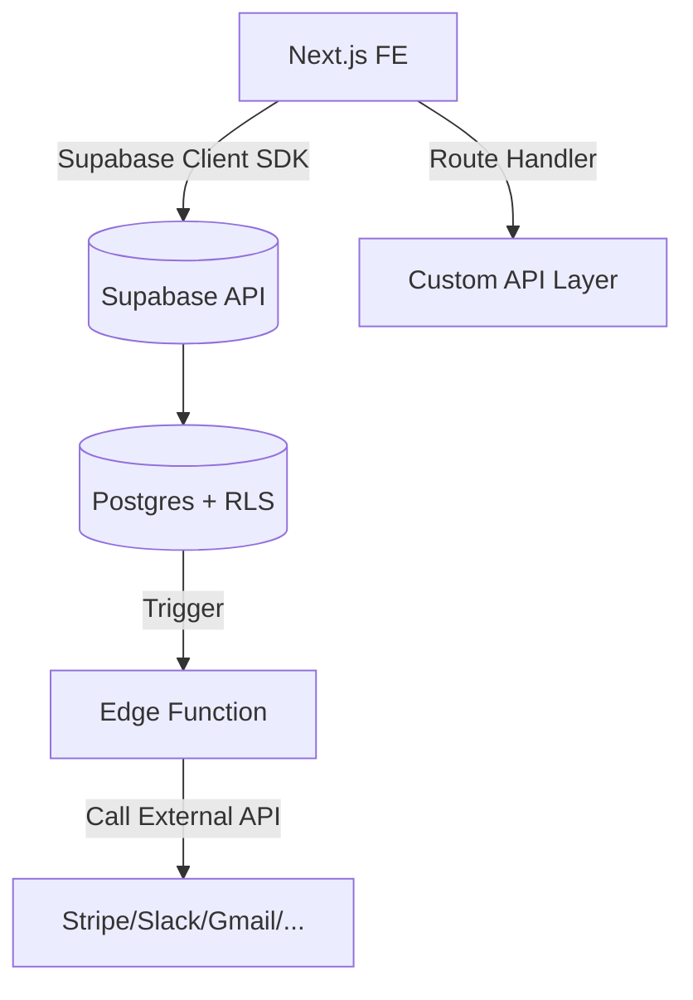

# 🧩 Phần 7. API & Integration Patterns

> Mục tiêu: hiểu các mô hình tích hợp API với Supabase, thiết kế lớp API hợp lý, và kết nối được với dịch vụ bên ngoài một cách an toàn, observable, và có thể test.

---

## 7.1 🎯 Mục tiêu học phần

Sau khi hoàn thành phần này, dev có thể:

- Phân biệt giữa **Direct Supabase Query** và **API Layer Integration**.
- Thiết kế **Route Handlers** hoặc **Edge Functions** cho API logic.
- Tích hợp **Webhook (Stripe, Slack, Email)** vào hệ thống.
- Triển khai pattern **event-driven**: trigger trong DB → call Edge Function.
- Viết log, retry, và bảo mật API calls đúng cách.

---

## 7.2 🧠 Tổng quan kiến trúc API Integration



> 🔍 Supabase cho phép bạn **vừa đọc/ghi trực tiếp DB**, vừa **kích hoạt function hoặc webhook** để mở rộng sang các hệ thống khác.

---

## 7.3 ⚙️ 1️⃣ Khi nào gọi Supabase trực tiếp từ FE

**Phù hợp khi:**

- Dữ liệu không nhạy cảm, đã được bảo vệ bằng RLS.
- FE chỉ cần CRUD đơn giản.
- Không cần transform, cache, hay side-effect.

```tsx
"use client";
import { createClient } from "@/lib/supabaseClient";

export default function Profile() {
  const supabase = createClient();
  const [user, setUser] = useState(null);

  useEffect(() => {
    supabase
      .from("profiles")
      .select("*")
      .then(({ data }) => setUser(data?.[0]));
  }, []);
}
```

✅ Ưu điểm: nhanh, gọn, realtime.
⚠️ Nhược điểm: không kiểm soát logic phức tạp, khó trace, phụ thuộc RLS chặt chẽ.

---

## 7.4 ⚙️ 2️⃣ Khi nào nên có lớp API trung gian (Route Handler)

**Phù hợp khi:**

- Cần **xử lý nghiệp vụ phức tạp** (gọi nhiều bảng, logic, kiểm tra điều kiện).
- Muốn **ẩn logic** hoặc **tránh expose trực tiếp Supabase key**.
- Cần **gắn thêm step logging / retry / integration ngoài**.

Ví dụ:

```ts
// app/api/invoices/route.ts
import { createServer } from "@/lib/supabaseServer";
import { NextResponse } from "next/server";

export async function POST(req: Request) {
  const supabase = createServer();
  const body = await req.json();

  const { data, error } = await supabase
    .from("invoices")
    .insert({ ...body, created_at: new Date() });

  if (error) return NextResponse.json({ error }, { status: 400 });

  // Gọi webhook external (ví dụ gửi email)
  await fetch(process.env.NOTIFY_URL!, {
    method: "POST",
    headers: { "Content-Type": "application/json" },
    body: JSON.stringify({ event: "invoice_created", data }),
  });

  return NextResponse.json({ message: "Invoice created", data });
}
```

✅ Ưu điểm:

- Dễ thêm retry, logging, auth tùy chỉnh.
- Dễ test (Postman / integration tests).
  ⚠️ Nhược điểm:
- Mất realtime.
- Phải maintain layer trung gian (DevOps + CI).

---

## 7.5 ⚙️ 3️⃣ Khi nào nên dùng Edge Function

**Phù hợp khi:**

- Cần chạy logic phía server **ngoài context của request người dùng**.
- Xử lý trigger event từ DB hoặc cron (như “invoice created” → gửi email).
- Gọi API bên ngoài bằng **service role key** (an toàn, có quyền cao hơn).

Ví dụ: `functions/notify-slack/index.ts`

```ts
import { serve } from "https://deno.land/std@0.168.0/http/server.ts";
import { createClient } from "https://esm.sh/@supabase/supabase-js@2";

serve(async (req) => {
  const event = await req.json();
  console.log("🔔 Received event:", event);

  await fetch("https://hooks.slack.com/services/XXXXX", {
    method: "POST",
    body: JSON.stringify({ text: `New invoice: ${event.data.id}` }),
  });

  return new Response("ok", { status: 200 });
});
```

Deploy:

```bash
supabase functions deploy notify-slack
```

---

## 7.6 🧩 4️⃣ Webhook từ Supabase (Trigger → Edge Function)

### 🔹 Tạo trigger trong DB

```sql
create or replace function notify_new_invoice()
returns trigger as $$
declare
  payload jsonb;
begin
  payload := jsonb_build_object('id', new.id, 'amount', new.amount);
  perform net.http_post(
    url := 'https://<project>.functions.supabase.co/notify-slack',
    headers := jsonb_build_object('Content-Type', 'application/json'),
    body := payload
  );
  return new;
end;
$$ language plpgsql security definer;

create trigger on_invoice_created
after insert on invoices
for each row execute function notify_new_invoice();
```

> ✅ Khi invoice được insert → trigger gọi function Slack.

---

## 7.7 ⚡ 5️⃣ Tích hợp Webhook ngoài (Stripe, GitHub, v.v.)

### 🔹 Ví dụ Stripe webhook

`app/api/stripe/route.ts`

```ts
import { headers } from "next/headers";
import Stripe from "stripe";
import { createServer } from "@/lib/supabaseServer";

const stripe = new Stripe(process.env.STRIPE_SECRET_KEY!);

export async function POST(req: Request) {
  const sig = headers().get("stripe-signature")!;
  const text = await req.text();

  try {
    const event = stripe.webhooks.constructEvent(
      text,
      sig,
      process.env.STRIPE_WEBHOOK_SECRET!
    );

    if (event.type === "checkout.session.completed") {
      const session = event.data.object as any;
      const supabase = createServer();
      await supabase
        .from("payments")
        .insert({ stripe_id: session.id, email: session.customer_email });
    }

    return new Response("ok", { status: 200 });
  } catch (err: any) {
    console.error(err);
    return new Response("Webhook Error", { status: 400 });
  }
}
```

> ⚠️ **Không parse JSON trước khi xác minh signature** — Stripe yêu cầu raw body.

---

## 7.8 🧭 Event-driven integration pattern

Khi hệ thống phức tạp hơn, bạn nên dùng pattern **Event → Function → Queue**:

```mermaid
flowchart LR
A[Database Insert] --> B[DB Trigger]
B --> C[Edge Function Handler]
C --> D[Queue (pgmq)]
D --> E[Worker Function]
E --> F[External API / Email]
```

### 💡 Ưu điểm

- Không block user request.
- Có retry / log.
- Mở rộng dễ dàng khi có thêm event.

---

## 7.9 🧠 Error Handling & Logging

### 🔹 Log request / response

```ts
try {
  const res = await fetch(apiUrl, options);
  if (!res.ok) throw new Error(`HTTP ${res.status}`);
  const data = await res.json();
  console.log("✅ API success", data);
} catch (err) {
  console.error("❌ API error", err);
  await supabase.from("api_log").insert({
    endpoint: apiUrl,
    status: "failed",
    error: String(err),
  });
}
```

### 🔹 Table `api_log`

```sql
create table api_log (
  id bigserial primary key,
  endpoint text,
  status text,
  error text,
  created_at timestamptz default now()
);
```

---

## 7.10 🧰 Bảo mật & Rate Limiting

1. **Không expose service key** — chỉ dùng trong Edge Functions hoặc Route Handlers.
2. **Verify signature** với webhook (Stripe, Slack, GitHub…).
3. **Giới hạn request** bằng middleware:

   ```ts
   // app/middleware.ts
   import { NextResponse } from "next/server";
   export function middleware(req) {
     const ip = req.headers.get("x-forwarded-for");
     // Simple rate limit logic
     return NextResponse.next();
   }
   ```

4. **Ẩn endpoint nhạy cảm** (đặt dưới `/api/internal/`) và bảo vệ bằng token header.
5. **Log mọi lỗi API** để có thể trace qua Supabase Logs.

---

## 7.11 🧭 Checklist hoàn thành

- [ ] Biết khi nào gọi Supabase trực tiếp vs API trung gian.
- [ ] Tạo được Route Handler xử lý CRUD + gọi external API.
- [ ] Tạo được Edge Function nhận webhook từ DB.
- [ ] Tích hợp được Stripe / Slack / Gmail webhook.
- [ ] Hiểu event-driven pattern: Trigger → Function → Queue.
- [ ] Có bảng `api_log` để lưu trace & error.

---

## 7.12 💡 Best Practices nội bộ

1. **Route Handler = logic ngắn, Edge Function = logic phức tạp.**
2. **Luôn verify signature cho webhook.**
3. **Không gửi request ra ngoài trong transaction DB.**
4. **Idempotent API** — gọi lại nhiều lần không gây duplicate.
5. **Đặt log chi tiết** trong Edge Function (console.log + table log).
6. **Sử dụng pgmq cho retry** khi API call thất bại.
7. **Phân quyền rõ endpoint public/private.**
8. **Giữ toàn bộ integration keys trong Supabase secrets, không .env local.**
9. **Giới hạn timeout API call ≤ 10s.**
10. **Document rõ các endpoint nội bộ trong `/docs/api.md`.**

---

## 7.13 📚 Tài liệu tham khảo

- [Supabase Functions & Webhooks](https://supabase.com/docs/guides/functions)
- [Supabase pg_net (HTTP client)](https://supabase.com/docs/guides/database/extensions/pg-net)
- [Next.js Route Handlers](https://nextjs.org/docs/app/building-your-application/routing/route-handlers)
- [Stripe Webhook Verification](https://stripe.com/docs/webhooks/signatures)
- [Supabase Queue (pgmq)](https://supabase.com/docs/guides/database/extensions/pgmq)

---

## 7.14 🧾 Output sau phần này

> Sau khi hoàn tất phần 7, dev mới sẽ có thể:
>
> - [x] Chọn đúng mô hình tích hợp API.
> - [x] Viết Route Handler cho CRUD và webhook.
> - [x] Viết Edge Function để xử lý event-driven.
> - [x] Tích hợp thành công Stripe/Slack/GitHub webhook.
> - [x] Log và bảo mật API đúng chuẩn.
