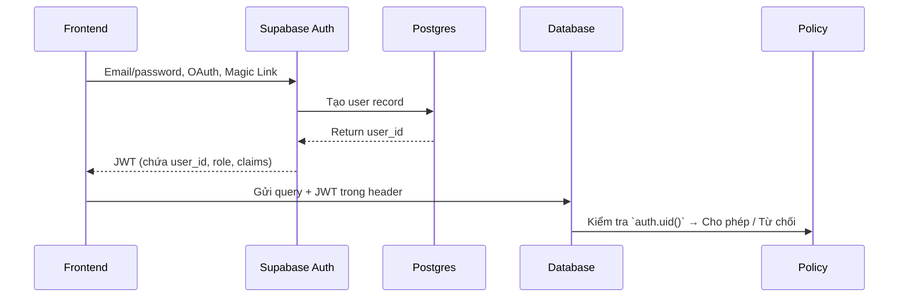

# 🔐 Phần 2. Authentication

> Mục tiêu: nắm được toàn bộ quy trình đăng ký – đăng nhập – quản lý session – bảo vệ route trong Next.js + Supabase.

---

## 2.1 🎯 Mục tiêu học phần

Sau khi hoàn thành phần này, dev có thể:

- Hiểu cách **Supabase Auth hoạt động** (JWT, claims, anon/service role key).
- Cấu hình **Next.js + Supabase** để login/logout.
- Tạo **UI đăng nhập / đăng ký / reset password** cơ bản.
- Bảo vệ routes bằng middleware (server-side).
- Gắn user profile và metadata vào database.

---

## 2.2 🔍 Tổng quan về Supabase Auth

### 💡 Kiến trúc Auth

Supabase Auth dựa trên:

- **Postgres** làm core (user data lưu trong bảng `auth.users`)
- **JWT** để xác thực client requests
- **Policies (RLS)** kiểm soát quyền truy cập ở tầng DB



---

### 🔑 Các khái niệm quan trọng

| Khái niệm                    | Giải thích                                                                   |
| ---------------------------- | ---------------------------------------------------------------------------- |
| **Anon Key**                 | Public key dùng ở frontend để gọi Supabase API (quyền hạn hạn chế).          |
| **Service Role Key**         | Dùng cho backend (Edge Functions / server) — có quyền bỏ qua RLS.            |
| **JWT Token**                | Chứa thông tin user (id, role, email, metadata). Được gửi trong mọi request. |
| **RLS (Row-Level Security)** | Policy trong DB kiểm tra `auth.uid()` để xác định quyền truy cập.            |

---

## 2.3 🧱 Thiết lập Auth trong Next.js

### 🔹 Cài thêm packages

```bash
pnpm add @supabase/ssr
```

`@supabase/ssr` giúp **giữ session Supabase trên server** (quan trọng cho App Router).

---

### 🔹 Cấu trúc helper chuẩn nội bộ

#### `/lib/supabaseClient.ts`

```ts
import { createBrowserClient } from "@supabase/ssr";

export const createClient = () =>
  createBrowserClient(
    process.env.NEXT_PUBLIC_SUPABASE_URL!,
    process.env.NEXT_PUBLIC_SUPABASE_ANON_KEY!
  );
```

#### `/lib/supabaseServer.ts`

```ts
import { createServerClient } from "@supabase/ssr";
import { cookies } from "next/headers";

export const createServer = () => {
  const cookieStore = cookies();
  return createServerClient(
    process.env.NEXT_PUBLIC_SUPABASE_URL!,
    process.env.NEXT_PUBLIC_SUPABASE_ANON_KEY!,
    { cookies: { get: (name) => cookieStore.get(name)?.value } }
  );
};
```

---

### 🔹 Middleware bảo vệ route

`/middleware.ts`

```ts
import { NextResponse } from "next/server";
import { createServer } from "./lib/supabaseServer";

export async function middleware(req) {
  const res = NextResponse.next();
  const supabase = createServer();
  const { data } = await supabase.auth.getSession();

  // Nếu không có session → redirect đến trang đăng nhập
  if (!data.session && req.nextUrl.pathname.startsWith("/dashboard")) {
    return NextResponse.redirect(new URL("/login", req.url));
  }
  return res;
}

export const config = {
  matcher: ["/dashboard/:path*"],
};
```

---

## 2.4 🧭 Luồng đăng nhập / đăng ký / đăng xuất

### 1️⃣ Đăng ký (Sign up)

```ts
"use client";
import { useState } from "react";
import { createClient } from "@/lib/supabaseClient";

export default function Signup() {
  const supabase = createClient();
  const [email, setEmail] = useState("");
  const [password, setPassword] = useState("");

  const handleSignup = async () => {
    const { error } = await supabase.auth.signUp({ email, password });
    if (error) alert(error.message);
    else alert("Check your email to confirm signup!");
  };

  return (
    <div>
      <h2>Sign up</h2>
      <input onChange={(e) => setEmail(e.target.value)} placeholder="Email" />
      <input
        type="password"
        onChange={(e) => setPassword(e.target.value)}
        placeholder="Password"
      />
      <button onClick={handleSignup}>Register</button>
    </div>
  );
}
```

---

### 2️⃣ Đăng nhập (Sign in)

```ts
"use client";
import { createClient } from "@/lib/supabaseClient";
import { useRouter } from "next/navigation";

export default function Login() {
  const router = useRouter();
  const supabase = createClient();

  const handleLogin = async (email, password) => {
    const { error } = await supabase.auth.signInWithPassword({
      email,
      password,
    });
    if (error) alert(error.message);
    else router.push("/dashboard");
  };
}
```

---

### 3️⃣ Đăng xuất (Sign out)

```ts
"use client";
import { createClient } from "@/lib/supabaseClient";
import { useRouter } from "next/navigation";

export default function LogoutButton() {
  const router = useRouter();
  const supabase = createClient();

  const handleLogout = async () => {
    await supabase.auth.signOut();
    router.push("/login");
  };

  return <button onClick={handleLogout}>Logout</button>;
}
```

---

## 2.5 🧩 Đồng bộ Profile User

Sau khi đăng ký, Supabase chỉ có record trong `auth.users`.
Bạn nên sync thêm bảng `public.profiles` để lưu metadata hoặc thông tin bổ sung.

### 🔹 SQL migration

`/supabase/migrations/20251105T_create_profiles_table.sql`

```sql
create table profiles (
  id uuid references auth.users on delete cascade primary key,
  full_name text,
  avatar_url text,
  created_at timestamptz default now()
);
alter table profiles enable row level security;

create policy "Public profiles are viewable by owner"
on profiles for select
using ( auth.uid() = id );

create policy "Users can insert their own profile"
on profiles for insert
with check ( auth.uid() = id );
```

---

### 🔹 Trigger tự động tạo profile

`/supabase/migrations/20251105T_trigger_sync_profile.sql`

```sql
create function public.handle_new_user()
returns trigger as $$
begin
  insert into public.profiles (id) values (new.id);
  return new;
end;
$$ language plpgsql security definer;

create trigger on_auth_user_created
after insert on auth.users
for each row execute procedure public.handle_new_user();
```

> ✅ Khi user đăng ký → trigger tự tạo profile tương ứng.

---

## 2.6 🧩 Metadata & Claims

Bạn có thể thêm **custom metadata** vào JWT để hỗ trợ RLS phức tạp (như role hoặc org_id).

### Cập nhật metadata

```ts
await supabase.auth.updateUser({
  data: { role: "admin", organization_id: "org_abc123" },
});
```

### Truy cập metadata trong policy

```sql
create policy "Org members only"
on tasks
for select
using (
  auth.jwt()->>'organization_id' = organization_id
);
```

---

## 2.7 🛡️ Bảo vệ route (Protected Routes)

- Dùng **middleware.ts** (server-side) để redirect nếu chưa login.
- Dùng **server component** để fetch user session.

Ví dụ:

```tsx
import { createServer } from "@/lib/supabaseServer";

export default async function DashboardPage() {
  const supabase = createServer();
  const { data } = await supabase.auth.getUser();

  if (!data.user) return <div>Unauthorized</div>;
  return <div>Welcome, {data.user.email}</div>;
}
```

---

## 2.8 🧭 Password Reset & Magic Link

### Gửi link reset

```ts
await supabase.auth.resetPasswordForEmail(email, {
  redirectTo: "http://localhost:3000/reset-password",
});
```

### Magic link login (email-only)

```ts
await supabase.auth.signInWithOtp({
  email: "user@example.com",
});
```

> Khi người dùng bấm link trong email → Supabase sẽ tự tạo session và redirect về FE.

---

## 2.9 ✅ Checklist hoàn thành

- [ ] Hiểu rõ cơ chế Auth và JWT của Supabase
- [ ] Đăng ký / đăng nhập / đăng xuất hoạt động
- [ ] Middleware redirect user chưa login
- [ ] Có bảng `profiles` đồng bộ user metadata
- [ ] Hiểu cách thêm custom claim vào JWT
- [ ] Bảo vệ được trang `/dashboard`

---

## 2.10 💡 Best Practices nội bộ

1. **Không bao giờ lưu mật khẩu thủ công** — luôn dùng API `auth.signUp`.
2. **Không chia sẻ service key** cho FE (chỉ dùng anon key).
3. **Luôn sync user profile** bằng trigger, không tạo thủ công.
4. **Luôn bật RLS** cho mọi bảng có liên quan đến user.
5. **Middleware chỉ redirect** – không xử lý logic nặng.
6. **Tách rõ client/server Supabase client** (`createClient` vs `createServer`).
7. **Luôn test logout & expired session** khi triển khai auth.

---

## 2.11 📚 Tài liệu tham khảo

- [Supabase Auth Docs](https://supabase.com/docs/guides/auth)
- [Next.js App Router + Supabase Auth](https://supabase.com/docs/guides/auth/server-side/nextjs)
- [Managing Sessions with @supabase/ssr](https://supabase.com/docs/guides/auth/server-side/nextjs#using-the-supabase-ssr-package)
- [Postgres RLS Docs](https://supabase.com/docs/guides/auth/row-level-security)

---

## 2.12 🧾 Output sau phần này

Sau khi hoàn tất phần 2, dev mới phải:

- [x] Hiểu rõ Auth architecture (JWT, anon key, service role).
- [x] Tạo được flow login/logout đầy đủ.
- [x] Có middleware bảo vệ route `/dashboard`.
- [x] Có bảng `profiles` đồng bộ với `auth.users`.
- [x] Có thể thêm metadata (role, org_id) để dùng cho RLS.
