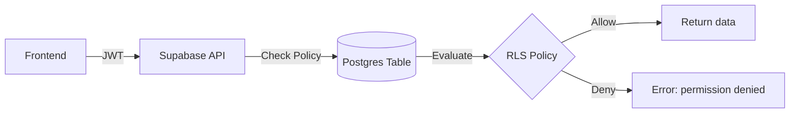

# Phần 3. Authorization (RLS & Policy)

> Mục tiêu: hiểu rõ cách Supabase dùng RLS để bảo vệ dữ liệu, viết được policy an toàn cho từng bảng, và gắn được metadata (role, org_id) từ JWT vào policy.

## 3.1 🎯 Mục tiêu học phần

Sau khi hoàn thành phần này, dev có thể:

- Hiểu rõ **RLS (Row-Level Security)** hoạt động như thế nào trong Postgres/Supabase.
- Biết cách bật/tắt RLS, viết policy cho CRUD.
- Sử dụng **`auth.uid()`** và **JWT claim** trong policy.
- Thiết kế **multi-tenant** (nhiều tổ chức, nhiều user) an toàn.
- Quản lý role (admin, member, guest) ở tầng DB.

## 3.2 🔍 Tổng quan về Authorization trong Supabase

### Auth vs Authorization

| Khái niệm          | Vai trò                                                | Xử lý ở đâu                   |
| ------------------ | ------------------------------------------------------ | ----------------------------- |
| **Authentication** | Xác thực danh tính người dùng (login, token, session)  | Supabase Auth                 |
| **Authorization**  | Xác định người đó **được phép làm gì** (xem, sửa, xóa) | **RLS Policy trong Database** |

### Kiến trúc Authorization



> ✅ Quyết định "ai được truy cập" nằm **ngay trong DB**, không phải ở code FE hay API.

## 3.3 🧱 Bật RLS và Policy cơ bản

### Bước 1. Bật RLS cho bảng

```sql
alter table profiles enable row level security;
```

### Bước 2. Tạo policy cho `SELECT`

```sql
create policy "Users can view their own profile"
on profiles
for select
using ((select auth.uid()) = id );
```

> ✅ Nghĩa là: user chỉ được xem record mà `id` của record đó trùng với `auth.uid()` từ JWT.

### Bước 3. Policy cho `INSERT`

```sql
create policy "Users can insert their own profile"
on profiles
for insert
with check ((select auth.uid()) = id );
```

### Bước 4. Policy cho `UPDATE`

```sql
create policy "Users can update their own profile"
on profiles
for update
using ((select auth.uid()) = id )
with check ((select auth.uid()) = id );
```

> 🔎 **`using`** kiểm tra khi _đọc record_, còn **`with check`** kiểm tra khi _ghi/insert/update_.

## 3.4 🧩 Các hàm helper trong Supabase RLS

| Hàm            | Mô tả                                                                        |
| -------------- | ---------------------------------------------------------------------------- |
| `auth.uid()`   | Trả về `user_id` từ JWT.                                                     |
| `auth.jwt()`   | Trả về toàn bộ payload JWT dưới dạng JSON.                                   |
| `auth.role()`  | Trả về role của người đang truy cập (thường là `authenticated` hoặc `anon`). |
| `auth.email()` | Trả về email của user nếu có.                                                |

Ví dụ:

```sql
create policy "Admins can see all"
on users
for select
using ( auth.jwt()->>'role' = 'admin' );
```

## 3.5 🏢 Thiết kế Authorization cho Multi-tenant

### Mô hình dữ liệu mẫu

```sql
create table organizations (
  id uuid primary key default gen_random_uuid(),
  name text not null
);

create table members (
  id uuid primary key default gen_random_uuid(),
  organization_id uuid references organizations(id),
  user_id uuid references auth.users(id),
  role text check (role in ('admin', 'member')),
  created_at timestamptz default now()
);
```

### Policy cho bảng `organizations`

```sql
alter table organizations enable row level security;

create policy "Org members can view their organization"
on organizations
for select
using (
  id in (
    select organization_id from members where user_id = auth.uid()
  )
);
```

### Policy cho bảng `members`

```sql
alter table members enable row level security;

create policy "Members can view members in their org"
on members
for select
using (
  organization_id in (
    select organization_id from members where user_id = auth.uid()
  )
);
```

> 👉 Điều này giúp user chỉ thấy data của tổ chức mình, không bao giờ thấy của tổ chức khác - **ngay cả khi hacker đổi ID**.

## 3.6 🧩 Sử dụng JWT Metadata cho Role & Org

### Khi user đăng nhập, JWT chứa metadata

```json
{
  "sub": "user_123",
  "email": "john@example.com",
  "role": "admin",
  "organization_id": "org_456"
}
```

### Policy dùng metadata

```sql
create policy "Admins can view all org data"
on organizations
for select
using (
  auth.jwt()->>'role' = 'admin'
);
```

> ✅ Dữ liệu role/org_id được thêm bằng `updateUser({ data: { role, organization_id } })` trong Supabase Auth.

## 3.7 🧩 Role-based Policy tổng hợp (RBAC)

| Role     | Hành động                         | Policy ví dụ                    |
| -------- | --------------------------------- | ------------------------------- |
| `admin`  | Xem & sửa tất cả data trong org   | `auth.jwt()->>'role' = 'admin'` |
| `member` | Chỉ xem/sửa record của chính mình | `auth.uid() = created_by`       |
| `guest`  | Chỉ đọc dữ liệu public            | `auth.role() = 'anon'`          |

Ví dụ: Policy RBAC cho bảng `tasks`

```sql
alter table tasks enable row level security;

create policy "Admins can manage all tasks"
on tasks for all
using ( auth.jwt()->>'role' = 'admin' );

create policy "Members can manage own tasks"
on tasks for all
using ( auth.uid() = created_by );

create policy "Guests can view public tasks"
on tasks for select
using ( visibility = 'public' );
```

## 3.8 🧮 Kiểm thử Policy

### Cách test nhanh bằng SQL

```sql
-- Giả lập user login
set role authenticated;
set jwt.claims.role = 'member';
set jwt.claims.sub = 'user_123';

-- Test SELECT
select * from tasks;
```

### Kiểm tra qua Supabase Dashboard → SQL Editor

- Chạy query như trên với `Run as Authenticated User`.
- Thử thay JWT metadata khác nhau để xác minh kết quả.

## 3.9 🧩 Dùng Policy kết hợp Trigger (Audit Log)

Ví dụ ghi log mỗi khi user truy cập bảng `tasks`

```sql
create table audit_log (
  id bigserial primary key,
  user_id uuid,
  action text,
  table_name text,
  at timestamptz default now()
);

create function log_task_access()
returns trigger as $$
begin
  insert into audit_log (user_id, action, table_name)
  values (auth.uid(), TG_OP, TG_TABLE_NAME);
  return new;
end;
$$ language plpgsql;

create trigger trg_log_task_access
after select or insert or update or delete on tasks
for each statement execute procedure log_task_access();
```

## 3.10 🧭 Checklist hoàn thành

- [ ] Biết bật/tắt RLS và viết policy cơ bản.
- [ ] Hiểu rõ `auth.uid()` và `auth.jwt()`.
- [ ] Viết được policy multi-tenant.
- [ ] Áp dụng RBAC (admin/member/guest) ở tầng DB.
- [ ] Test policy bằng SQL hoặc Supabase Dashboard.
- [ ] Hiểu cách gắn metadata vào JWT để policy linh hoạt.

## 3.11 💡 Best Practices nội bộ

1. **Luôn bật RLS** cho tất cả bảng (trừ bảng system).
2. **Không dùng service key** để bypass RLS trừ trường hợp đặc biệt (Edge Function admin).
3. **Mỗi bảng → có ít nhất 1 policy SELECT, INSERT, UPDATE, DELETE** rõ ràng.
4. **Không rely vào code phía frontend** để kiểm tra quyền truy cập.
5. **Metadata trong JWT chỉ dùng cho context** – không thay thế kiểm tra logic phức tạp.
6. **Giữ policy file versioned** cùng migration (`migrations/policies.sql`).
7. **Test policy** mỗi khi thêm bảng hoặc role mới.
8. **Tránh viết policy trùng logic - tách nhỏ theo hành động**.
9. **Luôn review chính sách "superuser" (admin)** để tránh leak toàn bộ data.
10. **Dùng comment trong SQL** để mô tả ý nghĩa mỗi policy (hữu ích khi onboarding dev mới).

## 3.12 📚 Tài liệu tham khảo

- [Supabase RLS Guide](https://supabase.com/docs/guides/database/postgres/row-level-security)
- [PostgreSQL Row-Level Security Docs](https://www.postgresql.org/docs/current/ddl-rowsecurity.html)
- [Custom Claims & Role-based Access Control (RBAC)](https://supabase.com/docs/guides/database/postgres/custom-claims-and-role-based-access-control-rbac)

## 3.13 🧾 Output sau phần này

> Sau khi hoàn tất phần 3, dev mới nên:
>
> - [x] Hiểu cơ chế RLS và policy hoạt động.
> - [x] Biết cách viết policy cho từng CRUD.
> - [x] Tạo được policy multi-tenant (theo organization).
> - [x] Áp dụng RBAC (role-based) bằng JWT claim.
> - [x] Test và xác minh quyền truy cập của từng user.
