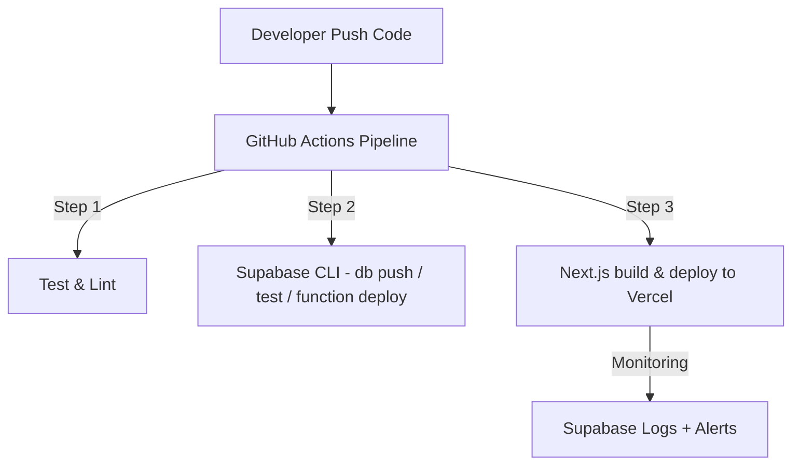
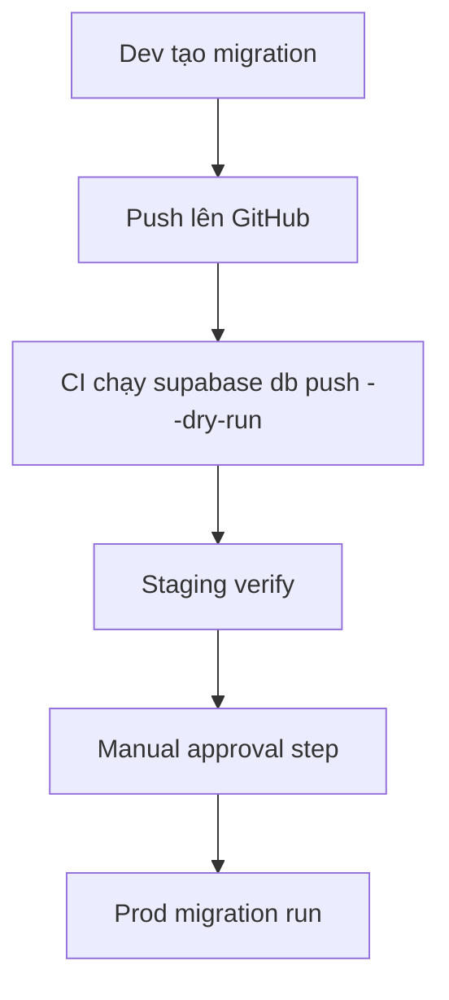

# ⚙️ Phần 8. CI/CD & DevOps

> Mục tiêu: thiết lập quy trình CI/CD tự động cho Supabase và Next.js, quản lý nhiều môi trường (dev/staging/prod), và đảm bảo deploy an toàn, rollback dễ dàng.

---

## 8.1 🎯 Mục tiêu học phần

Sau khi hoàn thành phần này, dev có thể:

- Thiết lập pipeline CI/CD (GitHub Actions) cho Supabase + Next.js.
- Tự động hóa **migration, Edge Functions deploy, build FE**.
- Quản lý nhiều môi trường và secrets an toàn.
- Hiểu cách giám sát, logging và rollback.
- Biết tối ưu cost & DevOps effort cho dự án Supabase-first.

---

## 8.2 🧩 Kiến trúc CI/CD tổng quan



---

## 8.3 ⚙️ Chuẩn bị CI/CD

### 1️⃣ Cài Supabase CLI trong pipeline

```yaml
- name: Setup Supabase CLI
  uses: supabase/setup-cli@v1
  with:
    version: latest
```

### 2️⃣ Cấu hình Secrets trong GitHub

| Tên                                                          | Mô tả                          |
| ------------------------------------------------------------ | ------------------------------ |
| `SUPABASE_ACCESS_TOKEN`                                      | Token Supabase CLI             |
| `SUPABASE_PROJECT_REF`                                       | Project ref ID (`abcd1234`)    |
| `SUPABASE_DB_PASSWORD`                                       | Password DB (dùng khi migrate) |
| `VERCEL_TOKEN`                                               | Token deploy Next.js           |
| `VERCEL_ORG_ID` / `VERCEL_PROJECT_ID`                        | Từ dashboard Vercel            |
| `NEXT_PUBLIC_SUPABASE_URL` / `NEXT_PUBLIC_SUPABASE_ANON_KEY` | Cho FE build                   |

---

## 8.4 🧰 CI/CD pipeline mẫu

`.github/workflows/ci.yml`

```yaml
name: Supabase + Next.js CI/CD

on:
  push:
    branches: [main]
  workflow_dispatch:

jobs:
  build-test-deploy:
    runs-on: ubuntu-latest
    steps:
      - name: Checkout repo
        uses: actions/checkout@v4

      - name: Setup Node.js
        uses: actions/setup-node@v4
        with:
          node-version: 20

      - name: Setup Supabase CLI
        uses: supabase/setup-cli@v1
        with:
          version: latest

      - name: Install dependencies
        run: npm ci

      - name: Lint & Unit Test
        run: npm run lint && npm run test --if-present

      - name: Supabase Migration & Functions
        env:
          SUPABASE_ACCESS_TOKEN: ${{ secrets.SUPABASE_ACCESS_TOKEN }}
          SUPABASE_PROJECT_REF: ${{ secrets.SUPABASE_PROJECT_REF }}
        run: |
          supabase link --project-ref $SUPABASE_PROJECT_REF
          supabase db push
          supabase functions deploy --all

      - name: Build Next.js
        run: npm run build

      - name: Deploy to Vercel
        run: |
          npm i -g vercel
          vercel deploy --prebuilt --prod \
            --token=${{ secrets.VERCEL_TOKEN }}
```

> 💡 `supabase functions deploy --all` sẽ tự động deploy tất cả function mới/updated.

---

## 8.5 🧩 Multi-environment setup (dev/staging/prod)

### 📂 Cấu trúc môi trường

```
.env.development
.env.staging
.env.production
```

### Ví dụ `.env.production`

```bash
NEXT_PUBLIC_SUPABASE_URL=https://prod-project.supabase.co
NEXT_PUBLIC_SUPABASE_ANON_KEY=...
SUPABASE_PROJECT_REF=prod-xyz123
```

### GitHub Actions dynamic env

```yaml
env:
  SUPABASE_PROJECT_REF: ${{ github.ref == 'refs/heads/main' && secrets.PROD_REF || secrets.STG_REF }}
```

> ✅ Tự động chọn project Supabase khác nhau theo branch (`staging` hoặc `main`).

---

## 8.6 🧱 Migration workflow (Production-safe)



### Mẫu trong pipeline

```yaml
- name: Supabase Migration Dry Run
  run: supabase db push --dry-run

- name: Wait for staging approval
  if: github.ref == 'refs/heads/main'
  uses: trstringer/manual-approval@v1
  with:
    approvers: "teamlead1, teamlead2"

- name: Apply Production Migration
  if: github.ref == 'refs/heads/main'
  run: supabase db push
```

> 🔐 **Luôn require review trước khi apply migration lên production.**

---

## 8.7 🧩 Deploy Edge Functions riêng biệt

Khi bạn chỉ update function mà không thay đổi schema.

```bash
supabase functions deploy send-reminder
```

### Tích hợp CI

```yaml
- name: Deploy Edge Functions only
  run: supabase functions deploy send-reminder --project-ref $SUPABASE_PROJECT_REF
```

> ✅ Giúp deploy nhanh hơn mà không ảnh hưởng DB migration.

---

## 8.8 🧠 Rollback strategy

### 1️⃣ Rollback migration

```bash
supabase db remote commit --message "rollback to previous version"
supabase db push
```

Hoặc restore từ backup Supabase Dashboard (auto snapshot hàng ngày).

### 2️⃣ Rollback function

```bash
supabase functions deploy send-reminder@<previous-version>
```

> ✅ Giữ file function versioned trong Git giúp rollback nhanh.

---

## 8.9 🧭 Monitoring & Observability

| Thành phần          | Cách theo dõi                         | Công cụ           |
| ------------------- | ------------------------------------- | ----------------- |
| **Edge Function**   | `supabase functions logs --name <fn>` | Supabase CLI      |
| **Cron/pgmq Job**   | Query `cron.job_run_details`          | Supabase SQL      |
| **Frontend deploy** | Dashboard Vercel / Cloudflare         | Web UI            |
| **Error tracking**  | Sentry hoặc Logflare                  | Optional          |
| **System alert**    | Email / Slack webhook                 | via Edge Function |

---

## 8.10 🧮 Backup & Disaster Recovery

- Supabase auto-backup hàng ngày (Pro plan).
- Tùy chọn export thủ công:

  ```bash
  supabase db dump --remote > backup-2025-11-06.sql
  ```

- Restore khi cần:

  ```bash
  supabase db restore --file backup-2025-11-06.sql
  ```

- Luôn backup trước migration lớn hoặc xóa dữ liệu hàng loạt.

---

## 8.11 🧰 Local DevOps Utilities

Tạo script `scripts/dev.sh` để dev chạy môi trường đầy đủ local:

```bash
#!/bin/bash
echo "🧱 Starting local Supabase + Web..."
supabase start &
pnpm run dev
```

Tạo `scripts/teardown.sh`:

```bash
#!/bin/bash
echo "🧹 Cleaning up..."
supabase stop
docker system prune -f
```

> Giúp dev dễ setup local, không phụ thuộc manual steps.

---

## 8.12 🧭 Checklist hoàn thành

- [ ] Pipeline GitHub Actions hoạt động (build + migrate + deploy).
- [ ] Secrets Supabase & Vercel được config an toàn.
- [ ] Có cơ chế dry-run migration + approval trước prod.
- [ ] Function deploy được tự động hóa.
- [ ] Có cách rollback migration & function.
- [ ] Có log + alert cho job và function.

---

## 8.13 💡 Best Practices nội bộ

1. **Tách rõ branch → môi trường (dev/stg/prod).**
2. **Không chạy migration tự động trên main** nếu chưa approval.
3. **Giữ version CLI đồng nhất giữa dev và CI** (`supabase --version`).
4. **Luôn kiểm tra `supabase db diff` trước khi push.**
5. **Gắn log commit message → migration name** để dễ trace.
6. **Giữ secrets ở GitHub → không commit file .env.**
7. **Không deploy function chưa test local (`supabase functions serve`).**
8. **Dùng tag release `vX.Y.Z` cho deploy chính thức.**
9. **Ghi lại tất cả các job vào changelog CI/CD.**
10. **Luôn có rollback script (migration + function).**

---

## 8.14 📚 Tài liệu tham khảo

- [Supabase CLI – Managing Environments](https://supabase.com/docs/guides/cli/managing-environments)
- [Supabase db push / diff / dump](https://supabase.com/docs/reference/cli/supabase-db-push)
- [Supabase Functions Deploy](https://supabase.com/docs/reference/cli/supabase-functions-deploy)
- [GitHub Actions Manual Approval](https://github.com/marketplace/actions/manual-approval)
- [Vercel CLI Deploy Docs](https://vercel.com/docs/cli/deploy)

---

## 8.15 🧾 Output sau phần này

> Sau khi hoàn tất phần 8, dev mới có thể:
>
> - [x] Hiểu toàn bộ quy trình CI/CD cho Supabase + Next.js.
> - [x] Tự động hóa migration, test, build, deploy.
> - [x] Quản lý multi-environment và secrets.
> - [x] Theo dõi logs, rollback khi có sự cố.
> - [x] Vận hành dự án Supabase-first với effort DevOps tối thiểu.
