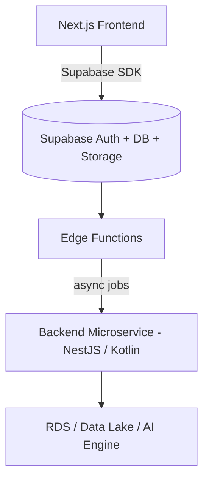

# Phần 12. So sánh với Techstack Truyền Thống

> Mục tiêu: Hiểu sự khác biệt giữa “Supabase-first architecture” và “Backend API truyền thống”
> — về cấu trúc, effort triển khai, chi phí, tốc độ phát triển, và khả năng vận hành lâu dài.

## 12.1 🎯 Mục tiêu học phần

Sau phần này, bạn có thể:

- Giải thích rõ khi nào nên dùng **Supabase-first**, khi nào nên dùng **backend truyền thống**.
- Hiểu **trade-off** về performance, chi phí, và maintainability.
- Dễ dàng đưa ra quyết định công nghệ cho dự án thực tế.

## 12.2 🧩 So sánh tổng quan

| Hạng mục                    | **Supabase + Next.js**                                          | **Backend Truyền Thống (NestJS / Spring Boot)**       |
| --------------------------- | --------------------------------------------------------------- | ----------------------------------------------------- |
| **Kiến trúc tổng thể**      | Monolithic serverless (Auth, DB, API, Storage trong 1 platform) | Microservice hoặc 3-tier (API + DB + Infra tách biệt) |
| **Setup ban đầu**           | 5–10 phút (CLI + project init)                                  | 1–2 ngày (server setup, DB config, auth, deploy)      |
| **Auth / Session**          | Built-in Supabase Auth (JWT, OTP, OAuth)                        | Phải tự cài passport.js / Spring Security             |
| **Database**                | PostgreSQL managed + RLS + triggers                             | PostgreSQL / MySQL tự host hoặc RDS                   |
| **Storage / File Upload**   | Supabase Storage (API sẵn)                                      | AWS S3 / GCP Storage + code tích hợp                  |
| **API Layer**               | Supabase client SDK / Edge Function                             | REST / GraphQL tự define                              |
| **Batch Job / Cron**        | pg_cron, pgmq, Edge Function schedule                           | Cloud Task / cron job riêng                           |
| **CI/CD**                   | Supabase CLI + GitHub Actions                                   | Jenkins / GitLab CI cần config thủ công               |
| **Realtime**                | Supabase Realtime (WS built-in)                                 | Redis PubSub / Socket.io / Kafka                      |
| **Cost khởi điểm**          | ~25–50 USD/tháng                                                | ~70–150 USD/tháng                                     |
| **Scale cost**              | Theo usage (linear)                                             | Theo instance (step-based)                            |
| **DevOps effort**           | Thấp (hầu như không cần sysadmin)                               | Cao (phải maintain infra, scaling, logs)              |
| **Performance baseline**    | Tốt cho CRUD và API đơn giản                                    | Cao hơn trong high-load / compute-heavy               |
| **Tính mở rộng**            | Dễ cho MVP / SaaS nhỏ, hạn chế khi cần control sâu              | Tự do tuyệt đối, nhưng tốn effort                     |
| **Lock-in risk**            | Vừa (Supabase vendor lock-in)                                   | Thấp (có thể chuyển host tùy ý)                       |
| **Bảo mật (Security)**      | Có RLS, key-based access, policy rõ                             | Tự implement middleware, guard, ACL                   |
| **Logging & Observability** | Supabase Logs + Dashboard                                       | ELK / Loki / Prometheus phải tự triển khai            |
| **Developer Experience**    | Cao, dev mới onboard nhanh                                      | Tốt với team backend mạnh                             |
| **Thời gian ra MVP**        | Rất nhanh (1–3 ngày)                                            | Trung bình (1–2 tuần)                                 |

## 12.3 ⚙️ So sánh chi tiết theo từng layer

### Authentication & Authorization

| Tiêu chí                                    | Supabase                | Backend truyền thống      |
| ------------------------------------------- | ----------------------- | ------------------------- |
| Auth provider (email, Google, GitHub, etc.) | Có sẵn                  | Tự code hoặc dùng library |
| JWT / Session                               | Tự sinh, auto refresh   | Tự quản lý refresh token  |
| Role / RLS                                  | Native trong DB         | Implement ở middleware    |
| MFA / OTP                                   | Có plugin sẵn           | Phải tự thêm              |
| Tích hợp FE                                 | Supabase client SDK, dễ | API login/logout thủ công |

✅ **Ưu điểm Supabase:** Triển khai auth cực nhanh, bảo mật chuẩn JWT.
⚠️ **Nhược điểm:** Khó mở rộng custom claim hoặc multi-tenant logic phức tạp.

### Database & ORM

| Tiêu chí           | Supabase                      | Backend truyền thống               |
| ------------------ | ----------------------------- | ---------------------------------- |
| Query layer        | SQL trực tiếp (PostgREST API) | ORM (TypeORM, Hibernate)           |
| Migration          | `supabase db push`            | Flyway / Liquibase / TypeORM CLI   |
| Trigger, Function  | Có sẵn và auto deploy         | Tự viết SQL / scripts              |
| Row Level Security | Native                        | Tự code (middleware, ACL)          |
| Monitoring         | Dashboard Supabase            | pgAdmin / Grafana / custom metrics |

✅ **Supabase** phù hợp MVP, SaaS CRUD nhanh.
⚠️ **Backend truyền thống** mạnh hơn khi cần transaction logic phức tạp hoặc DB hybrid.

### API & Integration

| Tiêu chí                 | Supabase                       | Backend truyền thống             |
| ------------------------ | ------------------------------ | -------------------------------- |
| API CRUD                 | Tự động qua PostgREST          | Viết REST/GraphQL endpoint       |
| Business logic           | Edge Function hoặc Next.js API | Controller + Service Layer       |
| External API integration | Edge Function / pg_net         | HTTP client (Axios, Feign, v.v.) |
| Rate limiting            | Middleware tự code             | Có sẵn trong Nest / API Gateway  |
| Custom serialization     | Giới hạn                       | Toàn quyền kiểm soát             |

✅ **Supabase:** đơn giản hóa backend API.
⚠️ **Truyền thống:** linh hoạt hơn khi cần nhiều logic phức tạp, validation sâu.

### CI/CD & DevOps

| Tiêu chí     | Supabase                          | Backend truyền thống               |
| ------------ | --------------------------------- | ---------------------------------- |
| Deploy       | CLI (`supabase functions deploy`) | Docker / K8s / EC2                 |
| DB migration | Auto push                         | Flyway / Liquibase                 |
| Build & Test | GitHub Actions nhanh gọn          | Jenkins / GitLab CI cấu hình nhiều |
| Scaling      | Auto-managed                      | Manual hoặc auto-scaling group     |
| Monitoring   | Logs dashboard                    | Grafana, Loki, Prometheus          |
| Backup       | Built-in snapshot                 | RDS backup tự setup                |

✅ **Supabase:** giảm DevOps effort 70–80%.
⚠️ **Truyền thống:** linh hoạt hơn với custom infra, multi-region, network layer.

### Cost & Maintainability

| Tiêu chí             | Supabase-first     | Backend truyền thống  |
| -------------------- | ------------------ | --------------------- |
| Cost per user        | thấp (usage-based) | cao (instance-based)  |
| Storage              | shared, auto-scale | pay per GB S3 / EBS   |
| Compute              | pay per function   | pay per hour instance |
| Maintenance          | gần như 0          | cần team DevOps       |
| Developer onboarding | nhanh (1–2 ngày)   | chậm (1–2 tuần)       |
| Debug                | logs tập trung     | phân tán nhiều tầng   |

✅ Supabase giúp startup tiết kiệm chi phí khởi điểm lớn.
⚠️ Khi scale lớn (hàng triệu user, heavy compute), cần hybrid kiến trúc.

## 12.4 🚀 Performance Trade-off

| Loại workload                      | Supabase + Edge Functions               | Backend truyền thống      |
| ---------------------------------- | --------------------------------------- | ------------------------- |
| CRUD nhỏ, realtime, SaaS dashboard | 🟢 Rất tốt                              | 🟢 Tốt                    |
| Batch job lớn, tính toán dài       | 🟡 Giới hạn runtime                     | 🟢 Linh hoạt              |
| API pipeline nhiều bước            | 🟡 Bị giới hạn service key / call chain | 🟢 Linh hoạt              |
| High concurrency (>10k RPS)        | 🟡 Cold start impact                    | 🟢 Tối ưu connection pool |
| Heavy async I/O                    | 🟢 Deno handle tốt                      | 🟢 Node/Java đều ổn       |
| CPU-bound processing               | 🔴 Không phù hợp                        | 🟢 Tốt (thread pool)      |

👉 Tóm lại:
Supabase **xuất sắc cho MVP / SaaS vừa và nhỏ**,
Backend truyền thống **vượt trội khi cần performance cực cao và kiểm soát hạ tầng chi tiết.**

## 12.5 🧠 Dev Experience & Productivity

| Yếu tố               | Supabase-first            | Truyền thống                   |
| -------------------- | ------------------------- | ------------------------------ |
| Onboarding dev mới   | 1–2 ngày                  | 1–2 tuần                       |
| Mức độ code cần viết | 30–50% ít hơn             | Nhiều boilerplate              |
| Debug lỗi auth / DB  | Nhanh, dashboard tích hợp | Phải combine nhiều logs        |
| Team nhỏ (2–5 dev)   | Rất phù hợp               | Tốn công setup                 |
| Team lớn (10+ dev)   | Cần quy ước code rõ hơn   | Dễ phân module                 |
| Hotfix / Deploy      | 1 CLI command             | Pipeline build, restart server |
| Documentation        | Gọn, dễ tự học            | Phải tự ghi lại chuẩn nội bộ   |

## 12.6 🧮 Tổng quan Effort vs Value

| Giai đoạn                  | Supabase Effort             | Truyền thống Effort | Ghi chú                  |
| -------------------------- | --------------------------- | ------------------- | ------------------------ |
| MVP (0–3 tháng)            | ⭐ Thấp                     | 🔺 Cao              | Supabase thắng tuyệt đối |
| Production (3–12 tháng)    | ⚖️ Trung bình               | ⚖️ Trung bình       | Tùy vào quy mô           |
| Scale lớn (1M+ user)       | 🔺 Tăng mạnh (vendor limit) | ⭐ Ổn định          | Backend có lợi thế       |
| Bảo trì lâu dài            | ⭐ Dễ                       | ⚠️ Tốn công         | Supabase update tự động  |
| Chi phí DevOps             | ⭐ Thấp                     | 🔺 Cao              | Không cần server admin   |
| Flexibility (custom logic) | ⚠️ Hạn chế                  | ⭐ Cao              | Backend tự do hơn        |

## 12.7 🧭 Khi nào nên chọn Supabase

✅ **Dùng Supabase-first khi:**

- Xây dựng MVP / SaaS vừa & nhỏ (<1M user).
- Ưu tiên tốc độ ra sản phẩm.
- Không có team DevOps riêng.
- Cần realtime / auth / storage tích hợp sẵn.
- Dự án codebase Next.js hoặc frontend-heavy.
- Muốn tối ưu chi phí hạ tầng giai đoạn đầu.

## 12.8 ⚙️ Khi nào nên chọn Backend Truyền Thống

✅ **Dùng backend riêng khi:**

- Có nghiệp vụ phức tạp (multi-step business flow).
- Cần tích hợp nhiều hệ thống (ERP, payment, data pipeline).
- Có team backend mạnh hoặc DevOps riêng.
- Cần hiệu năng cực cao, kiểm soát networking, connection pooling.
- Hệ thống cần multi-region / private VPC / fine-grained IAM.

## 12.9 🧾 Tổng hợp so sánh định lượng

| Tiêu chí               | Supabase-first    | Backend truyền thống  |
| ---------------------- | ----------------- | --------------------- |
| Setup project          | 10 phút           | 1–2 ngày              |
| MVP hoàn chỉnh         | 2–4 ngày          | 1–2 tuần              |
| Cost khởi điểm         | $25               | $100+                 |
| DevOps effort          | 1x                | 5x                    |
| Auth / Storage ready   | ✅                | ❌                    |
| Realtime / PubSub      | ✅                | ⚠️                    |
| Compute performance    | ⚠️                | ✅                    |
| Custom workflow        | ⚠️                | ✅                    |
| Security & Audit       | ✅                | ✅                    |
| Maintainability        | ✅                | ⚠️                    |
| Scaling limit          | ⚠️ (vendor-based) | ✅                    |
| Tốc độ release feature | 🚀 Nhanh          | ⚙️ Chậm hơn           |
| ROI (effort/value)     | ⭐ Cao nhất       | ⚖️ Phụ thuộc use case |

## 12.10 💡 Lời khuyên triển khai Hybrid Architecture

Nhiều công ty hiện nay chọn **Hybrid model**:

💡 **Pattern này lý tưởng khi:**

- Supabase xử lý Auth, CRUD, Realtime.
- Backend riêng chỉ dùng cho logic nặng hoặc async job.
- Dễ scale mà vẫn giữ chi phí thấp giai đoạn đầu.

## 12.11 🧭 Checklist chọn stack cho dự án

| Câu hỏi                                           | Nếu "Có" → Gợi ý               |
| ------------------------------------------------- | ------------------------------ |
| Bạn cần MVP trong < 2 tuần?                       | ✅ Supabase                    |
| Dự án có dưới 1 triệu user dự kiến?               | ✅ Supabase                    |
| Team chưa có DevOps engineer?                     | ✅ Supabase                    |
| Cần realtime UI, chat, dashboard?                 | ✅ Supabase                    |
| Có nghiệp vụ phức tạp / batch lớn?                | ✅ Backend truyền thống        |
| Cần connect hệ thống nội bộ (ERP, SSO)?           | ✅ Backend truyền thống        |
| Hệ thống cần xử lý song song hoặc tính toán nặng? | ✅ Backend truyền thống        |
| Dự kiến mở rộng global multi-region?              | ⚙️ Hybrid (Supabase + Backend) |

## 12.12 📚 Tài liệu tham khảo

- [Supabase vs Firebase vs AWS Amplify](https://supabase.com/docs/guides/resources/compare)
- [Supabase vs Custom Backend Architecture](https://supabase.com/blog/supabase-vs-custom-backend)
- [NestJS Official Docs](https://docs.nestjs.com/)
- [Spring Boot Architecture](https://spring.io/projects/spring-boot)
- [AWS Pricing Calculator](https://calculator.aws/)
- [PostgREST Performance Notes](https://postgrest.org/en/stable/performance.html)

## 12.13 🧾 Output sau phần này

> Sau khi hoàn tất phần 12, dev mới có thể:
>
> - [x] So sánh chi tiết Supabase + Next.js với backend truyền thống.
> - [x] Hiểu trade-off giữa tốc độ phát triển và khả năng mở rộng.
> - [x] Đưa ra quyết định công nghệ phù hợp từng dự án.
> - [x] Xác định khi nào nên kết hợp hybrid architecture.
> - [x] Giải thích rõ ràng vì sao Supabase là lựa chọn tối ưu cho MVP.
