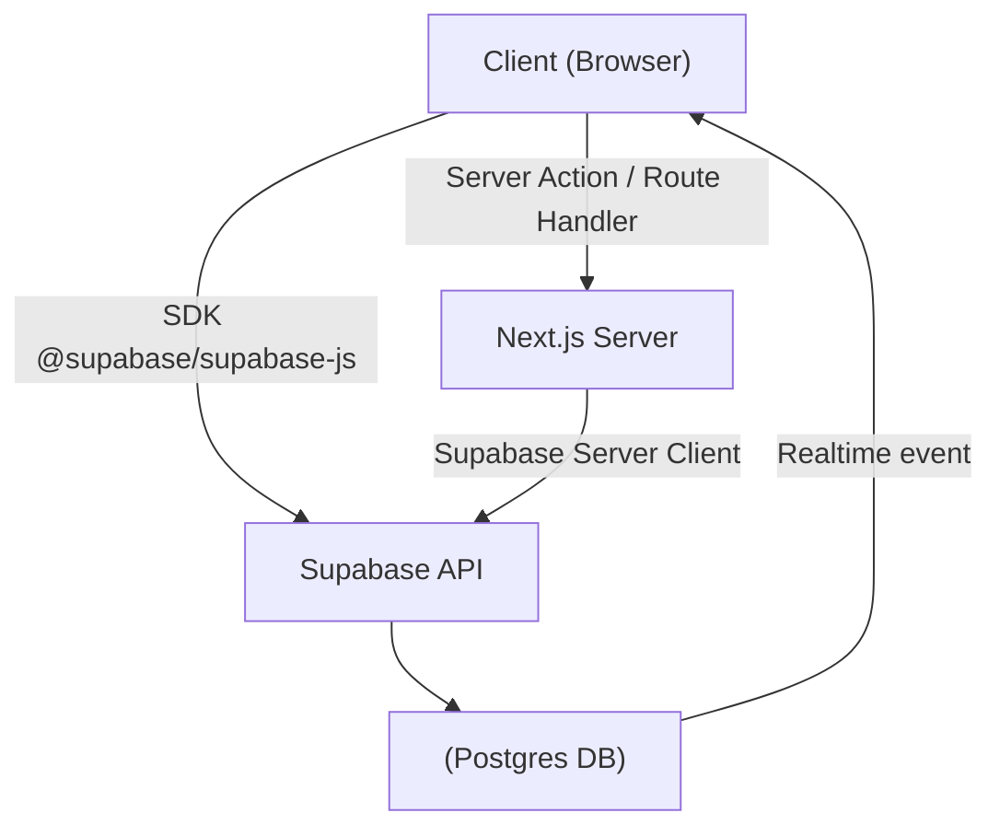

# Phần 5. Supabase + Next.js Integration

> Mục tiêu: hiểu cách tích hợp Supabase SDK vào Next.js App Router (SSR/CSR), thực hiện CRUD an toàn với RLS, và triển khai realtime UI + file upload.

## 5.1 🎯 Mục tiêu học phần

Sau khi hoàn thành phần này, dev có thể:

- Cấu hình Supabase cho cả **client-side** và **server-side** trong Next.js.
- Thực hiện CRUD (Create / Read / Update / Delete) thông qua Server Action hoặc Route Handler.
- Hiểu cách bảo vệ truy vấn qua RLS và session JWT.
- Cập nhật UI realtime khi dữ liệu thay đổi.
- Upload file an toàn với Supabase Storage.

## 5.2 🧩 Kiến trúc kết nối Supabase – Next.js



### Giải thích

- **Client SDK** dùng cho thao tác UI nhanh (fetch nhẹ, subscribe realtime).
- **Server Client** dùng cho logic cần bảo mật (create, update, delete).
- **RLS** đảm bảo dữ liệu chỉ truy cập bởi user hợp lệ.

## 5.3 ⚙️ Thiết lập Supabase Client

> 📖 **Lưu ý**: Phần thiết lập cho `/lib/supabaseClient.ts` và `/lib/supabaseServer.ts` đã được mô tả chi tiết trong [Phần 2 – Authentication](./authentication.md#cau-truc-helper-chuan-noi-bo). Vui lòng tham khảo phần đó để xem implementation đầy đủ.

## 5.4 🧠 Khi nào dùng Client vs Server

| Tình huống                                   | Dùng                             | Giải thích                |
| -------------------------------------------- | -------------------------------- | ------------------------- |
| Lấy dữ liệu hiển thị nhanh (UI table, feed)  | Client SDK                       | Có realtime, dễ tương tác |
| Cập nhật, xóa, tạo bản ghi                   | Server Action / Server Component | Giữ bảo mật và ổn định    |
| Xử lý logic phức tạp (batch, API call ngoài) | Route Handler / Edge Function    | Tách riêng để reuse       |
| Fetch khi render SSR                         | Server SDK                       | Giữ session và SEO        |

## 5.5 💾 CRUD cơ bản (Server Action)

### `app/subscriptions/page.tsx`

```tsx
import { createServer } from "@/lib/supabaseServer";

export default async function SubscriptionPage() {
  const supabase = createServer();
  const { data: subs } = await supabase
    .from("subscriptions")
    .select("*")
    .order("created_at", { ascending: false });

  return (
    <div className="p-6">
      <h2 className="text-xl font-semibold mb-3">My Subscriptions</h2>
      <ul>
        {subs?.map((s) => (
          <li key={s.id}>
            {s.service_name} – ${s.price} ({s.status})
          </li>
        ))}
      </ul>
    </div>
  );
}
```

### Tạo mới (Server Action)

`app/subscriptions/add.tsx`

```tsx
"use client";

import { useState } from "react";
import { createClient } from "@/lib/supabaseClient";

export default function AddSubscription() {
  const [form, setForm] = useState({ service_name: "", price: 0 });
  const supabase = createClient();

  const handleAdd = async () => {
    const { error } = await supabase.from("subscriptions").insert(form);
    if (error) alert(error.message);
    else alert("Added successfully!");
  };

  return (
    <div>
      <input
        placeholder="Service name"
        onChange={(e) => setForm({ ...form, service_name: e.target.value })}
      />
      <input
        type="number"
        placeholder="Price"
        onChange={(e) =>
          setForm({ ...form, price: parseFloat(e.target.value) })
        }
      />
      <button onClick={handleAdd}>Add</button>
    </div>
  );
}
```

> ✅ Vì Supabase đã bật RLS, user chỉ có thể thêm record có `user_id = auth.uid()`.

## 5.6 🧭 Route Handlers (API layer tuỳ chọn)

`app/api/subscriptions/route.ts`

```ts
import { NextResponse } from "next/server";
import { createServer } from "@/lib/supabaseServer";

export async function POST(req: Request) {
  const supabase = createServer();
  const body = await req.json();
  const { data, error } = await supabase.from("subscriptions").insert(body);
  if (error) return NextResponse.json({ error }, { status: 400 });
  return NextResponse.json(data);
}
```

> Ưu điểm: có thể thêm middleware / logging / transform data.
> Dùng khi FE không gọi Supabase trực tiếp hoặc cần tích hợp API ngoài.

## 5.7 ⚡ Realtime Update

Supabase hỗ trợ **listen sự kiện database** qua `channel`.

```tsx
"use client";
import { useEffect, useState } from "react";
import { createClient } from "@/lib/supabaseClient";

export default function RealtimeList() {
  const supabase = createClient();
  const [subs, setSubs] = useState([]);

  useEffect(() => {
    const load = async () => {
      const { data } = await supabase.from("subscriptions").select("*");
      setSubs(data || []);
    };
    load();

    const channel = supabase
      .channel("public:subscriptions")
      .on(
        "postgres_changes",
        { event: "*", schema: "public", table: "subscriptions" },
        (payload) => {
          console.log("Change received!", payload);
          load();
        }
      )
      .subscribe();

    return () => supabase.removeChannel(channel);
  }, []);

  return (
    <ul>
      {subs.map((s) => (
        <li key={s.id}>{s.service_name}</li>
      ))}
    </ul>
  );
}
```

> ⚡ Mỗi khi user thêm/sửa/xóa subscription → UI tự động cập nhật realtime.

## 5.8 🖼️ Upload file với Supabase Storage

### 1. Tạo bucket

Trong Supabase Dashboard → Storage → Create Bucket → `invoices`

### 2. Bật RLS cho bucket

```sql
create policy "Users can upload own invoices"
on storage.objects for insert
with check ( auth.uid() = owner );
```

### 3. Upload file từ client

```tsx
"use client";
import { createClient } from "@/lib/supabaseClient";

export default function UploadInvoice() {
  const supabase = createClient();

  const handleUpload = async (e: React.ChangeEvent<HTMLInputElement>) => {
    const file = e.target.files?.[0];
    if (!file) return;
    const { data, error } = await supabase.storage
      .from("invoices")
      .upload(`user-${Date.now()}-${file.name}`, file);
    if (error) alert(error.message);
    else alert("Uploaded!");
  };

  return <input type="file" onChange={handleUpload} />;
}
```

### 4. Lấy signed URL để tải xuống

```ts
const { data } = await supabase.storage
  .from("invoices")
  .createSignedUrl("user-123-invoice.pdf", 3600);
console.log(data.signedUrl);
```

> ✅ Signed URL giúp user chỉ có thể truy cập file tạm thời (1h).

## 5.9 🧭 Server Components với Session

Khi render SSR, cần lấy session của user:

```tsx
import { createServer } from "@/lib/supabaseServer";

export default async function Dashboard() {
  const supabase = createServer();
  const { data } = await supabase.auth.getUser();
  const user = data.user;

  return (
    <div>
      <h2>Welcome, {user?.email}</h2>
    </div>
  );
}
```

> ✅ Giữ session an toàn, không cần state client-side.

## 5.10 🧩 Error Handling

| Tình huống       | Cách xử lý                             | Gợi ý                                |
| ---------------- | -------------------------------------- | ------------------------------------ |
| Policy từ chối   | Kiểm tra RLS log hoặc console Supabase | Xem lại `auth.uid()`                 |
| 401 Unauthorized | Session mất hiệu lực                   | Gọi `supabase.auth.refreshSession()` |
| Timeout API      | Giảm payload hoặc paginate             | `limit()`, `range()`                 |
| Upload lỗi 413   | File > 50MB                            | Nén hoặc tách nhỏ                    |

## 5.11 🧭 Checklist hoàn thành

- [ ] Đã thiết lập client & server Supabase trong Next.js
- [ ] CRUD hoạt động với RLS
- [ ] Hiểu khi nào dùng client SDK và server SDK
- [ ] Realtime cập nhật UI thành công
- [ ] Upload / download file an toàn
- [ ] Hiểu cách gắn session và auth vào SSR

## 5.12 💡 Best Practices nội bộ

1. **Luôn chạy CRUD qua RLS** - không bypass bằng service key trừ Edge Function.
2. **Dùng Server Action hoặc Route Handler cho mutation** → tránh expose key.
3. **Realtime nên giới hạn schema/table** để tiết kiệm kết nối.
4. **Upload file → dùng signed URL, không public bucket.**
5. **Tách Supabase logic ra `/lib/hooks/` hoặc `/lib/repository/`** để dễ test.
6. **Cache nhẹ trong server component** khi fetch dữ liệu tĩnh (`revalidate: 60`).
7. **Không lưu JWT trong localStorage** - Supabase tự quản lý cookie.
8. **Ghi log mỗi thao tác CRUD quan trọng** (dùng trigger hoặc Edge Function).

## 5.13 📚 Tài liệu tham khảo

- [Supabase JS SDK Docs](https://supabase.com/docs/reference/javascript/start)
- [Next.js Create Forms with Server Actions](https://nextjs.org/docs/app/guides/forms)
- [Supabase Realtime Docs](https://supabase.com/docs/guides/realtime)
- [Supabase Storage Security](https://supabase.com/docs/guides/storage)

## 5.14 🧾 Output sau phần này

> Sau khi hoàn tất phần 5, dev mới sẽ có thể:
>
> - [x] Tạo trang CRUD hoàn chỉnh với Supabase + Next.js.
> - [x] Cập nhật UI realtime khi dữ liệu thay đổi.
> - [x] Upload file an toàn bằng signed URL.
> - [x] Hiểu rõ flow session + RLS giữa client & server.
> - [x] Tạo route handler hoặc server action an toàn.
