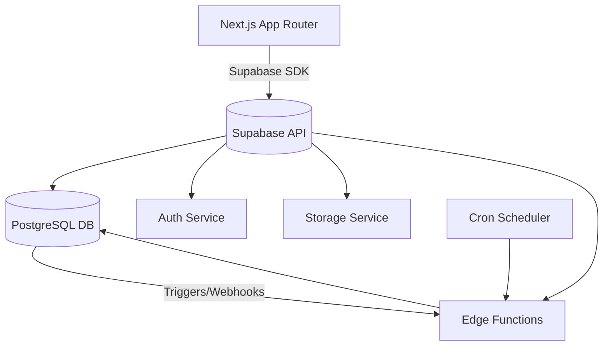

# 🏁 Phần 0. Giới thiệu & Tổng quan

> Mục đích: giúp dev mới hiểu “Supabase là gì”, “vì sao chọn stack này”, và “lộ trình học ra sao” trước khi đi vào kỹ thuật cụ thể.

## 0.1 🎯 Mục tiêu của tài liệu

### ✅ Mục đích

- Cung cấp kiến thức và hướng dẫn **từng bước** để dev mới có thể:

  - Hiểu kiến trúc **Supabase + Next.js** (Fullstack as one project).
  - Biết **triển khai ứng dụng từ đầu đến deploy** (Auth, CRUD, RLS, Storage, Cron, Queue,…).
  - Nắm **best practices nội bộ** khi viết code, test, và quản lý môi trường.
  - Biết so sánh hiệu quả Supabase với backend truyền thống (NestJS, Express, Spring Boot,…).

### 👥 Đối tượng học

- **Frontend Dev** muốn mở rộng sang fullstack.
- **Fullstack Dev** muốn tiết kiệm effort backend (MVP nhanh).
- **Intern / Junior Dev** cần nắm stack chuẩn nội bộ.
- **Tech lead / Trainer** cần dùng bộ tài liệu này để đào tạo người mới.

### 🧩 Kết quả đạt được

Sau khi hoàn thành tài liệu:

- Có thể tạo **Supabase project mới** + **Next.js frontend** từ zero.
- Tự viết CRUD, Auth, RLS, batch job, storage, deploy CI/CD.
- Hiểu được **“Supabase = Postgres + Backend service layer”**, không phải chỉ là database.
- Có khả năng **review code / hướng dẫn người khác** đúng best practice.

## 0.2 🧠 Giới thiệu về Supabase

### 💡 Định nghĩa ngắn gọn

> Supabase là **Backend-as-a-Service (BaaS)** mã nguồn mở, xây dựng trên **PostgreSQL**, cung cấp:
>
> - Database (Postgres)
> - Authentication
> - Storage (file, image,…)
> - Realtime
> - Edge Functions
> - Cron / Queue
>   → Giúp bạn **dựng backend trong vài giờ thay vì vài tuần.**

### ⚙️ Thành phần chính

| Thành phần         | Mô tả                                                      | Vai trò tương đương trong backend truyền thống |
| ------------------ | ---------------------------------------------------------- | ---------------------------------------------- |
| **Database**       | PostgreSQL có thể truy vấn trực tiếp hoặc qua REST/GraphQL | RDS / Cloud SQL                                |
| **Auth**           | Quản lý user, OAuth, JWT, Magic Link                       | Auth service / JWT middleware                  |
| **Storage**        | Lưu trữ file, image, signed URL                            | S3 / Cloud Storage                             |
| **Edge Functions** | Function serverless viết bằng JS/TS                        | Cloud Functions / Lambda                       |
| **Cron**           | Lên lịch job (pg_cron, pg_net)                             | BullMQ / Cloud Scheduler                       |
| **Realtime**       | Pub/Sub thay đổi dữ liệu (WebSocket)                       | Socket.IO / Pusher                             |
| **Queue (pgmq)**   | Message Queue trong DB                                     | SQS / RabbitMQ                                 |

### 📊 So sánh tổng quan

| Tiêu chí                     | Supabase                                | Backend truyền thống              |
| ---------------------------- | --------------------------------------- | --------------------------------- |
| Tốc độ dựng MVP              | 🚀 Rất nhanh (Auth, Storage, DB có sẵn) | Cần setup từng phần               |
| DevOps effort                | Thấp (hầu như không cần server quản lý) | Cao (RDS, S3, cron, queue, CI/CD) |
| Kiểm soát hạ tầng            | Trung bình                              | Toàn quyền                        |
| Độ phức tạp domain           | Phù hợp app nhỏ–vừa                     | Tốt hơn cho app lớn, phức tạp     |
| Chi phí ban đầu              | Rất thấp (free tier)                    | Trung bình – cao                  |
| Mức độ mở rộng (scalability) | Hạn chế theo plan Supabase              | Linh hoạt tuỳ infra               |

## 0.3 🏗️ Kiến trúc tổng quan Supabase + Next.js

### 🔍 Tổng quan kiến trúc



### 💬 Giải thích flow

1. **Frontend (Next.js)**: render SSR/CSR, gọi Supabase SDK để CRUD, login,…
2. **Supabase API layer**: tự động expose REST/GraphQL endpoint từ schema.
3. **Postgres (Database)**: lưu dữ liệu + thực thi policies (RLS).
4. **Auth module**: xử lý đăng ký, đăng nhập, JWT claim.
5. **Edge Functions**: xử lý nghiệp vụ phức tạp / kết nối dịch vụ bên ngoài.
6. **Cron & Queue**: xử lý background tasks / định kỳ.
7. **Realtime & Webhook**: push dữ liệu cập nhật tới frontend theo event.

## 0.4 ⚡ Vì sao chọn Supabase + Next.js

### 🧩 Lý do kỹ thuật

- Dự án nội bộ hoặc MVP cần ra nhanh → giảm thời gian setup backend.
- Next.js App Router + Supabase SDK hỗ trợ tốt SSR/SSG/ISR → trải nghiệm người dùng mượt.
- Postgres + RLS đảm bảo bảo mật ở tầng DB, giảm rủi ro do lỗi code.
- CLI, migration, Edge Function, Cron → đủ mạnh để triển khai production-scale.

### 💵 Lý do vận hành

- Supabase có **Free Tier** và **Pay-as-you-go**, không cần team DevOps.
- Có dashboard monitoring, log, rollback, auto backup.
- Dễ đào tạo đội mới: chỉ cần biết SQL và JavaScript/TypeScript.

### 👨‍💻 Lý do đào tạo

- Một dev mới có thể nắm toàn bộ stack trong **1 tuần**.
- Giúp dev frontend hiểu thêm backend logic mà không cần học framework backend riêng.

## 0.5 🚀 Lộ trình học & triển khai

| Giai đoạn   | Chủ đề chính                    | Kết quả đạt được                               | Thời lượng gợi ý |
| ----------- | ------------------------------- | ---------------------------------------------- | ---------------- |
| **Phase 0** | Tổng quan, setup môi trường     | Biết Supabase là gì, tạo project & Next.js app | 0.5 ngày         |
| **Phase 1** | Database, Auth, RLS             | Biết cách thiết kế schema, bảo mật RLS         | 2 ngày           |
| **Phase 2** | Supabase + Next.js Integration  | CRUD, Auth UI, Protect route                   | 2 ngày           |
| **Phase 3** | Batch job, Queue, Edge Function | Tạo job, xử lý async                           | 2–3 ngày         |
| **Phase 4** | CI/CD & DevOps                  | Biết deploy, migration, test                   | 2 ngày           |
| **Phase 5** | Review & Best practices         | Tổng kết, so sánh backend truyền thống         | 1 ngày           |

> Tổng cộng: **~10 ngày training** để một dev có thể tự làm MVP production-ready.

## 0.6 📦 Case Study xuyên suốt: _Subscription Manager App_

Để dễ học và thống nhất ví dụ, tài liệu sẽ sử dụng **1 app xuyên suốt**.

### 🔧 Yêu cầu tính năng

- User đăng ký / đăng nhập (email + OAuth).
- Mỗi user có thể tạo nhiều “subscription” (Netflix, Spotify,…).
- Gửi email nhắc khi gần hết hạn.
- Cho phép upload ảnh hóa đơn (invoice).
- Dashboard hiển thị realtime khi thêm/sửa subscription.

### 🗂️ Cấu trúc thư mục gợi ý

```bash
/app
  /auth
  /dashboard
  /subscription
/lib
  supabaseClient.ts
  auth.ts
/supabase
  /migrations
  /policies
  /functions
/scripts
  sendReminder.ts
```

### 💬 Output

- App hoàn chỉnh triển khai trên Vercel + Supabase.
- Toàn bộ ví dụ trong tài liệu sẽ dùng app này để minh hoạ.

## 0.7 ✅ Checklist sau khi đọc xong phần này

- [ ] Hiểu khái niệm Supabase và các module chính.
- [ ] Hiểu lợi thế so với backend truyền thống.
- [ ] Nắm sơ đồ kiến trúc Supabase + Next.js.
- [ ] Biết mục tiêu của tài liệu và kết quả mong đợi.
- [ ] Đã cài đặt sẵn công cụ (Node, Supabase CLI, VSCode).
- [ ] Đã tạo project Supabase + Next.js mẫu.

## 0.8 💡 Best Practices nội bộ

1. **Luôn nghĩ Supabase như Postgres mở rộng**, không phải “no-code backend”.
2. **Luôn viết migration và policy bằng SQL** — không thao tác bằng tay trên dashboard production.
3. **Mỗi module học → commit riêng** (để dev mới có thể checkout từng bước).
4. **Bắt đầu từ use-case thật (app xuyên suốt)** → dễ hiểu hơn học khô.
5. **Sau mỗi phần → review bằng checklist & mini quiz.**

## 0.9 📚 Tài liệu tham khảo

- [Supabase Docs](https://supabase.com/docs)
- [Next.js App Router Guide](https://nextjs.org/docs/app)
- [Supabase GitHub Examples](https://github.com/supabase/examples)
- Nội bộ:
  - `/docs/supabase_overview.md`
  - `/docs/training_schedule.md`
  - `/repos/supabase-next-starter`
