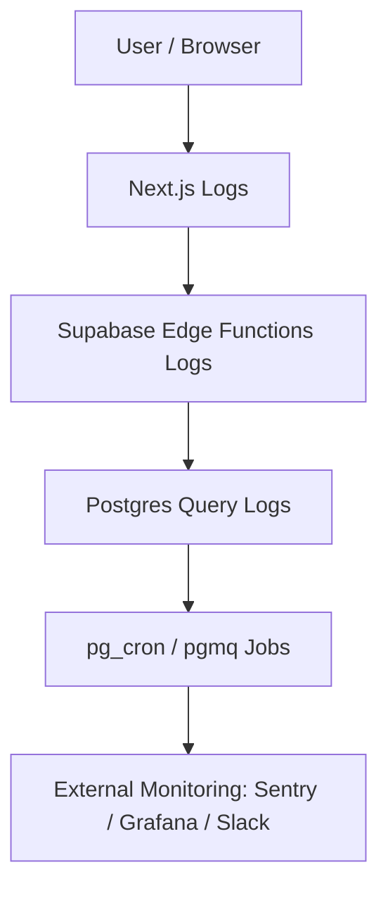

# Phần 9. Observability & Debugging

> Mục tiêu: xây dựng khả năng “quan sát toàn diện” — logs, traces, metrics — để phát hiện sớm lỗi, hiểu nguyên nhân gốc (root cause), và tối ưu hiệu năng của Supabase + Next.js.

## 9.1 🎯 Mục tiêu học phần

Sau khi hoàn thành phần này, dev có thể:

- Đọc, lọc, và phân tích log Supabase (DB, Edge Function, Cron).
- Bắt và theo dõi error trace trong Next.js và Edge Functions.
- Ghi log nghiệp vụ (custom logging).
- Giám sát query chậm, error HTTP, hoặc job fail.
- Thiết lập cảnh báo (Slack, Email, Sentry, v.v.).

## 9.2 🧩 Các lớp Observability trong hệ thống



| Layer                  | Mục tiêu quan sát                      | Công cụ chính         |
| ---------------------- | -------------------------------------- | --------------------- |
| **Frontend (Next.js)** | UI error, API latency                  | Sentry, console logs  |
| **Edge Functions**     | Runtime error, event tracing           | Supabase CLI logs     |
| **Database**           | Query slow, constraint error, RLS fail | Supabase SQL logs     |
| **Background jobs**    | Cron fail, queue retry                 | pg_cron / pgmq log    |
| **Integration**        | Webhook fail, 3rd-party timeout        | API log table / alert |

## 9.3 ⚙️ Log cơ bản trong Supabase

### 1️⃣ Edge Function Logs

```bash
supabase functions logs --name send-reminder --follow
```

> Hiển thị log thực tế của function khi được gọi (error, console.log, status).

### 2️⃣ Database Logs (Query / Error)

Truy cập **Supabase Dashboard → Logs → Database**
Hoặc query thủ công:

```sql
select event_message, metadata
from logs
where event_type = 'postgres'
order by timestamp desc limit 10;
```

### 3️⃣ Cron Job Logs

```sql
select * from cron.job_run_details order by start_time desc limit 5;
```

### 4️⃣ Realtime Errors

Nếu Realtime channel disconnect:

```js
supabase
  .channel("x")
  .subscribe()
  .on("error", (err) => console.error("Realtime error:", err));
```

## 9.4 🧰 Log có cấu trúc (Structured Logging)

Thay vì log text, nên log JSON để dễ truy vấn và phân tích.

```ts
console.log(
  JSON.stringify({
    event: "invoice_created",
    user: userId,
    amount,
    timestamp: new Date().toISOString(),
  })
);
```

> Dễ gửi qua pipeline (Sentry, Loki, Logflare) hoặc parse lại bằng SQL JSON query.

## 9.5 🧠 Debug trong Edge Function

### Local serve với live log

```bash
supabase functions serve send-reminder
```

Sau đó test:

```bash
curl -i http://localhost:54321/functions/v1/send-reminder
```

### Gắn try/catch chi tiết

```ts
try {
  const res = await fetch(api);
  if (!res.ok) throw new Error(`External API failed ${res.status}`);
} catch (err) {
  console.error("❌ [send-reminder] error", err);
}
```

> ✅ Khi deploy, log này sẽ hiển thị trong `supabase functions logs`.

## 9.6 🧩 Log trong Database (bảng custom)

Tạo bảng `system_logs` để lưu hành động / error quan trọng:

```sql
create table system_logs (
  id bigserial primary key,
  level text check (level in ('info', 'warn', 'error')),
  message text,
  context jsonb,
  created_at timestamptz default now()
);
```

Ghi log từ Edge Function:

```ts
await supabase.from("system_logs").insert({
  level: "error",
  message: "Failed to call external API",
  context: { api: "slack", status: 500 },
});
```

> Có thể xem lại log bằng dashboard hoặc export ra Grafana / DataDog.

## 9.7 ⚡ Debug Performance Query

### Dò query chậm

```sql
select query, total_exec_time, calls
from pg_stat_statements
order by total_exec_time desc limit 10;
```

### Bật extension

```sql
create extension if not exists pg_stat_statements;
```

### Phân tích EXPLAIN ANALYZE

```sql
explain analyze select * from subscriptions where user_id = 'abc';
```

> Giúp xác định thiếu index, scan toàn bảng, hoặc RLS overhead.

## 9.8 🧭 Observability cho Next.js

### Log cơ bản

```ts
import pino from "pino";
export const logger = pino({ level: "info" });

logger.info({ route: "/api/task", user, latency });
logger.error({ route: "/api/task", err });
```

### Sentry integration

```bash
npm i @sentry/nextjs
```

`/sentry.client.config.ts`

```ts
import * as Sentry from "@sentry/nextjs";
Sentry.init({
  dsn: process.env.SENTRY_DSN!,
  tracesSampleRate: 1.0,
});
```

> ✅ Tự động bắt lỗi FE/BE, hiển thị stacktrace + user info + release version.

## 9.9 🧩 Alerting (Email / Slack)

Tạo Edge Function `alert-slack`:

```ts
import { serve } from "https://deno.land/std/http/server.ts";

serve(async (req) => {
  const { level, message, context } = await req.json();
  await fetch("https://hooks.slack.com/services/XXXX", {
    method: "POST",
    body: JSON.stringify({
      text: `🚨 [${level}] ${message}\nContext: ${JSON.stringify(context)}`,
    }),
  });
  return new Response("ok");
});
```

Gọi khi có lỗi nghiêm trọng:

```ts
await fetch(`${SUPABASE_FN_URL}/alert-slack`, {
  method: "POST",
  body: JSON.stringify({
    level: "error",
    message: "Payment failed",
    context: { user: userId, amount },
  }),
});
```

> 🔔 Giúp team nhận thông báo trong Slack khi có lỗi runtime.

## 9.10 🧮 Monitor hệ thống định kỳ

| Thành phần     | Kiểm tra                   | Tần suất  | Cách thực hiện               |
| -------------- | -------------------------- | --------- | ---------------------------- |
| Database       | Slow query, lỗi constraint | Hàng ngày | `pg_stat_statements`         |
| Cron jobs      | Fail / delayed run         | Mỗi 6h    | Query `cron.job_run_details` |
| Edge Functions | Error rate > 1%            | Realtime  | Supabase Logs                |
| Storage        | File upload fail           | Hàng ngày | `system_logs`                |
| FE latency     | TTFB, LCP, error           | Liên tục  | Vercel / Sentry              |
| Integration    | API timeout                | Hàng ngày | `api_log` table              |

## 9.11 🧭 Checklist hoàn thành

- [ ] Biết cách đọc log Supabase (DB, Cron, Function).
- [ ] Tạo bảng `system_logs` lưu trace nội bộ.
- [ ] Dò query chậm qua `pg_stat_statements`.
- [ ] Bắt lỗi runtime Edge Function bằng `try/catch + console`.
- [ ] Thiết lập Sentry cho FE + BE.
- [ ] Tạo cảnh báo Slack tự động.
- [ ] Có dashboard hoặc query kiểm tra log định kỳ.

## 9.12 💡 Best Practices nội bộ

1. **Luôn log JSON thay vì plain text.**
2. **Gắn traceId hoặc requestId** vào mọi log liên quan.
3. **Không log data nhạy cảm** (password, token).
4. **Dùng log level (`info`, `warn`, `error`) chuẩn.**
5. **Log ngay trước return trong Edge Function** để trace full context.
6. **Luôn chạy EXPLAIN ANALYZE trước khi thêm index.**
7. **Dùng Sentry cho toàn bộ frontend + backend.**
8. **Tạo view `v_slow_queries` để monitor tự động.**
9. **Gắn timestamp ISO trong tất cả log.**
10. **Giữ retention log ≥ 30 ngày.**

## 9.13 📚 Tài liệu tham khảo

- [Supabase Logs](https://supabase.com/docs/guides/platform/logs)
- [Supabase pg_stat_statements](https://supabase.com/docs/guides/database/extensions/pg-stat-statements)
- [Supabase Functions Logs](https://supabase.com/docs/guides/functions/logs)
- [Sentry Next.js Integration](https://docs.sentry.io/platforms/javascript/guides/nextjs/)
- [OpenTelemetry + Next.js Guide](https://opentelemetry.io/docs/instrumentation/js/nextjs/)

## 9.14 🧾 Output sau phần này

> Sau khi hoàn tất phần 9, dev mới sẽ có thể:
>
> - [x] Đọc và lọc log Supabase đầy đủ (function, cron, query).
> - [x] Viết structured log JSON cho trace dễ phân tích.
> - [x] Bắt lỗi runtime Edge Function & Frontend bằng Sentry.
> - [x] Dò và tối ưu query chậm.
> - [x] Tạo cảnh báo tự động khi có lỗi nghiêm trọng.
> - [x] Giữ hệ thống Supabase + Next.js observable & debug được.
