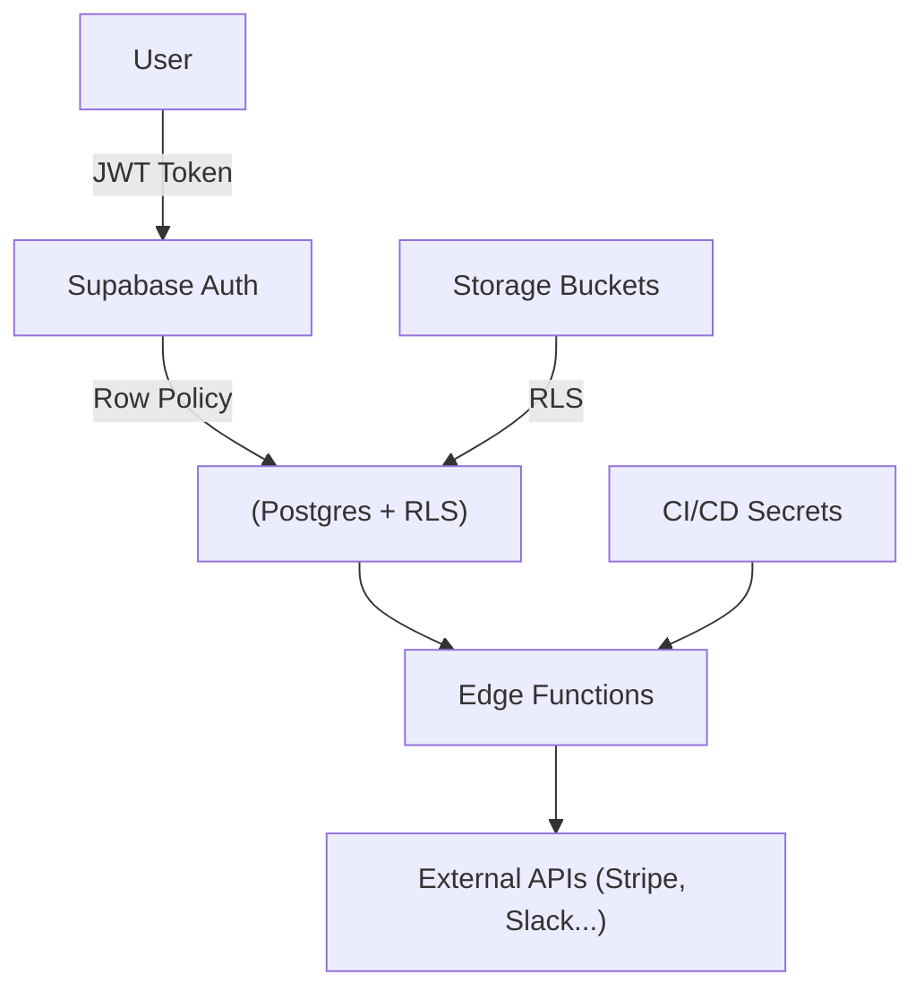

# Phần 10. Security Best Practices

> Mục tiêu: hiểu rõ các lớp bảo mật trong hệ thống Supabase + Next.js, nắm quy tắc "an toàn theo mặc định" (secure-by-default), và tránh những sai lầm phổ biến khi đưa dự án lên production.

## 10.1 🎯 Mục tiêu học phần

Sau khi hoàn thành phần này, dev có thể:

- Bảo vệ API key, token, và session đúng chuẩn.
- Cấu hình RLS (Row Level Security) an toàn.
- Giới hạn quyền truy cập Edge Functions, Storage, và Webhook.
- Bảo vệ secrets trong CI/CD.
- Hiểu mô hình phân quyền trong Supabase.

## 10.2 🧩 Các lớp bảo mật chính



| Layer                  | Rủi ro            | Cách bảo vệ                       |
| ---------------------- | ----------------- | --------------------------------- |
| **Frontend (Next.js)** | Lộ key, token     | Ẩn service key, chỉ dùng anon key |
| **Auth**               | Token giả mạo     | Xác minh JWT từ Supabase          |
| **Database**           | Query vượt quyền  | Bật RLS & policy rõ ràng          |
| **Storage**            | File public leak  | Bucket riêng tư + signed URL      |
| **Functions**          | Unauthorized call | Header validation + rate limit    |
| **CI/CD**              | Lộ secrets        | GitHub Encrypted Secrets          |
| **Webhook**            | Giả request       | Verify signature                  |

## 10.3 🔑 1️⃣ API Keys & Environment Variables

### ❌ Sai lầm phổ biến

- Commit file `.env` vào repo
- Dùng `service_role_key` ở frontend
- Gọi API Supabase từ FE bằng key quyền cao

### ✅ Cách đúng

```bash
# .env.local (frontend)
NEXT_PUBLIC_SUPABASE_URL=...
NEXT_PUBLIC_SUPABASE_ANON_KEY=...

# .env.server (backend / Edge)
SUPABASE_SERVICE_ROLE_KEY=...
```

> 🔐 Quy tắc:
>
> - FE chỉ dùng **Anon Key**
> - Backend (Edge Function, Cron, CI/CD) mới dùng **Service Role Key**

**Không bao giờ** export `service_role_key` ra trình duyệt hay API public.

## 10.4 🧱 2️⃣ Row Level Security (RLS)

RLS là "hàng rào bảo mật" quan trọng nhất trong Supabase.

### ✅ Checklist RLS

| Hạng mục                                                   | Đã làm? | Ghi chú                                      |
| ---------------------------------------------------------- | ------- | -------------------------------------------- |
| Bật RLS cho tất cả bảng chứa dữ liệu user                  | ☐       | `alter table ... enable row level security;` |
| Mỗi bảng có policy SELECT / INSERT / UPDATE / DELETE riêng | ☐       | Không dùng `for all` tùy tiện                |
| Policy có `auth.uid()` kiểm tra user                       | ☐       | Không rely vào email                         |
| Policy cho `admin` / `service role` riêng                  | ☐       | `auth.jwt()->>'role' = 'admin'`              |
| Test policy bằng `Run as user` trong dashboard             | ☐       | Đảm bảo không leak dữ liệu                   |

### Ví dụ chính xác

```sql
create policy "Users can read own data"
on profiles
for select
using ( auth.uid() = id );

create policy "Admins can read all"
on profiles
for select
using ( auth.jwt()->>'role' = 'admin' );
```

### ❌ Sai

```sql
create policy "Allow all users"
on profiles
for select
using ( true ); -- ❌ bất kỳ ai cũng xem được
```

## 10.5 🔐 3️⃣ Auth & Session Security

### ✅ Token expiration

- Access token Supabase có TTL mặc định 1 giờ.
- Refresh tự động qua cookie → không cần localStorage.
- Luôn bật **Secure cookies (HTTPS only)** trong dashboard.

### ✅ Logout đúng cách

```ts
await supabase.auth.signOut({ scope: "local" });
```

### ⚠️ Tránh lưu

- JWT token trong localStorage/sessionStorage.
- Email/password trong state toàn cục.

### ✅ Thay vào đó

Supabase SSR client (`@supabase/ssr`) đã tự động lưu session qua cookies an toàn.

## 10.6 🧩 4️⃣ Edge Functions Security

### ✅ Xác minh caller

```ts
const authHeader = req.headers.get("authorization") ?? "";
const token = authHeader.replace("Bearer ", "");
const { data, error } = await supabase.auth.getUser(token);
if (error || !data?.user) return new Response("Unauthorized", { status: 401 });
```

### ✅ Giới hạn domain

```ts
const origin = req.headers.get("origin");
if (!["https://app.example.com"].includes(origin!)) {
  return new Response("Forbidden", { status: 403 });
}
```

### ✅ Rate limit

- Dùng Cloudflare hoặc Supabase Function middleware:
  cache IP → đếm request → block nếu vượt ngưỡng.

## 10.7 🧱 5️⃣ Storage Bucket Security

### ⚠️ Sai phổ biến

- Tạo bucket `public` rồi upload file user trực tiếp.
- Không xác minh `auth.uid()` trước khi upload.

### ✅ Cách đúng

- Tạo bucket riêng: `user-files`
- Bật RLS:

```sql
create policy "User can upload own file"
on storage.objects
for insert
with check ( auth.uid()::text = (storage.foldername(name))[1] );
```

- Dùng **signed URL** để tải xuống:

```ts
const { data } = await supabase.storage
  .from("user-files")
  .createSignedUrl("user-123/avatar.png", 3600);
```

## 10.8 ⚙️ 6️⃣ Webhook & Integration Security

### ✅ Xác minh signature (ví dụ Stripe)

```ts
import Stripe from "stripe";
const event = stripe.webhooks.constructEvent(
  rawBody,
  sig,
  process.env.STRIPE_WEBHOOK_SECRET!
);
```

### ✅ Giới hạn IP / domain gọi đến Edge Function

```ts
const ip = req.headers.get("x-forwarded-for");
if (!["3.18.12.63", "3.130.192.231"].includes(ip!)) {
  return new Response("Forbidden", { status: 403 });
}
```

### ✅ Không để Edge Function public mặc định

Thêm header xác thực custom nếu cần:

```ts
const secret = req.headers.get("x-internal-secret");
if (secret !== Deno.env.get("INTERNAL_SECRET"))
  return new Response("Unauthorized", { status: 401 });
```

## 10.9 🧰 7️⃣ CI/CD & Secrets Protection

| Rủi ro                   | Biện pháp                                            |
| ------------------------ | ---------------------------------------------------- |
| Lộ key trong log CI      | Không echo biến env (`set -x`)                       |
| Secrets bị push lên repo | Thêm `.env*` vào `.gitignore`                        |
| Truy cập trái phép       | Giới hạn quyền "Read/Write" của GitHub Actions Token |
| Dùng CLI sai ref         | Luôn link đúng project với `supabase link`           |
| Token hết hạn            | Rotate `SUPABASE_ACCESS_TOKEN` định kỳ               |

### ✅ GitHub Secrets

Thiết lập:

```bash
SUPABASE_ACCESS_TOKEN
SUPABASE_PROJECT_REF
SUPABASE_SERVICE_ROLE_KEY
VERCEL_TOKEN
```

> 🔐 Tất cả secrets chỉ được tham chiếu trong workflow, không hardcode trong YAML.

## 10.10 🧮 8️⃣ Database-Level Hardening

| Hạng mục            | Giải thích                                                 |
| ------------------- | ---------------------------------------------------------- |
| `no PUBLIC access`  | Không cấp quyền `public` role cho bảng.                    |
| `search_path`       | Cố định schema: `set search_path = 'public'`               |
| `SECURITY DEFINER`  | Chỉ dùng khi thật cần thiết cho trigger.                   |
| `pgcrypto`          | Dùng cho hash/mã hóa dữ liệu nhạy cảm.                     |
| `limited extension` | Chỉ bật extension cần thiết (`pg_cron`, `pgmq`, `pg_net`). |
| `audit_log`         | Lưu mọi hành động xóa hoặc cập nhật dữ liệu.               |

## 10.11 🧠 9️⃣ Frontend Security (Next.js)

| Mối nguy             | Giải pháp                                               |
| -------------------- | ------------------------------------------------------- |
| XSS                  | Escape dữ liệu render (`dangerouslySetInnerHTML` → cấm) |
| CSRF                 | Sử dụng cookie httpOnly + middleware kiểm tra origin    |
| CORS                 | Chỉ whitelist domain chính thức                         |
| Clickjacking         | Thêm header `X-Frame-Options: DENY`                     |
| Error Leak           | Ẩn lỗi server khi trả về FE (chỉ gửi message chung)     |
| Cache sensitive data | Tắt caching với route `/api/*` chứa user info           |

## 10.12 🧭 10️⃣ Auditing & Incident Response

1. **Log toàn bộ hành động quan trọng** (`INSERT`, `UPDATE`, `DELETE`)
   → Lưu vào bảng `audit_log`.

   ```sql
   create table audit_log (
     id bigserial primary key,
     table_name text,
     action text,
     user_id uuid,
     data jsonb,
     created_at timestamptz default now()
   );
   ```

2. **Gắn trigger audit**

   ```sql
   create or replace function log_changes()
   returns trigger as $$
   begin
     insert into audit_log (table_name, action, user_id, data)
     values (TG_TABLE_NAME, TG_OP, auth.uid(), row_to_json(NEW));
     return NEW;
   end;
   $$ language plpgsql;
   ```

3. **Cảnh báo khi có truy cập bất thường**

   - So sánh `auth.uid()` không trùng `created_by` → gửi Slack alert.
   - Cron check hàng giờ các hành động delete / update.

## 10.13 🧭 Checklist bảo mật tổng thể

| Mục                                      | Trạng thái |
| ---------------------------------------- | ---------- |
| 🔐 Chỉ dùng anon key ở FE                | ☐          |
| 🔑 Service key chỉ trong Edge/CI/CD      | ☐          |
| 🧱 RLS bật cho mọi bảng                  | ☐          |
| ⚙️ Storage bucket private + signed URL   | ☐          |
| 🧩 Edge Function xác thực caller         | ☐          |
| 🧠 Webhook xác minh signature/IP         | ☐          |
| 🧰 Secrets được lưu trong GitHub Secrets | ☐          |
| 🧮 DB không cấp quyền PUBLIC             | ☐          |
| 🚨 Có audit log và alert Slack           | ☐          |
| ✅ Định kỳ rotate keys & tokens          | ☐          |

## 10.14 💡 Best Practices nội bộ

1. **Security by Default** – mọi bảng, bucket, function mặc định _bị chặn truy cập_.
2. **Không bao giờ hardcode secrets** – kể cả trong test.
3. **Mỗi môi trường (dev/stg/prod)** dùng key riêng biệt.
4. **Rotate token mỗi 90 ngày.**
5. **Chỉ admin mới có service role key.**
6. **Cảnh báo nếu dev bật RLS = false trong PR.**
7. **Tạo script kiểm tra policy chưa có `auth.uid()`.**
8. **Bảo vệ route `/api/internal/*` bằng token nội bộ.**
9. **Giới hạn bandwidth public bucket.**
10. **Luôn test các case "truy cập trái phép" trong QA.**

## 10.15 📚 Tài liệu tham khảo

- [Supabase Security Overview](https://supabase.com/docs/guides/platform/security)
- [PostgreSQL RLS Docs](https://www.postgresql.org/docs/current/ddl-rowsecurity.html)
- [Supabase Auth Security](https://supabase.com/docs/guides/auth)
- [Supabase Storage Security](https://supabase.com/docs/guides/storage)
- [Next.js Security Headers](https://nextjs.org/docs/advanced-features/security-headers)
- [OWASP Top 10 (2023)](https://owasp.org/www-project-top-ten/)

## 10.16 🧾 Output sau phần này

> Sau khi hoàn tất phần 10, dev mới có thể:
>
> - [x] Triển khai hệ thống Supabase + Next.js với các lớp bảo mật đầy đủ.
> - [x] Thiết kế RLS & Policy an toàn, tránh leak dữ liệu.
> - [x] Bảo vệ keys, storage, webhook, và CI/CD secrets.
> - [x] Tạo audit log và cơ chế cảnh báo sự cố.
> - [x] Nắm vững nguyên tắc "Secure by Default" cho toàn dự án.
